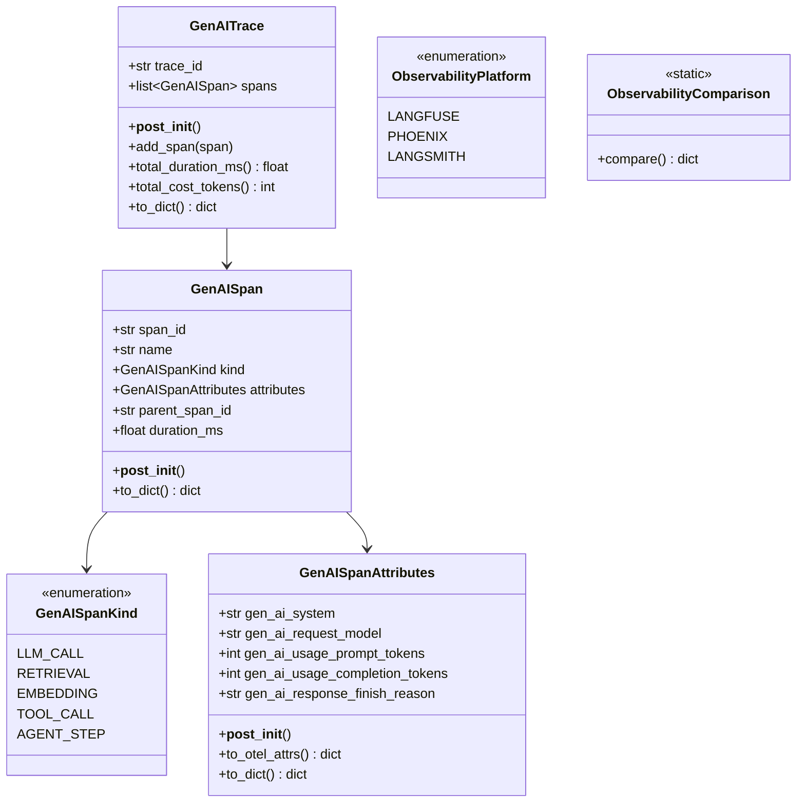
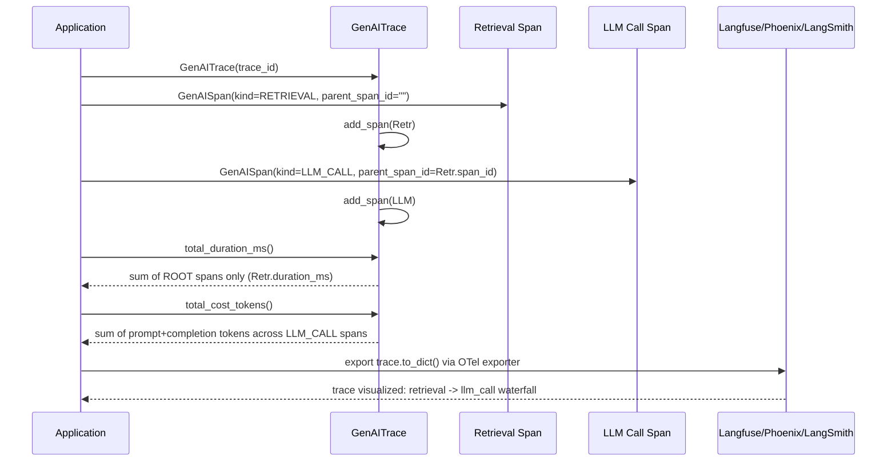

# Day 106 — LLM Observability: OTel GenAI, Langfuse/Phoenix/LangSmith Comparison

## WHY

A single RAG or agent request touches multiple distinct stages — retrieval, prompt construction, the LLM call itself, and post-processing — each with its own latency and cost profile. Without GenAI-aware tracing, an engineer looking at an aggregate p99 latency number has no way to tell whether a slow request is dominated by vector search, the model call, or a downstream tool. OpenTelemetry's GenAI semantic conventions extend the canonical distributed-trace span model with LLM-specific attributes (`gen_ai.system`, `gen_ai.request.model`, `gen_ai.usage.prompt_tokens`, etc.), so a trace becomes portable across backends instead of being locked into one vendor's proprietary schema.

Three popular platforms implement (or compete with) this idea differently: Langfuse (open-source, self-hostable, OTel-native), Phoenix (Arize, embedding/drift-aware), and LangSmith (LangChain-native, managed only). Choosing between them is a self-hosting / cost-tracking-granularity / eval-integration trade-off.

---

## HOW

`GenAISpanAttributes` models the dotted OTel GenAI attribute keys as a flat dataclass; `to_otel_attrs()` converts the Pythonic field names (`gen_ai_request_model`) into the dotted wire format (`gen_ai.request.model`) that an actual OTel exporter would emit. `GenAISpan` wraps these attributes with span identity (`span_id`, `parent_span_id`) and `kind` (one of `LLM_CALL`, `RETRIEVAL`, `EMBEDDING`, `TOOL_CALL`, `AGENT_STEP`).

`GenAITrace` aggregates spans under a single `trace_id`. `total_duration_ms()` sums only **root-level** spans (those with no `parent_span_id`) — child spans are nested inside their parent's duration and double-counting them would inflate the total. `total_cost_tokens()` sums prompt+completion tokens only across `LLM_CALL` spans — retrieval/tool spans don't consume LLM tokens directly.

---

## Class Diagram

---

## Sequence Diagram — Building a Trace for a RAG Request

---

## Key Takeaways

1. OTel GenAI conventions (`gen_ai.*` dotted attrs) make traces portable across Langfuse/Phoenix/LangSmith/custom backends — avoid vendor lock-in at the instrumentation layer.
2. `GenAITrace.total_duration_ms()` only sums root spans — child span durations are already nested inside their parent, so summing all spans would double-count.
3. `total_cost_tokens()` filters to `LLM_CALL` spans specifically — retrieval and tool-call spans have their own cost dimensions (vector DB queries, API calls) that don't belong in token-cost aggregation.
4. Langfuse and Phoenix are self-hostable and OTel-native; LangSmith is managed-only and LangChain-native — pick based on your self-hosting and ecosystem constraints.
