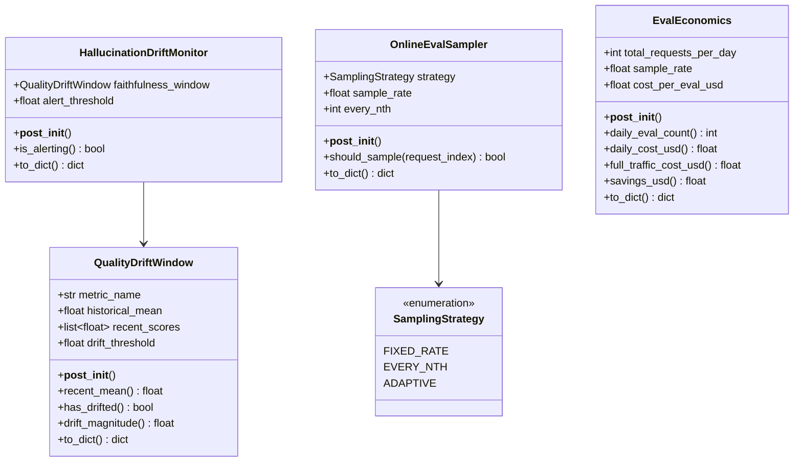
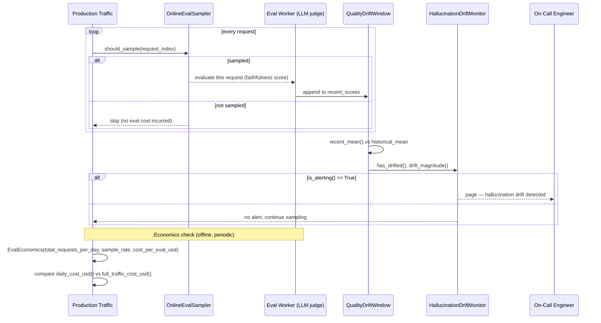

# Day 107 — LLM Monitoring in Prod: Quality/Hallucination Drift, Online Eval, Full-Traffic Economics

## WHY

Offline eval at deploy time catches regressions you already anticipated, but it cannot catch drift that emerges only in production: shifting user query distributions, upstream document changes feeding a RAG retriever, or subtle model-provider updates that silently change output characteristics. Two related but distinct phenomena need monitoring:

- **Quality drift** — a rolling window of eval scores trending down relative to a historical baseline.
- **Hallucination drift** — the faithfulness-specific case of quality drift, worth its own alert because hallucination has outsized trust/safety consequences.

You cannot afford to eval 100% of production traffic — at scale, every evaluated request costs money (an LLM-judge call, a human reviewer, or both). Online eval samples a fraction of traffic, trading signal for cost. Understanding the economics (sample rate × volume × cost-per-eval) tells you exactly what you're paying to maintain visibility, and what full-traffic coverage would cost by comparison.

---

## HOW

`QualityDriftWindow` compares a `recent_scores` rolling window's mean against a `historical_mean`; `has_drifted()` fires when the relative drop `(historical_mean - recent_mean) / historical_mean` exceeds `drift_threshold`. `HallucinationDriftMonitor` wraps a faithfulness-specific `QualityDriftWindow` and escalates to `is_alerting()` only when drift is **both** detected and its magnitude exceeds a separate, typically higher, `alert_threshold` — this two-stage check avoids paging on-call for noise-level drift while still catching real degradation.

`OnlineEvalSampler` decides which requests get evaluated: `FIXED_RATE` and `ADAPTIVE` both hash the request index into a `[0,100)` bucket and compare against `sample_rate*100`; `EVERY_NTH` deterministically samples every Nth request. `EvalEconomics` computes the resulting `daily_cost_usd()` against the hypothetical `full_traffic_cost_usd()` (sample_rate=1.0) to make the cost/coverage trade-off explicit.

---

## Class Diagram

---

## Sequence Diagram — Production Monitoring Loop

---

## Key Takeaways

1. `QualityDriftWindow.has_drifted()` is a relative-drop check, not absolute — a metric with a low historical mean needs a smaller absolute drop to trigger.
2. `HallucinationDriftMonitor.is_alerting()` requires both `has_drifted()` AND `drift_magnitude() > alert_threshold` — a two-stage gate that reduces alert noise.
3. `EVERY_NTH` sampling is deterministic and easy to reason about; `FIXED_RATE`/`ADAPTIVE` use hash-based sampling for a target percentage of traffic.
4. `EvalEconomics.savings_usd()` quantifies exactly what sampling buys you over full-traffic eval — use it to justify (or challenge) your current sample rate.
