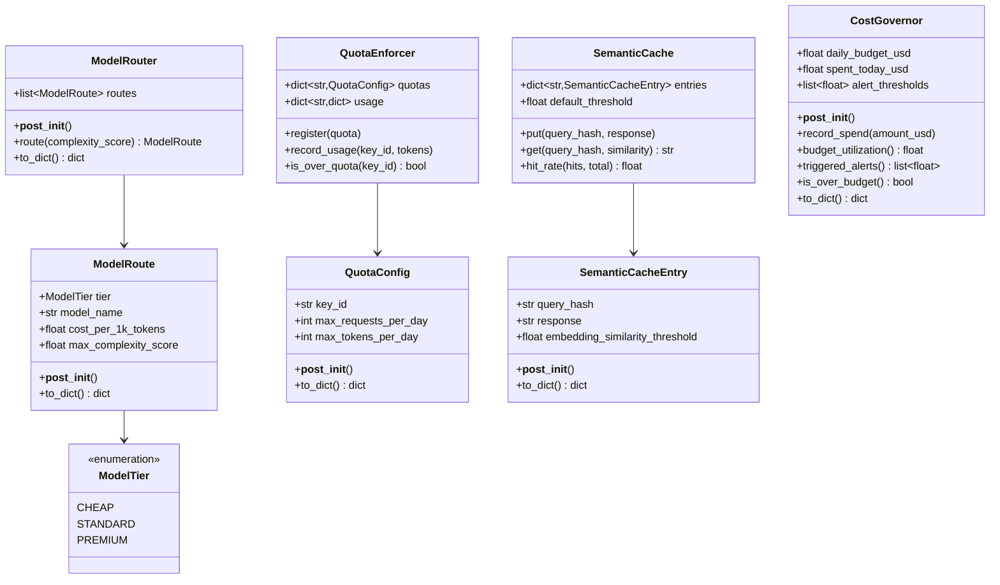
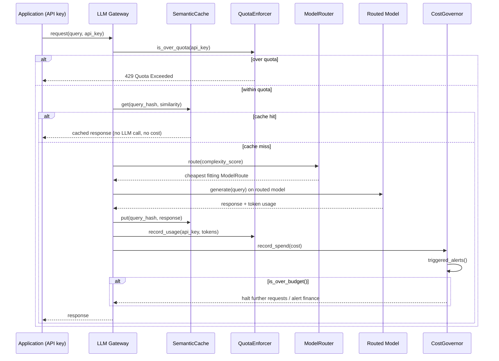

# Day 108 — LLM Gateway Architecture: Model Routing, Quota Enforcement, Semantic Caching, Cost Governance

## WHY

Without a centralizing gateway, every team in an organization calls LLM provider APIs directly — there's no shared cost visibility, no quota enforcement preventing one team from exhausting a shared budget, and no de-duplication of semantically identical requests (huge waste for FAQ-style or templated traffic). A gateway sits between applications and the LLM provider(s) and owns four concerns:

1. **Model routing** — send cheap/simple queries to a cheap model and only escalate to an expensive model when complexity demands it.
2. **Quota enforcement** — cap usage per tenant/API-key so no single caller can blow the shared budget or rate limit.
3. **Semantic caching** — detect and reuse responses for queries that are semantically (not just textually) identical to a prior request.
4. **Cost governance** — aggregate spend across all callers and trigger alerts at configurable budget thresholds before the bill surprises anyone.

---

## HOW

`ModelRouter.route(complexity_score)` sorts its `ModelRoute`s by `max_complexity_score` ascending and returns the first (cheapest) route whose ceiling is still `>=` the query's complexity — i.e., escalate only as far as necessary, never further. `QuotaEnforcer` tracks per-key `usage` (`requests`, `tokens`) against a registered `QuotaConfig`; `is_over_quota()` checks both dimensions, since a key could exhaust its token budget well before its request-count budget or vice versa.

`SemanticCache` stores `(query_hash -> SemanticCacheEntry)` pairs; `get(query_hash, similarity)` returns the cached response only if the provided similarity score (computed upstream by an embedding comparison) meets the entry's own `embedding_similarity_threshold` — different cached entries can demand different confidence levels. `CostGovernor` accumulates `spent_today_usd` and reports which `alert_thresholds` (e.g. 50%, 80%, 100%) have been crossed via `triggered_alerts()`, with `is_over_budget()` as the hard stop signal.

---

## Class Diagram

---

## Sequence Diagram — A Request Through the Gateway

---

## Key Takeaways

1. `ModelRouter.route()` always picks the **cheapest** route that still fits the complexity ceiling — escalation is monotonic and cost-minimizing.
2. `QuotaEnforcer.is_over_quota()` checks both request count and token count — either dimension can independently trip the limit.
3. `SemanticCache` keys are query hashes, but the threshold for a hit is per-entry (`embedding_similarity_threshold`), allowing different confidence bars for different cached answers.
4. `CostGovernor.triggered_alerts()` returns every threshold crossed, not just the highest — lets you distinguish "approaching budget" (50%/80%) from "over budget" (100%+) alerts.
5. A gateway turns four previously invisible problems (routing cost, quota abuse, redundant calls, runaway spend) into explicit, testable, governed logic.
