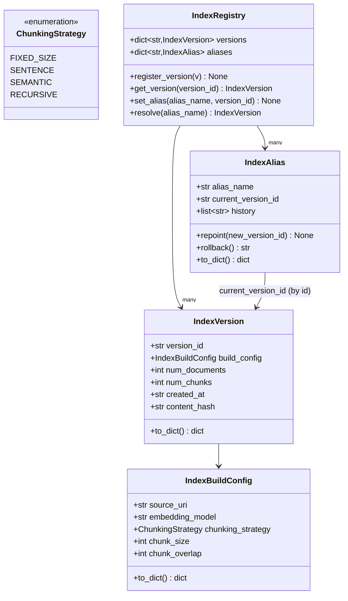
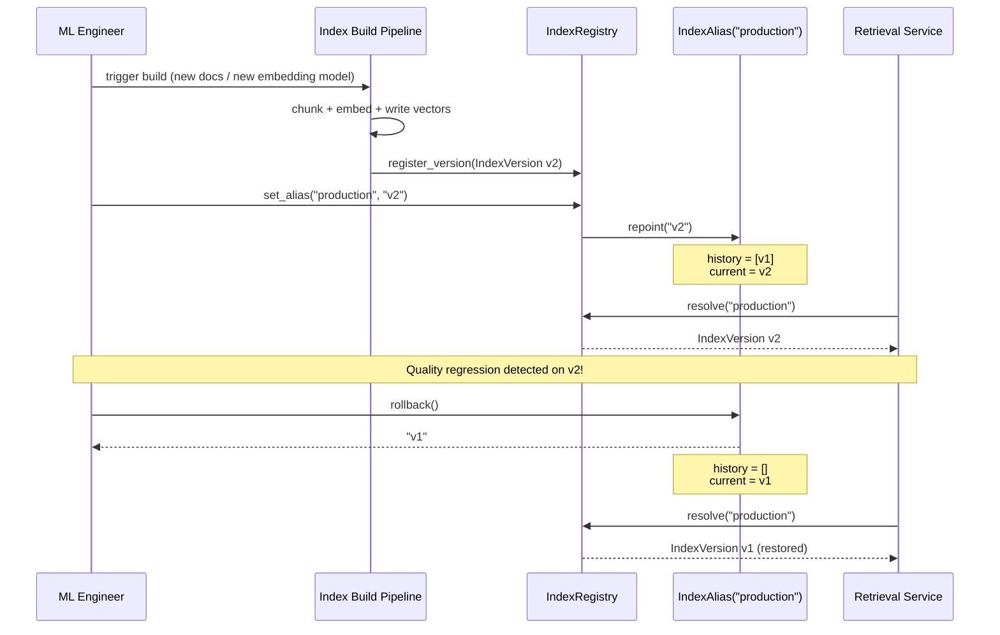

# Day 109 — Index Build Pipeline + Versioning + Rollback

**Phase 15: RAG Production Operations | Module:** `platform/llm/index_pipeline.py`

## WHY

A vector index is the load-bearing artifact of a RAG system, exactly the way a
trained model checkpoint is the load-bearing artifact of a classical ML
system. It deserves the same production guarantees:

- **Reproducibility** — given an index version, you must be able to say
  exactly what documents, chunking strategy, and embedding model produced it.
- **Immutability** — once built, a version never changes in place. Mutating
  an index silently (re-embedding chunks, dropping documents) breaks the
  ability to reason about why retrieval quality changed.
- **Instant rollback** — if a re-index introduces bad chunks, a broken
  embedding model, or corrupted source documents, you need to revert
  production traffic to the last known-good version in seconds, not by
  re-running the whole pipeline.

Without versioning, "the index" is a mutable blob nobody can audit. A bad
re-index becomes a multi-hour incident instead of a one-line pointer flip.

## HOW

Every build of an index produces an `IndexVersion`: an immutable record
identified by a `version_id` and a `content_hash` derived from the build
configuration (embedding model, chunking strategy, chunk count). The actual
"production index" that the serving layer queries is never referenced
directly — it's referenced through an `IndexAlias`, a named pointer (e.g.
`"production"`) that can be repointed to any registered version.

- **Build** → produces a new immutable `IndexVersion`, registered in the
  `IndexRegistry`.
- **Promote** → `IndexRegistry.set_alias("production", new_version_id)`
  repoints the alias, pushing the previous version onto `history`.
- **Rollback** → `IndexAlias.rollback()` pops the last entry off `history`
  and makes it current again — no rebuild required.

This mirrors model registry patterns (MLflow Model Registry stages, SageMaker
Model Package versions) applied to retrieval indexes.

## Class Diagram

## Sequence Diagram — Build, Promote, and Rollback

## Key Design Points

- `content_hash` is computed automatically in `__post_init__` from
  `embedding_model:chunking_strategy:num_chunks` via SHA-256 (truncated to 12
  hex chars) — this gives a cheap fingerprint for spotting accidental
  duplicate builds, without requiring a full corpus hash.
- `IndexAlias.history` is a simple stack: `repoint` pushes, `rollback` pops.
  Multiple rollbacks walk back through prior promotions.
- `IndexRegistry.set_alias` is idempotent for "first use" (creates the alias)
  vs. "subsequent use" (repoints) — callers never need to branch on whether
  the alias already exists.
