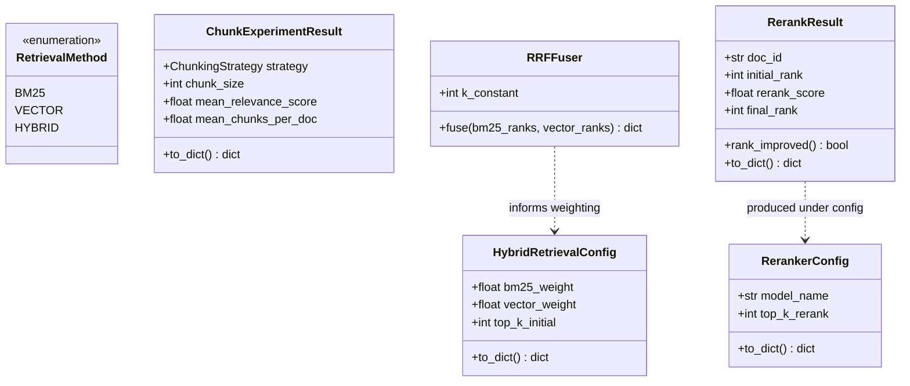
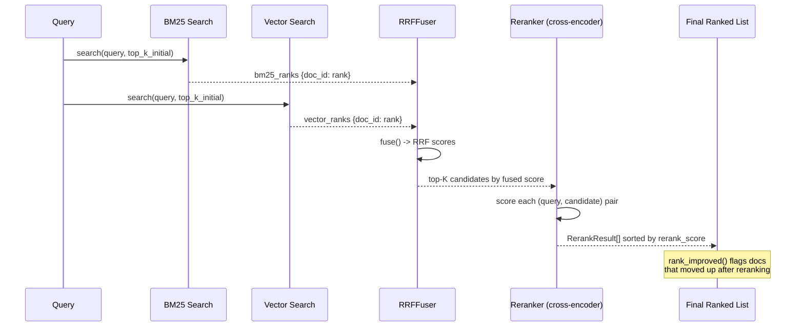

# Day 110 — Chunking Experiments + Hybrid Retrieval (BM25 + Vector) + Reranking

**Phase 15: RAG Production Operations | Module:** `platform/llm/retrieval.py`

## WHY

No single chunking strategy or retrieval method is universally correct:

- **Fixed-size chunking** is cheap and predictable but can slice a sentence
  (or a fact) in half across a chunk boundary.
- **Semantic chunking** respects meaning boundaries (paragraphs, sections)
  but is slower and harder to tune.
- **Pure vector search** is great at paraphrases and synonyms but misses
  exact-match queries — product codes, IDs, proper nouns that an embedding
  model may smear into a generic region of vector space.
- **Pure BM25** (sparse, keyword-based) nails exact matches but misses
  semantically related text that uses different words.

Hybrid retrieval combines both so a query benefits from whichever signal is
stronger. Reranking then spends a more expensive cross-encoder model — one
that scores a `(query, candidate)` pair jointly instead of comparing
independent embeddings — but only on the top-K candidates from cheap initial
retrieval, never on the whole corpus. This is the classic "cheap broad recall
→ expensive narrow precision" funnel.

## HOW

1. **Chunking experiments** — sweep `ChunkingStrategy` × `chunk_size`,
   measure `mean_relevance_score` (how good are retrieved chunks) and
   `mean_chunks_per_doc` (index bloat/fragmentation) per configuration.
2. **Hybrid fusion** — run BM25 and vector search independently, each
   producing a ranked list of `top_k_initial` candidates. Combine via
   **Reciprocal Rank Fusion (RRF)**: `score = 1/(k + rank_bm25) + 1/(k +
   rank_vector)`, where `k` (`k_constant`, conventionally 60) dampens the
   effect of any single very-high rank dominating the fused score. A
   candidate appearing in only one list still contributes its term; missing
   from a list contributes 0 for that term.
3. **Reranking** — take the fused top-K candidates, score each with a
   cross-encoder (`RerankerConfig.model_name`), and re-sort. `RerankResult`
   captures both `initial_rank` (from fused retrieval) and `final_rank`
   (post-rerank) so `rank_improved()` shows whether reranking actually moved
   a relevant doc up.

## Class Diagram

## Sequence Diagram — Hybrid Retrieval + Rerank Pipeline

## Key Design Points

- `RRFFuser.fuse` only adds a rank term for lists where the doc actually
  appears — a doc retrieved by only one method isn't penalized to zero, it
  just doesn't get the second term's boost.
- `HybridRetrievalConfig` validates `bm25_weight + vector_weight ≈ 1.0`
  (used for weighted-score fusion as an alternative to RRF), while
  `RRFFuser.k_constant` is independent of those weights — RRF doesn't use the
  weight fields directly, it's rank-based, not score-based.
- Reranking is **deliberately bounded** by `top_k_rerank` — applying a
  cross-encoder to the full corpus per query would be prohibitively
  expensive; it's only viable on a shortlist.
