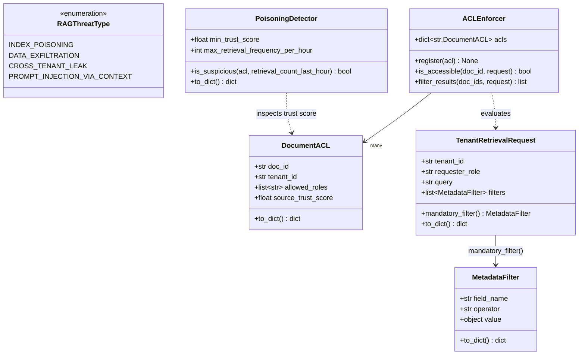
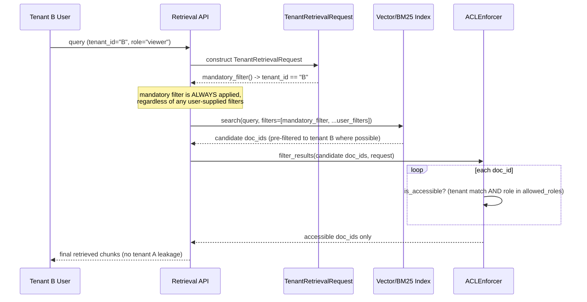

# Day 111 — Metadata Filtering + Multi-Tenant Retrieval Security + Document ACL Propagation

**Phase 15: RAG Production Operations | Module:** `platform/llm/retrieval_security.py`

## WHY

Vector similarity has no concept of "who is allowed to see this." If tenant
A's confidential contract and tenant B's query happen to land near each
other in embedding space, a naively-shared index will happily retrieve A's
document for B's query — a cross-tenant data leak that looks like a normal
retrieval result, not an obvious bug.

Two related threats this module defends against:

- **Cross-tenant leak / data exfiltration** — access control set at
  ingestion time (`DocumentACL`) must propagate all the way through to
  retrieval-time filtering. If it doesn't, "shared index, per-tenant
  metadata tag" is security theater.
- **Index poisoning** — an attacker contributes a document designed to be
  retrieved for unrelated queries (e.g. stuffed with generic high-frequency
  terms) and to inject malicious instructions into the LLM's context. This
  is a supply-chain-style attack on the corpus itself.

## HOW

- Every document/chunk carries a `DocumentACL` at ingestion: which tenant it
  belongs to, which roles may view it, and a `source_trust_score` reflecting
  how trusted its origin is.
- Every retrieval request is a `TenantRetrievalRequest` carrying the
  requester's `tenant_id` and `requester_role`. Its `mandatory_filter()`
  **always** returns a `tenant_id == self.tenant_id` filter — this is
  computed from the request's own identity, not from anything the caller
  supplies, so a malicious or buggy caller cannot override it by passing a
  different `tenant_id` filter in `filters`.
- `ACLEnforcer` is the actual gate: `is_accessible` requires both tenant
  match AND role membership; `filter_results` runs every candidate through
  that gate before chunks reach the LLM prompt.
- `PoisoningDetector` flags documents whose `source_trust_score` is below a
  floor, or whose retrieval frequency spikes abnormally (a sign of
  prompt-stuffing or SEO-style manipulation targeting the retriever).

## Class Diagram

## Sequence Diagram — Mandatory Tenant Filter + ACL Enforcement

## Key Design Points

- The mandatory filter is enforced **in two layers**: ideally pushed down
  into the index query itself (cheap), and always re-checked by
  `ACLEnforcer.filter_results` as defense-in-depth (catches index
  bugs/misconfiguration).
- `is_accessible` defaults to `False` for unregistered `doc_id`s — fail
  closed, not fail open.
- `PoisoningDetector.is_suspicious` is intentionally a simple OR of two
  independent signals (low trust OR abnormal frequency) so either alone is
  enough to flag for review.
