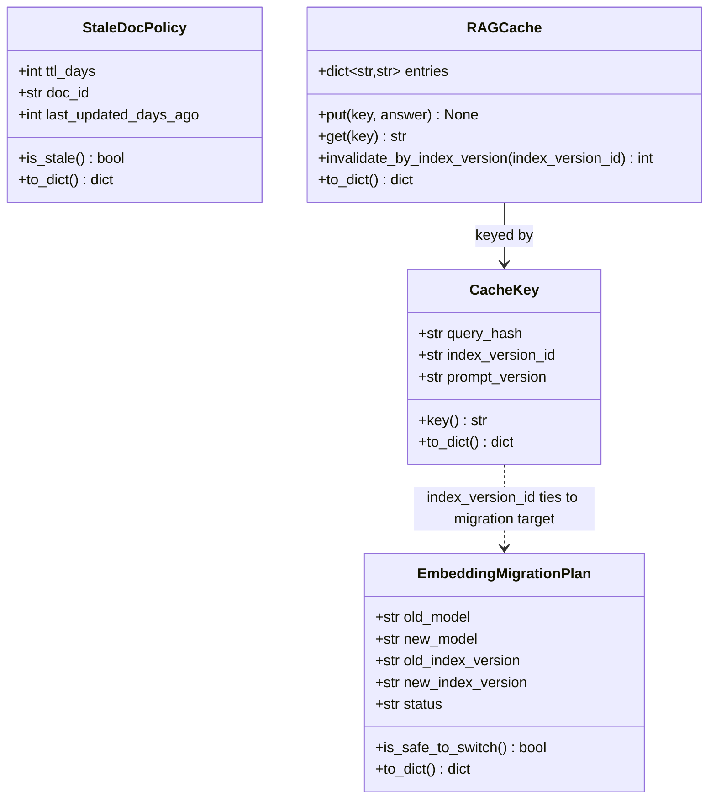
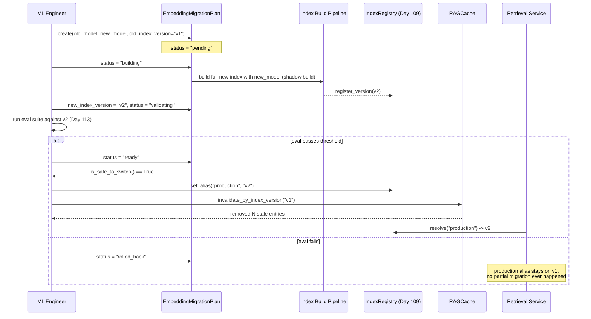

# Day 112 — Stale-Document Removal + Embedding-Model Migration + RAG Cache Invalidation

**Phase 15: RAG Production Operations | Module:** `platform/llm/index_lifecycle.py`

## WHY

Indexes are not "build once, query forever" artifacts. Three forms of decay
threaten correctness over time:

- **Stale documents** — a deprecated policy or outdated price sheet stays
  retrievable forever unless something explicitly sweeps it out. The result
  is confidently wrong answers sourced from content that's no longer true.
- **Embedding-model migration** — this is the highest-risk lifecycle event.
  Vectors from two different embedding models are **not comparable** — they
  live in different, unrelated vector spaces, even if dimensionality
  happens to match. Mixing old and new embeddings in the same similarity
  search silently produces garbage rankings with no error, no exception,
  just bad retrieval that looks plausible.
- **Stale cache** — a cached `query -> answer` pair served after the
  underlying document or index changed silently serves an outdated answer
  with full confidence.

## HOW

- **Stale docs**: `StaleDocPolicy` is a pure TTL check —
  `last_updated_days_ago > ttl_days`. A sweep job iterates documents,
  evaluates this policy, and purges anything stale from the index.
- **Embedding migration**: `EmbeddingMigrationPlan` models the migration as
  an explicit state machine: `pending → building → validating → ready →
  (switch)`, with `rolled_back` as an escape hatch. The new index is always
  built **fully, in parallel**, as a brand-new `IndexVersion` (Day 109) — it
  is never partially migrated in place. `is_safe_to_switch()` only returns
  `True` once status is `"ready"` AND a `new_index_version` actually exists,
  guarding against switching to an empty/unbuilt target.
- **Cache invalidation**: `CacheKey.key()` bakes the `index_version_id`
  (and `prompt_version`) directly into the cache key string. When an index
  is rebuilt and a new version is promoted, all old cache entries become
  unreachable by construction — no separate invalidation logic needed for
  the *new* version's queries. `RAGCache.invalidate_by_index_version`
  additionally provides an explicit sweep to reclaim memory from now-dead
  entries tied to retired index versions.

## Class Diagram

## Sequence Diagram — Safe Embedding Migration with Cache Invalidation

## Key Design Points

- `EmbeddingMigrationPlan` validates `old_model != new_model` — a
  "migration" to the same model is a no-op and likely a config bug, so it's
  rejected at construction.
- `is_safe_to_switch()` is a conjunction, not an OR — both `status ==
  "ready"` and a populated `new_index_version` are required, so an
  incomplete plan can never be mistaken for a safe one.
- `invalidate_by_index_version` checks for the delimited substring
  `f":{index_version_id}:"`, not a bare substring match, so `"v1"` does not
  accidentally match `"v10"` — this was deliberately tested.
