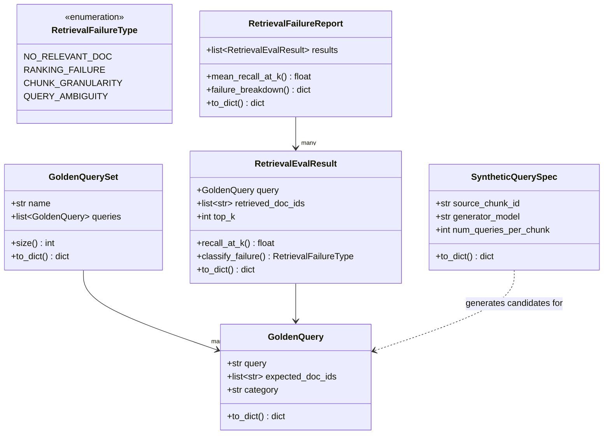
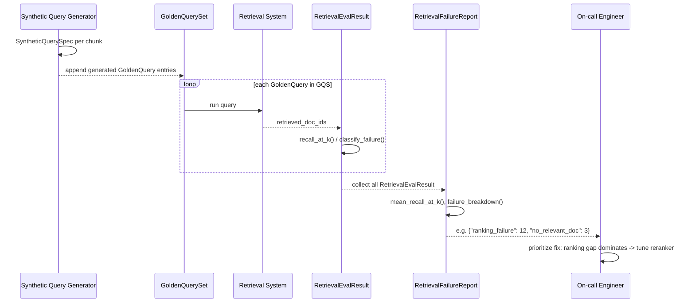

# Day 113 — Retrieval Failure Taxonomy + Golden Query Set + Synthetic Query Generation

**Phase 15: RAG Production Operations | Module:** `platform/llm/retrieval_eval.py`

## WHY

"RAG isn't working" is not actionable for an on-call engineer. The fix
differs completely depending on *why* it isn't working:

- The relevant document **doesn't exist** in the index at all (coverage
  gap — go fix ingestion).
- The relevant document **exists but wasn't retrieved** in the top-K
  (ranking gap — go fix the retriever/reranker/embedding model).
- The relevant document was retrieved, but the specific fact needed is
  **split across a chunk boundary** (chunking gap — go fix chunk size or
  strategy).
- The query itself is **ambiguous** and no single document set is "the"
  right answer (a query-design / UX problem, not a retrieval bug).

Golden query sets are expensive to hand-write at the scale needed for
confident regression detection. Synthetic query generation (LLM writes a
question that a chunk answers, with human spot-checking) scales eval
coverage by orders of magnitude.

## HOW

- A `GoldenQuery` pairs a `query` string with `expected_doc_ids` — the
  ground-truth set of documents that should be retrieved.
- `RetrievalEvalResult.recall_at_k()` measures what fraction of
  `expected_doc_ids` appear within `retrieved_doc_ids[:top_k]`.
- `classify_failure()` applies the taxonomy directly from that recall
  computation: perfect recall → no failure (`None`); zero overlap at all →
  `NO_RELEVANT_DOC`; partial overlap → `RANKING_FAILURE`. (`CHUNK_GRANULARITY`
  and `QUERY_AMBIGUITY` are reserved categories for richer failure analysis
  that requires inspecting chunk content/query semantics beyond doc-id
  overlap — this module establishes the taxonomy and the two
  automatically-derivable categories; the other two are assigned by human or
  LLM-judge review layered on top.)
- `SyntheticQuerySpec` describes how to scale the golden set: for a given
  `source_chunk_id`, ask `generator_model` to produce
  `num_queries_per_chunk` realistic questions that chunk answers, tagging
  the chunk as the expected source.
- `RetrievalFailureReport` aggregates many `RetrievalEvalResult`s into a
  `mean_recall_at_k()` and a `failure_breakdown()` — a count per failure
  type — so an engineer can see "60% of failures this week were ranking
  failures, not coverage gaps" and prioritize accordingly.

## Class Diagram

## Sequence Diagram — Eval Run + Failure Triage

## Key Design Points

- `recall_at_k()` truncates `retrieved_doc_ids` to `top_k` *before*
  comparing against expected — a relevant doc retrieved at rank 50 when
  `top_k=10` still counts as not-retrieved, matching what users actually
  see.
- `classify_failure()` returns `None` exactly when `recall_at_k() == 1.0`,
  keeping "passing" and "failing" mutually exclusive and unambiguous in
  `failure_breakdown()`.
- `failure_breakdown()` only counts non-`None` classifications, so a
  perfect-recall query never pollutes the breakdown.
