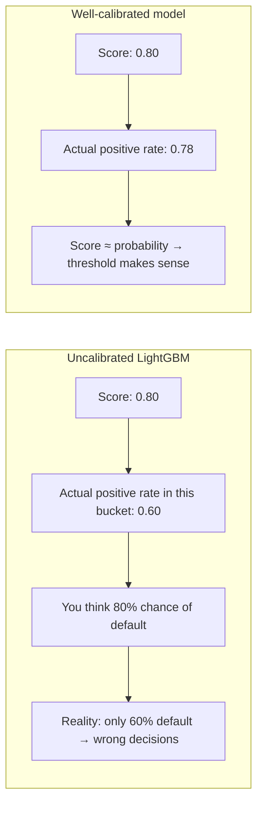
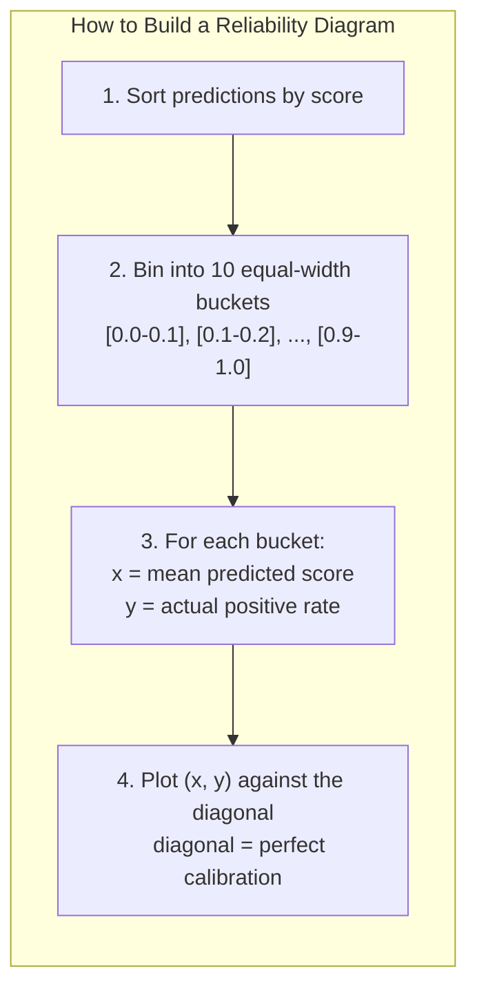
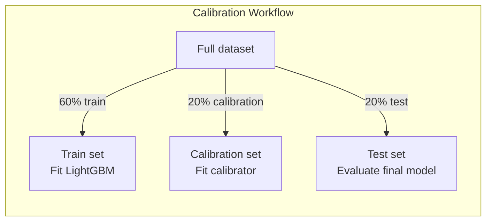

# Day 15 — Probability Calibration

> Tags: `[T][L]`  
> Deliverable: **`training/calibration.py`** — `CalibratedModel`, reliability diagram data, calibration report

---

## 1. The Calibration Problem

A classifier outputs a number between 0 and 1. We call it a "probability". But is it?

**Calibration** means: when the model outputs 0.7, the event should happen ~70% of the time.



### Why Does LightGBM Output Uncalibrated Probabilities?

LightGBM leaf values are optimized to minimize log-loss, not to produce calibrated probabilities. The model learns to rank well (high AUC) without caring whether 0.7 means "70% of the time".

**Result**: LightGBM tends to be **overconfident** (pushes scores toward 0 or 1) or has a systematic bias depending on class imbalance.

---

## 2. Diagnosing Miscalibration: The Reliability Diagram

The reliability diagram (calibration plot) is the standard diagnostic:



**Reading the diagram:**

| Pattern | Meaning |
|---|---|
| Points on the diagonal | Perfect calibration |
| Points below diagonal | Overconfident (model says 0.8, reality is 0.6) |
| Points above diagonal | Underconfident (model says 0.3, reality is 0.5) |
| S-curve shape | Common for tree models — overconfident in extremes |

**Our model's expected pattern**: LightGBM trained on imbalanced data (22% positive) tends to be overconfident for high-score predictions.

---

## 3. Calibration Metrics

### Expected Calibration Error (ECE)

$$ECE = \frac{1}{B} \sum_{b=1}^{B} |\overline{p}_b - \hat{p}_b|$$

Where:
- $B$ = number of bins (10)
- $\overline{p}_b$ = mean predicted probability in bin $b$
- $\hat{p}_b$ = fraction positive (actual rate) in bin $b$

**Interpretation**: ECE = 0 is perfect. ECE = 0.1 means on average the model is off by 10 percentage points. **ECE > 0.10 usually warrants calibration.**

### Brier Score

$$BS = \frac{1}{N} \sum_{i=1}^{N} (y_i - \hat{p}_i)^2$$

Lower is better. Decomposes into **calibration** + **refinement** (sharpness). A perfectly calibrated but uninformative model (always predict the base rate) has BS = base_rate × (1 - base_rate).

For our 22% positive rate: uninformative BS = 0.22 × 0.78 = **0.172**. A good model should be well below this.

---

## 4. Calibration Methods

### Platt Scaling (Sigmoid Calibration)

Fit a logistic regression on the raw scores with the true labels:
$$P(Y=1 \mid s) = \sigma(As + B)$$

**Pros**: Works with very small calibration sets (>100 samples).  
**Cons**: Assumes sigmoid shape — fails if miscalibration is non-monotone.  
**When to use**: When you have < 1000 calibration samples.

### Isotonic Regression

Fit a non-decreasing piecewise-constant function to map raw scores to calibrated probabilities:
$$P(Y=1 \mid s) = f_{isotonic}(s)$$

**Pros**: No parametric assumption — can correct any monotone miscalibration.  
**Cons**: Needs > 1000 samples; can overfit on small datasets.  
**When to use**: Default for production models with ≥ 1000 calibration samples.



**Critical**: never calibrate on training data. The model has already overfit to the training set; its scores on those samples are artificially extreme.

---

## 5. Code Walkthrough

### `training/calibration.py`

```python
from sklearn.calibration import CalibratedClassifierCV

def fit_calibrator(base_model, X_cal, y_cal, method="isotonic"):
    """cv="prefit" means: base_model is already fitted, calibrate on X_cal."""
    calibrated = CalibratedClassifierCV(base_model, cv="prefit", method=method)
    calibrated.fit(X_cal, y_cal)
    return calibrated
```

`cv="prefit"` is the key: it tells sklearn not to refit the base model. The `fit()` call only fits the calibrator on the calibration set.

### `CalibrationReport`

```python
report = calibration_report(base_model, calibrated_model, X_test, y_test)
# CalibrationReport(
#     method="isotonic",
#     ece_before=0.087,
#     ece_after=0.031,
#     brier_before=0.143,
#     brier_after=0.137,
# )
report.improved  # True (ECE improved)
```

### `reliability_data`

Returns a DataFrame suitable for logging as a CSV artifact to MLflow:
```python
df = reliability_data(y_true, y_prob, n_bins=10)
# mean_predicted | fraction_positive | gap
#  0.05            0.03               -0.02
#  0.15            0.12               -0.03
#  ...
```

---

## 6. Integrating Calibration into the Training Pipeline

```python
# In mlflow_train.py (after Day 15):
from training.calibration import fit_calibrator, calibration_report, reliability_data

# Split into train / cal / test:
n = len(df)
train_end = int(n * 0.60)
cal_end = int(n * 0.80)

df_train = df.iloc[:train_end]
df_cal = df.iloc[train_end:cal_end]
df_test = df.iloc[cal_end:]

# Fit base model on train only:
model = build_lgbm(cfg, ...)
model.fit(X_train, y_train)

# Fit calibrator on calibration set:
calibrated = fit_calibrator(model, X_cal, y_cal, method="isotonic")

# Compare:
report = calibration_report(model, calibrated, X_test, y_test)
report.log_summary()

# Log to MLflow:
mlflow.log_metric("ece_before_calibration", report.ece_before)
mlflow.log_metric("ece_after_calibration", report.ece_after)
rel_df = reliability_data(y_test, calibrated.predict_proba(X_test)[:, 1])
rel_df.to_csv("metrics/reliability_diagram.csv", index=False)
mlflow.log_artifact("metrics/reliability_diagram.csv")
```

---

## 7. How to Run

```bash
cd platform

# Run calibration check on a trained model:
make mlflow-train      # ensures model is trained and metrics exist
# Then in Python:
uv run python -c "
import pickle
import numpy as np
import pandas as pd
from pathlib import Path
from training.calibration import fit_calibrator, calibration_report, reliability_data

model = pickle.load(open('models/credit_risk_model.pkl', 'rb'))
df = pd.read_parquet('data/processed/features.parquet')

# Split: first 60% train, next 20% calibration, last 20% test
n = len(df)
y = df['DEFAULT_PAYMENT_NEXT_MONTH']
X = df.drop(columns=['DEFAULT_PAYMENT_NEXT_MONTH', 'ID'])
X_cal = X.iloc[int(n*0.6):int(n*0.8)]
y_cal = y.iloc[int(n*0.6):int(n*0.8)]
X_test = X.iloc[int(n*0.8):]
y_test = y.iloc[int(n*0.8):]

cal = fit_calibrator(model, X_cal.to_numpy(), y_cal.to_numpy())
report = calibration_report(model, cal, X_test.to_numpy(), y_test.to_numpy())
print(f'ECE: {report.ece_before:.4f} -> {report.ece_after:.4f}')
print(f'Improved: {report.improved}')
"

# Run the unit tests:
uv run pytest tests/unit/test_calibration.py -v
```

---

## 8. Debugging Calibration Issues

| Symptom | Likely Cause | Fix |
|---|---|---|
| ECE very high (> 0.15) | Severe class imbalance + no calibration | Use isotonic with ≥ 1000 cal samples |
| ECE improves but Brier gets worse | Calibrator overfitting | Use sigmoid (Platt) instead of isotonic |
| ECE = 0 but AUC = 0.5 | Model is perfectly calibrated but useless | Calibration ≠ discrimination |
| Reliability diagram has missing bins | Too few samples in extreme bins | Reduce n_bins to 5 |
| `CalibratedClassifierCV` raises | base_model has no predict_proba | Check model type |

---

## Key Takeaways

- **Calibration ≠ AUC.** A model can rank well (AUC=0.82) and be badly calibrated (ECE=0.15).
- **Calibration matters when the score drives a threshold decision.** The threshold in Day 16 only makes sense if the score is a true probability.
- **Use isotonic regression for production models** with ≥ 1000 calibration samples; Platt scaling otherwise.
- **Always hold out a separate calibration set** (not training, not test).
- **Calibration can hurt AUC slightly** (it re-maps scores, not ranks). Check both before and after.
