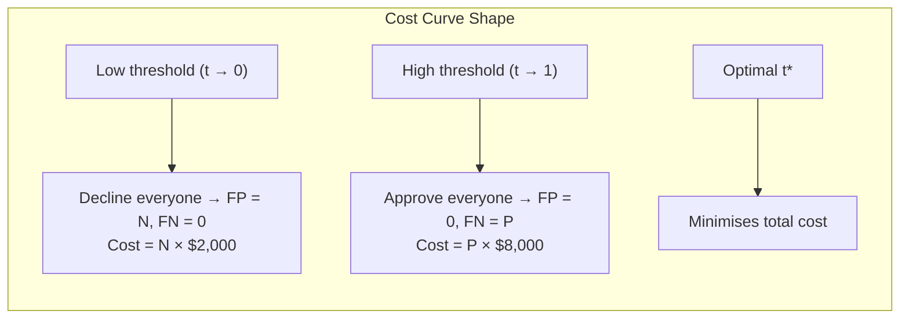
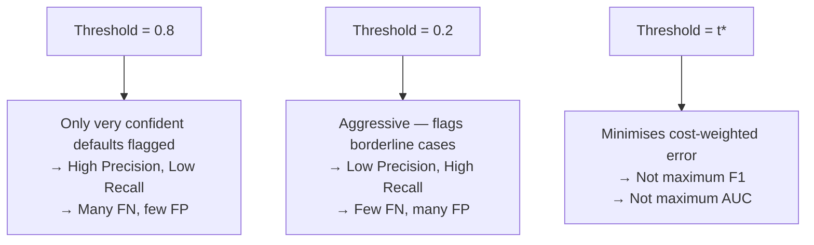
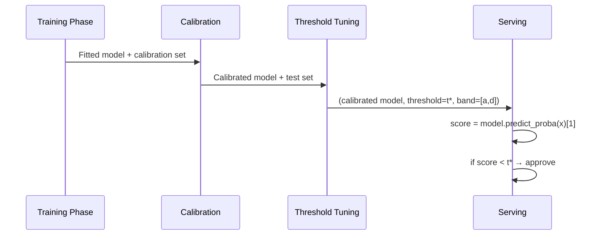

# Day 16 — Cost-Sensitive Threshold Tuning

> Tags: `[L]`  
> Deliverable: **`training/threshold.py`** — `find_cost_optimal_threshold`, `threshold_sweep`, `ThresholdResult`

---

## 1. Why 0.5 Is Almost Never the Right Threshold

Default classifiers output a threshold of 0.5: predict positive if score ≥ 0.5.  
This makes sense only when the cost of being wrong is symmetric.

For the credit risk model (system design from Day 4):

| Decision | Reality | Consequence | Cost |
|---|---|---|---|
| Approve (score < threshold) | Customer defaults | False Negative | **$8,000** loan loss |
| Decline (score ≥ threshold) | Customer was good | False Positive | **$2,000** lost LTV |
| Approve | Customer pays | True Negative | $0 |
| Decline | Customer would default | True Positive | $0 |

FN is **4× more expensive** than FP. Threshold 0.5 ignores this asymmetry.

**Intuition**: if declining a good customer costs $2K and approving a bad one costs $8K, you should be more conservative — lower the threshold to catch more defaulters, even at the cost of more false positives.

---

## 2. Cost-Sensitive Threshold Selection

### The Cost Function

$$\text{TotalCost}(t) = \text{FP}(t) \times C_{FP} + \text{FN}(t) \times C_{FN}$$

Where FP(t) and FN(t) are the false positives and false negatives at threshold $t$.



### Closed-Form Intuition

The optimal threshold balances the marginal costs:

$$t^* \approx \frac{C_{FP}}{C_{FP} + C_{FN}} = \frac{2000}{2000 + 8000} = 0.20$$

This is a heuristic (assumes equal class frequencies) but gives the right order of magnitude. The empirical search confirms the exact value for our dataset.

---

## 3. Threshold vs Precision-Recall Trade-off



**F-beta score** generalises F1:
$$F_\beta = (1 + \beta^2) \cdot \frac{\text{precision} \times \text{recall}}{(\beta^2 \times \text{precision}) + \text{recall}}$$

Setting $\beta = \sqrt{C_{FN}/C_{FP}} = \sqrt{4} = 2$ produces F2, which weights recall twice as much as precision. Maximising F2 approximates the cost-optimal threshold.

---

## 4. Interaction with Calibration

**Calibration must come before threshold tuning.**

If the model outputs score=0.8 when the true probability is 0.6, and you set threshold=0.7, you're actually thresholding at the wrong probability. After calibration:
- score=0.8 means ~80% chance of default → threshold=0.7 means: decline if > 70% probable
- Without calibration: you don't know what score=0.7 means in probability terms



---

## 5. Code Walkthrough

### `training/threshold.py`

```python
def find_cost_optimal_threshold(
    y_true, y_prob,
    fp_cost=2_000.0,
    fn_cost=8_000.0,
    n_points=200,
) -> ThresholdResult:
    thresholds = np.linspace(0.01, 0.99, n_points)
    best_cost = float("inf")
    best_t = 0.5

    for t in thresholds:
        y_pred = (y_prob >= t).astype(int)
        tn, fp, fn, tp = confusion_matrix(y_true, y_pred).ravel()
        cost = fp * fp_cost + fn * fn_cost
        if cost < best_cost:
            best_cost = cost
            best_t = t
    ...
    return ThresholdResult(threshold=best_t, total_cost=best_cost, ...)
```

### `threshold_sweep` for Plotting

```python
df = threshold_sweep(y_true, y_prob)
# Returns DataFrame:
# threshold | total_cost | fp | fn | precision | recall
# 0.010     | 54_400     | 0  |...
# 0.015     | ...
# ...minimum cost row at ~threshold 0.20-0.30...
```

Use this to plot the cost curve and verify the optimal threshold visually.

---

## 6. Running Threshold Analysis

```bash
cd platform

# Train + compute threshold:
uv run python -c "
import pandas as pd
import numpy as np
import pickle
from training.threshold import find_cost_optimal_threshold, threshold_sweep

model = pickle.load(open('models/credit_risk_model.pkl', 'rb'))
df = pd.read_parquet('data/processed/features.parquet')

n = len(df)
target = 'DEFAULT_PAYMENT_NEXT_MONTH'
X = df.drop(columns=[target, 'ID']).iloc[int(n*0.8):]
y = df[target].iloc[int(n*0.8):]
y_prob = model.predict_proba(X.to_numpy())[:, 1]
y_true = y.to_numpy()

result = find_cost_optimal_threshold(y_true, y_prob)
result.log_summary()
print(f'Optimal threshold: {result.threshold:.3f}')
print(f'Expected cost per sample: \${result.expected_cost_per_sample:.2f}')
print(f'Precision: {result.precision:.3f}, Recall: {result.recall:.3f}')

sweep = threshold_sweep(y_true, y_prob)
print(sweep.sort_values('total_cost').head(5).to_string())
"

# Run tests:
uv run pytest tests/unit/test_threshold.py -v
```

---

## 7. Logging Threshold to MLflow

```python
# In mlflow_train.py:
from training.threshold import find_cost_optimal_threshold, threshold_sweep

result = find_cost_optimal_threshold(y_test, y_prob)
mlflow.log_metric("optimal_threshold", result.threshold)
mlflow.log_metric("threshold_expected_cost_per_sample", result.expected_cost_per_sample)
mlflow.log_metric("threshold_precision", result.precision)
mlflow.log_metric("threshold_recall", result.recall)

# Save sweep CSV as artifact:
sweep_df = threshold_sweep(y_test, y_prob)
sweep_df.to_csv("metrics/threshold_sweep.csv", index=False)
mlflow.log_artifact("metrics/threshold_sweep.csv")
```

---

## 8. Debugging

| Symptom | Cause | Fix |
|---|---|---|
| Optimal threshold = 0.01 | FN cost >> FP cost + extreme imbalance | Check cost values; verify class balance |
| Cost curve is flat | Scores cluster at 0 or 1 | Calibration needed before threshold tuning |
| Optimal threshold varies run-to-run | Non-determinism in training | Fix seeds (Phase 1) before doing threshold analysis |
| Recall = 1.0 at optimal threshold | Threshold too low | Check FP/FN cost ratio — may be set incorrectly |
| Threshold different in prod vs eval | Train/serve skew (Phase 3) | Verify feature distributions match |

---

## Key Takeaways

- **Threshold tuning is a business decision**, not a ML decision. The FP and FN costs come from the domain (Day 4 system design).
- **The optimal threshold is approximately C_FP / (C_FP + C_FN) = 0.20** for this domain.
- **Always calibrate first, then tune the threshold.** Without calibration, the threshold has no probability interpretation.
- **Log the threshold to MLflow** alongside the model — it's part of the serving contract.
- **The threshold is not the model.** A model version can have multiple thresholds for different business contexts.
