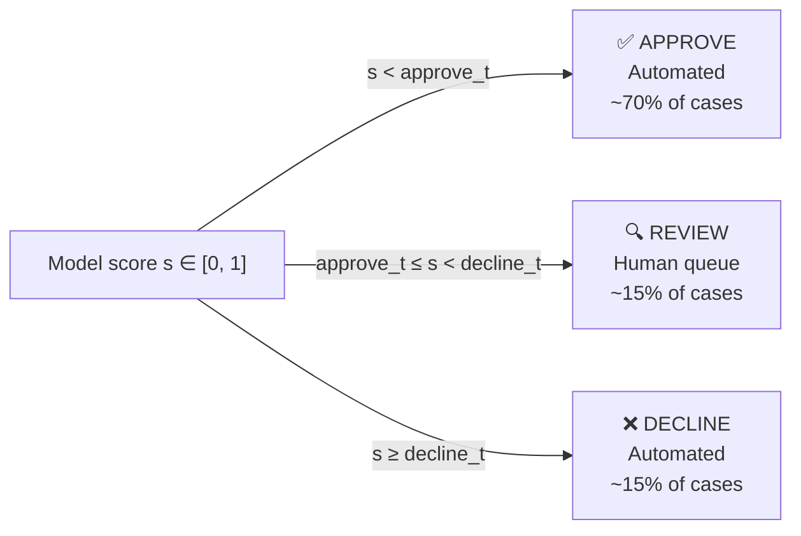
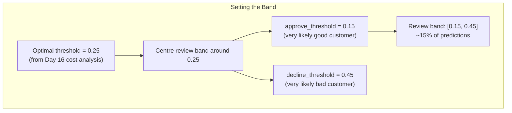
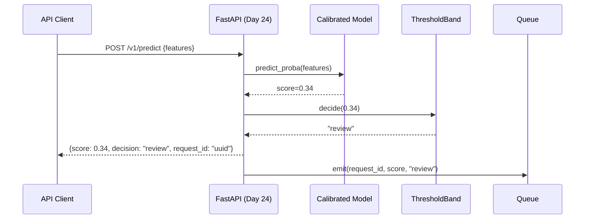

# Day 17 — Confidence Intervals & Reject/Abstain Option

> Tags: `[L]`  
> Deliverable: **`training/decision.py`** — `ThresholdBand`, `find_review_band`, `calibrate_band_for_cost`

---

## 1. The Abstain (Reject) Option

Binary decisions (approve/decline) force the model to commit on every prediction.  
But many predictions are **genuinely uncertain** — the model isn't sure.

The **reject/abstain option** adds a third outcome: "I don't know — send to a human."



**Economics of the review band**:

| Option | Cost | Accuracy |
|---|---|---|
| Auto-approve borderline case | $8,000 if wrong | Model accuracy |
| Auto-decline borderline case | $2,000 if wrong | Model accuracy |
| Send to human review | $100 reviewer cost | ~90% human accuracy |

For borderline cases (model confidence 0.3–0.6), routing to a human is almost always worth it — the $100 review cost is trivial vs $8,000 loss or $2,000 missed LTV.

---

## 2. Designing the Review Band

### Why Not Just Wide Band?

If you send everything to review, you defeat the purpose of ML. The review band should be:
1. **Narrow enough** that >80% of decisions are automated
2. **Centred on the uncertain region** (near the optimal threshold)
3. **Calibrated** so the boundaries represent true probabilities

### Band Width Strategy



**Typical starting points for credit risk:**
- `approve_threshold` ≈ 0.15 (score below this: very unlikely to default)
- `decline_threshold` ≈ 0.50 (score above this: very likely to default)
- Review band: [0.15, 0.50] — catches ~20–25% of cases

Adjust based on review capacity. If you can handle 500 reviews/day, tune to route ~500/day.

---

## 3. Confidence Intervals for Single Predictions

The point estimate (score=0.35) is not enough for a high-stakes decision.  
**Bootstrap confidence intervals** answer: "how certain is the model about this score?"

```python
# Bootstrap CI: sample training data 100 times, retrain, get score distribution
# 95% CI: [0.28, 0.41] → model is consistent
# 95% CI: [0.12, 0.67] → model is very uncertain → route to review

# Practical approach for production: use calibrated probability directly.
# score ∈ [0.15, 0.50] IS the uncertainty band — no need for bootstrapping
# if model is well calibrated.
```

For production at scale, per-prediction bootstrap CI is too slow. The review band is a practical proxy: anything in the uncertain region gets reviewed.

---

## 4. Three-Class Output in the Serving Layer



The response always includes:
- `score`: calibrated probability
- `decision`: approve | review | decline
- `request_id`: for audit trail (Day 51: prediction logging)

---

## 5. Code Walkthrough

### `ThresholdBand` — Immutable Configuration

```python
@dataclass(frozen=True)
class ThresholdBand:
    approve: float   # scores < this → approve
    decline: float   # scores ≥ this → decline
    # between approve and decline → review

    def decide(self, score: float) -> str:
        if score < self.approve:
            return "approve"
        if score >= self.decline:
            return "decline"
        return "review"

    def route_batch(self, scores: np.ndarray) -> np.ndarray:
        # vectorised — no Python loop
        return np.where(
            scores < self.approve, "approve",
            np.where(scores >= self.decline, "decline", "review"),
        )
```

`frozen=True` makes it a hashable, immutable value — safe to pass around without defensive copies.

### `routing_stats` — Capacity Planning

```python
band = ThresholdBand(approve=0.15, decline=0.45)
stats = band.routing_stats(y_prob_test)
# {
#   "pct_approve": 0.72,
#   "pct_review": 0.16,
#   "pct_decline": 0.12,
#   "review_band_width": 0.30,
# }
# → 72% automated approval, 16% to human review
```

### `find_review_band` — Actual Default Rate per Bucket

```python
df = find_review_band(y_true, y_prob, approve_threshold=0.15, decline_threshold=0.45)
# decision  | n    | pct  | positive_rate
# approve   | 4320 | 0.72 | 0.03   ← only 3% of approvals default ✅
# review    | 960  | 0.16 | 0.28   ← 28% default rate in review band → worth reviewing
# decline   | 720  | 0.12 | 0.71   ← 71% would default → correctly caught ✅
```

This is the key business metric: the **approval quality** (positive rate in approved bucket) should be very low, and the **decline accuracy** (positive rate in declined bucket) should be very high.

---

## 6. How to Run

```bash
cd platform

# Interactive band analysis:
uv run python -c "
import pandas as pd
import numpy as np
import pickle
from training.decision import ThresholdBand, find_review_band, calibrate_band_for_cost

model = pickle.load(open('models/credit_risk_model.pkl', 'rb'))
df = pd.read_parquet('data/processed/features.parquet')

n = len(df)
target = 'DEFAULT_PAYMENT_NEXT_MONTH'
X_test = df.drop(columns=[target, 'ID']).iloc[int(n*0.8):]
y_test = df[target].iloc[int(n*0.8):].to_numpy()
y_prob = model.predict_proba(X_test.to_numpy())[:, 1]

# Manual band:
band = ThresholdBand(approve=0.15, decline=0.45)
stats = band.routing_stats(y_prob)
print('Routing stats:', stats)

# Review band accuracy:
review_df = find_review_band(y_test, y_prob, 0.15, 0.45)
print(review_df.to_string())

# Auto-derive band for 15% review target:
auto_band = calibrate_band_for_cost(y_test, y_prob, target_review_pct=0.15)
print(f'Auto band: approve < {auto_band.approve}, decline >= {auto_band.decline}')
"

# Run tests:
uv run pytest tests/unit/test_decision.py -v
```

---

## 7. Operationalising the Review Band

### Logging the Band to MLflow

```python
mlflow.log_param("decision_approve_threshold", band.approve)
mlflow.log_param("decision_decline_threshold", band.decline)
stats = band.routing_stats(y_prob)
mlflow.log_metric("pct_auto_approve", stats["pct_approve"])
mlflow.log_metric("pct_human_review", stats["pct_review"])
mlflow.log_metric("pct_auto_decline", stats["pct_decline"])
```

### Monitoring the Band (Day 46–52)
- **Alert if review fraction spikes** (>25%): indicates model is losing confidence, possible drift
- **Alert if approval default rate rises** (>5%): approve bucket contains too many defaulters
- **Alert if review queue backlog grows**: human reviewers are a bottleneck

---

## 8. Debugging

| Symptom | Cause | Fix |
|---|---|---|
| All predictions → review | approve_threshold > decline_threshold | Check band config (ValidationError should catch this) |
| 0% sent to review | Band too wide or wrong side | Check approve < decline invariant |
| Approval positive rate = base rate | Model not discriminating | Calibration issue or model not trained |
| Review band has very low positive_rate | Band too conservative (approve too high) | Lower approve_threshold |

---

## Key Takeaways

- **Abstain is a first-class decision**, not an admission of failure.
- **The review band is where cost and confidence intersect.** Cases near the optimal threshold are uncertain; human review is cheap insurance.
- **Calibration is required for the band to mean something.** Without it, "score between 0.3 and 0.6" has no probability interpretation.
- **The band is a business parameter, not a model parameter.** It can be adjusted without retraining.
- **Route band: automate the easy cases, review the hard ones.** Target: >80% automated, <20% review.
