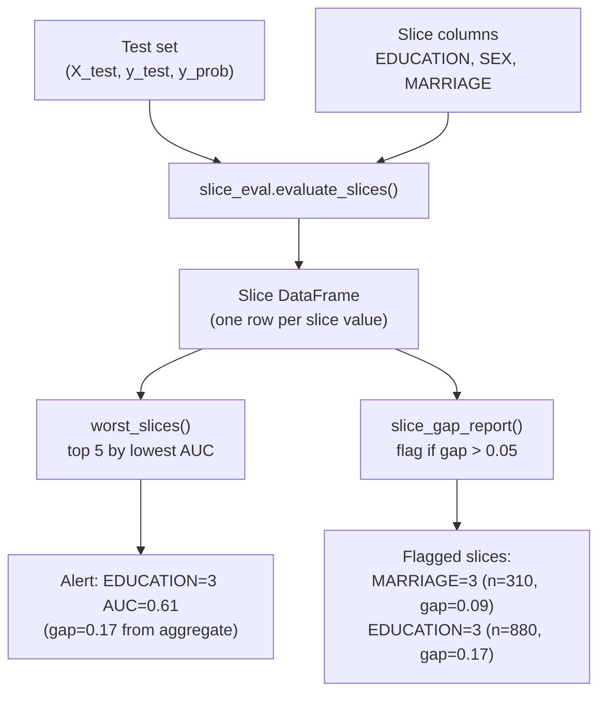
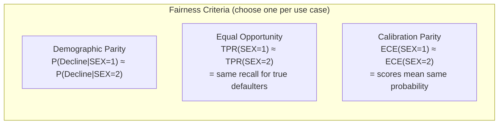
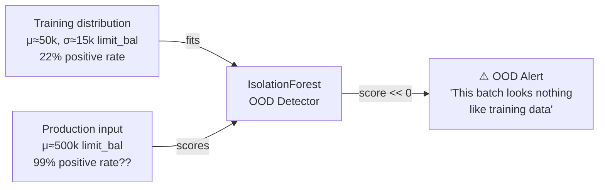

# Day 18 — Slice-Level Performance & OOD Detection

> Tags: `[L][M]`  
> Deliverable: **`training/slice_eval.py`** — `evaluate_slices`, `worst_slices`, `fit_ood_detector`, `ood_report`

---

## 1. The Simpson's Paradox Problem

Aggregate AUC=0.78 can hide terrible performance on important subgroups.

**Classic example — Simpson's Paradox:**

| Group | AUC |
|---|---|
| EDUCATION = 1 (graduate) | 0.82 |
| EDUCATION = 2 (university) | 0.79 |
| EDUCATION = 3 (high school) | 0.61 ← failing |
| EDUCATION = 4 (other) | 0.70 |
| **Overall** | **0.78** |

The overall AUC looks fine but the model is nearly random for high school graduates. If this group is underrepresented in training data (which it often is), the model never learned to distinguish them.

---

## 2. Slice Evaluation Framework



### Slice Columns for Credit Risk

| Column | Values | Why It Matters |
|---|---|---|
| `EDUCATION` | 1=grad, 2=univ, 3=HS, 4=other | Different credit behaviors by education level |
| `SEX` | 1=male, 2=female | Protected attribute — fairness check |
| `MARRIAGE` | 1=married, 2=single, 3=other | Life stage affects spending patterns |

In a production system, you'd also slice by:
- Income band (not in raw data, but a derived feature)
- Age group (AGE binned into 18-25, 26-35, 36-50, 50+)
- Credit limit quintile (LIMIT_BAL)

---

## 3. Fairness Considerations

For regulated domains (credit, insurance, hiring), slice evaluation is not optional — it's a regulatory requirement.

**Equal Credit Opportunity Act (ECOA)**: prohibits credit decisions that discriminate on protected attributes (sex, marital status, race, national origin, religion, age).



**These criteria are mathematically incompatible** (Chouldechova 2017). You must choose which matters most for your use case. For credit risk, **calibration parity** is usually preferred — the score should mean the same probability regardless of demographic group.

---

## 4. OOD Detection

### What is OOD?

Out-of-Distribution (OOD) inputs look nothing like training data. Examples:
- Training data: Taiwan credit card holders 2005
- Production: a different geography or time period enters the data pipeline
- Feature pipeline bug: LIMIT_BAL suddenly arrives in a different currency

**Why OOD is dangerous:** the model produces a confident prediction on inputs it has never seen. OOD detection surfaces these before they corrupt decisions.



### Isolation Forest

IsolationForest works by random partitioning:
- In-distribution samples need **many** cuts to isolate (dense region)
- OOD samples are isolated with **very few** cuts (sparse region)
- Anomaly score = average depth across trees (inverted: shorter path = more anomalous)

**Output**: `decision_function(X)` returns continuous score:
- Positive score ≈ in-distribution
- Negative score ≈ OOD / anomalous
- Threshold: 0 (the boundary is the `contamination` parameter)

```python
detector = fit_ood_detector(X_train, contamination=0.05)
scores = detector.decision_function(X_prod)
ood_fraction = (scores < 0).mean()
# If ood_fraction > 0.10 in production → alert
```

---

## 5. Code Walkthrough

### `evaluate_slices`

```python
def evaluate_slices(X, y_true, y_prob, slice_cols, min_size=50):
    for col in slice_cols:
        for val in X[col].unique():
            mask = X[col].to_numpy() == val
            n = mask.sum()
            if n < min_size:
                continue  # unreliable metrics on tiny slices
            rows.append({
                "slice_col": col,
                "slice_val": str(val),
                "n": n,
                "roc_auc": roc_auc_score(y_true[mask], y_prob[mask]),
                "average_precision": ...,
                "calibration_error": ...,
                "positive_rate": y_true[mask].mean(),
            })
    return pd.DataFrame(rows)
```

**`min_size=50`**: with fewer than 50 samples, AUC has high variance — the reported value is unreliable. In practice, use ≥ 200 for metrics you'll alert on.

### `slice_gap_report` — Flag Poor Slices

```python
df = slice_gap_report(slice_df, overall_metrics, metric="roc_auc", warn_threshold=0.05)
# slice_col | slice_val | n    | roc_auc | overall | gap   | flag
# EDUCATION | 3         | 880  | 0.610   | 0.780   | 0.170 | True  ← alert
# MARRIAGE  | 3         | 310  | 0.690   | 0.780   | 0.090 | True  ← alert
# SEX       | 1         | 3200 | 0.775   | 0.780   | 0.005 | False
```

### `fit_ood_detector` + `ood_report`

```python
detector = fit_ood_detector(X_train.to_numpy())
report = ood_report(detector, X_prod.to_numpy(), label="production_batch_2026-06-29")
# {
#   "ood_fraction": 0.04,   # 4% of production batch looks OOD
#   "mean_score": 0.12,     # mostly in-distribution
#   "p5_score": -0.03,      # 5th percentile slightly OOD
#   "n_samples": 1000,
# }
```

---

## 6. How to Run

```bash
cd platform

# Slice evaluation:
uv run python -c "
import pandas as pd
import numpy as np
import pickle
from training.slice_eval import evaluate_slices, worst_slices, slice_gap_report
from training.evaluate import compute_metrics

model = pickle.load(open('models/credit_risk_model.pkl', 'rb'))
df = pd.read_parquet('data/processed/features.parquet')
n = len(df)
target = 'DEFAULT_PAYMENT_NEXT_MONTH'
X_test = df.drop(columns=[target, 'ID']).iloc[int(n*0.8):]
y_test = df[target].iloc[int(n*0.8):].to_numpy()
y_prob = model.predict_proba(X_test.to_numpy())[:, 1]

overall = compute_metrics(y_test, y_prob)
print(f'Overall AUC: {overall[\"roc_auc\"]:.4f}')

slices = evaluate_slices(X_test, y_test, y_prob, slice_cols=['EDUCATION', 'SEX', 'MARRIAGE'])
print(slices.to_string())

worst = worst_slices(slices, metric='roc_auc', n=5)
print('\nWorst slices:')
print(worst.to_string())

gaps = slice_gap_report(slices, overall, warn_threshold=0.05)
print('\nFlagged slices:')
print(gaps[gaps['flag']].to_string())
"

# OOD detection:
uv run python -c "
import pandas as pd
import numpy as np
from training.slice_eval import fit_ood_detector, ood_report

df = pd.read_parquet('data/processed/features.parquet')
n = len(df)
target = 'DEFAULT_PAYMENT_NEXT_MONTH'
X = df.drop(columns=[target, 'ID'])
X_train = X.iloc[:int(n*0.8)].to_numpy()
X_test = X.iloc[int(n*0.8):].to_numpy()

detector = fit_ood_detector(X_train)
report = ood_report(detector, X_test, label='test_set')
print(report)

# Simulate OOD data:
rng = np.random.default_rng(42)
X_ood = X_train * 10 + 100000  # completely different scale
ood_report_sim = ood_report(detector, X_ood, label='simulated_ood')
print('Simulated OOD report:', ood_report_sim)
"

# Run tests:
uv run pytest tests/unit/test_slice_eval.py -v
```

---

## 7. Integrating into MLflow

```python
# In mlflow_train.py (after Day 18):
from training.slice_eval import evaluate_slices, worst_slices, slice_gap_report, fit_ood_detector

slices = evaluate_slices(X_test_df, y_test, y_prob, SLICE_COLS)
slices.to_csv("metrics/slice_metrics.csv", index=False)
mlflow.log_artifact("metrics/slice_metrics.csv")

# Log worst slice AUC as a metric (for model promotion gate):
worst = worst_slices(slices, n=1)
if len(worst) > 0:
    mlflow.log_metric("worst_slice_auc", float(worst["roc_auc"].iloc[0]))

# Log OOD fraction:
detector = fit_ood_detector(X_train.to_numpy())
ood = ood_report(detector, X_test.to_numpy())
mlflow.log_metric("test_ood_fraction", ood["ood_fraction"])
```

---

## 8. What Makes a Model Promotion-Ready?

After Phase 2, a model is ready for promotion to `champion` when:

| Check | Threshold |
|---|---|
| Overall AUC | ≥ 0.75 |
| ECE after calibration | ≤ 0.08 |
| Optimal threshold cost per sample | Within 10% of baseline |
| Worst slice AUC | ≥ 0.65 |
| Flagged slices (gap > 0.05) | ≤ 2 |
| OOD fraction (test set) | ≤ 0.05 |

These thresholds live in `params.yaml` (Phase 2 section) so they're versioned and reviewable.

---

## Key Takeaways

- **Aggregate metrics lie.** Always evaluate slice-level performance before promoting a model.
- **`min_size=50` is a floor, not a ceiling.** For business-critical slices, demand ≥ 200 samples.
- **Fairness is a constraint, not a trade-off.** Decide which fairness criterion matters before training, not after.
- **OOD detection belongs in monitoring** (Day 46+) but should be validated during training evaluation.
- **`slice_gap_report` is a model promotion gate input.** If a protected attribute slice has gap > 0.05, the model should not be promoted to champion without investigation.
