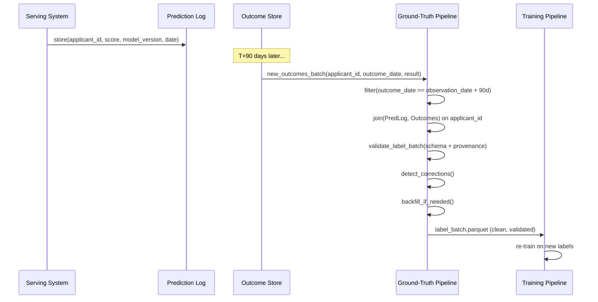

# Day 20 — Label Contracts & Ground-Truth Pipelines

## The Label Problem

In most ML systems, **labels arrive late**. In credit risk, you don't know if a customer defaulted until 1–6 months after the observation date. This creates a pipeline challenge that doesn't exist in standard supervised learning benchmarks.

```
Observation date           Label available
      │                          │
      ▼                          ▼
  [Row captured]  ─── 90+ days ─── [Default confirmed or not]

Timeline example (UCI Credit Default):
  Oct 2005: Credit utilisation, payment history captured   ← features
  Jan 2006: Outcome confirmed (defaulted or not)           ← label
  Gap: ~90 days
```

Without managing label delay explicitly:
- You train on rows that *appear* to have a label (they joined by matching ID)
- But 20–40% of the "labels" may be provisional (not yet confirmed)
- Your model trains on noise; performance collapses in production

---

## What is a Label Contract?

A label contract specifies:

1. **Provenance** — where did this label come from? (system of record, manual review, heuristic)
2. **Policy version** — which labelling rule generated it? (rules change over time)
3. **Observation window** — what time period does the label describe?
4. **Outcome delay** — how long after the observation do we wait before the label is considered final?
5. **Correction protocol** — what happens if a label is revised? (backfill, versioning)
6. **Schema** — required columns, types, valid values

---

## The Credit Risk Label Pipeline

```
┌─────────────────┐      ┌─────────────────┐      ┌─────────────────┐
│ Prediction log  │      │ Outcome store    │      │ Label batch     │
│                 │      │                 │      │                 │
│ applicant_id    │      │ applicant_id    │      │ applicant_id    │
│ prediction_date │─join─│ outcome_date    │─────▶│ label           │
│ risk_score      │      │ outcome_type    │      │ label_source    │
│ model_version   │      │ (default/paid)  │      │ policy_version  │
└─────────────────┘      └─────────────────┘      │ is_corrected    │
                                                   │ observation_win │
                                                   └─────────────────┘
```

The key constraint: **only join outcomes that have passed the observation window**.

```python
# Only use labels where the outcome has had time to be confirmed
min_outcome_date = prediction_date + timedelta(days=outcome_delay_days)
labels = outcomes[outcomes["outcome_date"] >= min_outcome_date]
```

---

## Label Provenance Fields

| Field | Type | Description |
|-------|------|-------------|
| `applicant_id` | int | Joins to prediction log |
| `label` | int (0/1) | Ground truth outcome |
| `label_source` | str | `"core_banking"` / `"manual_review"` / `"heuristic"` |
| `policy_version` | str | `"v1.2"` — the labelling rule that was applied |
| `label_timestamp` | datetime | When the label was generated |
| `observation_date` | date | The date the features were captured |
| `outcome_date` | date | The date the outcome was confirmed |
| `is_corrected` | bool | True if this row replaced an earlier label |
| `correction_reason` | str | Why it was corrected (nullable) |

---

## Label Correction & Backfill

Labels are not immutable. Two common scenarios:

### Scenario A — Late outcome
A customer pays late but avoids default. Initial label: 1 (default). Final label: 0 (paid).

**Protocol:**
1. Append a new row with `is_corrected=True`, `correction_reason="late_payment_resolved"`
2. The old row is **not deleted** — it's archived with `is_final=False`
3. The ground-truth pipeline always selects the most recent `is_final=True` row per applicant

### Scenario B — Policy change
The labelling policy changes (e.g. from "90 days past due" to "60 days past due").

**Protocol:**
1. New `policy_version` is assigned
2. All historical labels that must be re-derived under the new policy are backfilled
3. Model must be re-trained on the backfilled labels before deploying with the new policy

```
Without re-train: model trained on v1 labels, deployed with v2 labels → concept drift
With re-train:    consistency maintained from training to serving
```

---

## Label Arrival Timing

In a real credit pipeline, labels arrive gradually:

```
T+1 day:  ~5% of outcomes confirmed
T+7 days: ~30% confirmed (payments that bounced immediately)
T+30 days: ~70% confirmed (monthly payment cycle)
T+90 days: ~95% confirmed (standard default window)
T+180 days: ~99% confirmed (extended delinquency resolution)
```

This curve is called the **label arrival curve** or **label maturation curve**. It must be monitored:
- If the T+30 fraction drops suddenly, something is wrong with the outcome feed
- If the T+90 fraction exceeds 99%, great; re-training can use that data safely

---

## Sequence Diagram: Ground-Truth Pipeline



---

## Label Schema (Pandera)

The label batch Pandera schema enforces:
- `applicant_id` is positive integer, non-null
- `label` is in {0, 1} (binary), non-null
- `label_source` is in allowed set
- `policy_version` is non-null
- `label_timestamp` is non-null, parseable datetime
- `is_corrected` is boolean
- `outcome_date >= observation_date` (temporal ordering)

---

## Ground-Truth Quality Gates

Before labels enter training, they must pass:

| Gate | Check | Threshold |
|------|-------|-----------|
| Schema | All required columns present | 0 violations |
| Completeness | No nulls on key fields | 0 nulls on `label`, `applicant_id` |
| Balance | Positive rate in expected range | 10%–40% |
| Arrival | Fraction confirmed at T+90 | ≥ 90% |
| Correction rate | Fraction of rows with `is_corrected=True` | ≤ 5% (>5% = policy instability) |
| Policy version | All rows on same policy version | Single version per batch |

---

## The "Label Leakage" Pitfall

A common MLOps mistake: the feature snapshot includes information from *after* the observation date.

Example: feature pipeline runs on Jan 15. It captures `PAY_0` for Dec 2005.
If the pipeline accidentally includes Jan 2006 payment history → **leakage**.

Prevention:
- Feature snapshot date must be strictly before `observation_date`
- Assert this constraint in the ground-truth join:

```python
assert (label_batch["feature_snapshot_date"] < label_batch["observation_date"]).all()
```

---

## Code Walkthrough

### `label_contract.py`

`LabelMetadata` — frozen dataclass recording the business context:
- `label_source`, `policy_version`, `observation_window_days`, `outcome_delay_days`
- `validate_label_batch()`: runs the Pandera label schema
- `check_label_arrival()`: computes fraction of labels that have passed `outcome_delay_days`

`label_batch_schema` — Pandera schema for label batches. Uses `Check` for temporal ordering constraint.

### `ground_truth.py`

`join_predictions_with_outcomes()` — inner join of prediction log with confirmed outcomes, filtered by `outcome_delay_days`.

`detect_label_corrections()` — groups by `applicant_id`, finds duplicates, marks the correction rows.

`backfill_labels()` — replaces old labels with newer corrections by selecting the most recent `label_timestamp` per `applicant_id`.

`LabelArrivalStats` — computes the arrival curve: what fraction confirmed at T+1, T+7, T+30, T+90, T+180.

---

## How to Run

```bash
# Validate a label batch
make label-contract

# Run Day 20 unit tests
cd platform && uv run pytest tests/unit/test_label_contract.py tests/unit/test_ground_truth.py -v
```

---

## Key Invariants

1. **Never train on provisional labels** — wait for `outcome_delay_days` before including a row.
2. **Labels and features must be on the same policy version** — mismatch = implicit concept drift.
3. **Correction rows don't delete history** — always append, never overwrite (audit trail).
4. **Check arrival curve before every re-train** — if T+90 fraction is low, wait longer.
5. **Label source must be recorded** — `"heuristic"` and `"manual_review"` labels have different noise levels and should be flagged separately in slice evaluation.
