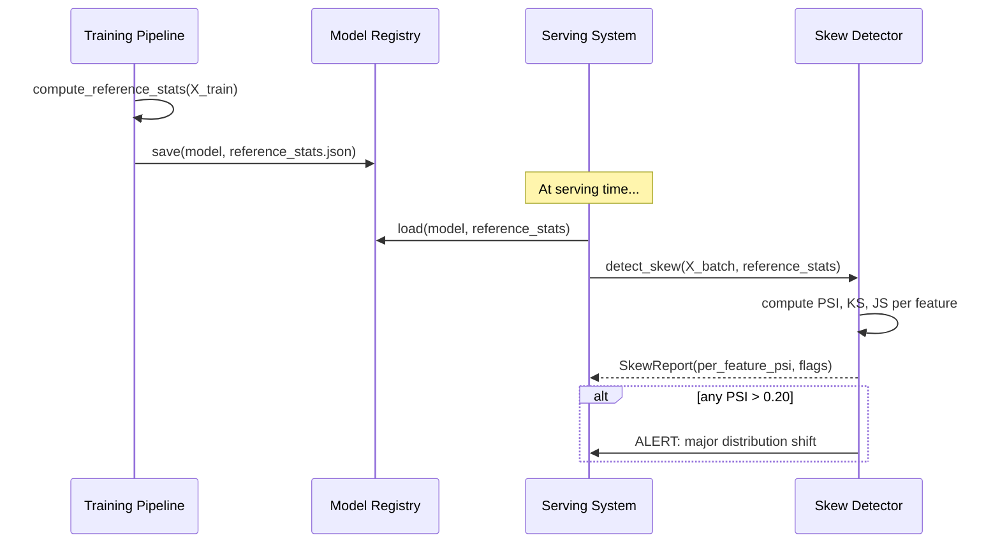

# Day 21 — Train/Serve Skew Detection + Dataset Slicing Strategy

## What is Train/Serve Skew?

**Train/serve skew** is the gap between the feature distribution your model was trained on and the feature distribution it sees at serving time. It is the most common root cause of silent model degradation in production.

Three types of skew:

| Type | Description | Example |
|------|-------------|---------|
| **Feature skew** | Input feature distribution shifts between training and serving | Mean `LIMIT_BAL` increases 20% as credit limits are raised |
| **Label skew** | The relationship between features and outcome changes | Default rate spikes during a recession |
| **Serving skew** | Features are *computed differently* at serving vs training | Training used BILL_AMT1 from June; serving uses BILL_AMT1 from July |

Feature skew and label skew are *data distribution problems*. Serving skew is a *pipeline bug*. Both degrade performance, but only serving skew can be fixed without retraining.

---

## Why AUC Doesn't Tell You There's Skew

AUC measures ranking quality on a test set. The test set is drawn from the same distribution as training. If the production distribution changes, AUC computed at evaluation time says nothing about production performance.

```
Training AUC = 0.78 (on held-out test set, same distribution as training)
Serving AUC  = 0.61 (on real production traffic, different distribution)
                ↑
          You only discover this after business outcomes deteriorate
```

Reference statistics captured at training time + skew detection on serving traffic catches this before outcomes deteriorate.

---

## Reference Statistics

At training time, compute and **save alongside the model artifact** a snapshot of the feature statistics:

```
models/
  credit_risk_model.pkl      ← the model
  reference_stats.json       ← training feature statistics
  calibration_report.json    ← from Phase 2
  threshold_config.json      ← from Phase 2
```

The reference stats include per-feature: mean, std, percentiles, null rate, n_unique.

At serving time, compare each incoming batch against the reference stats.

---

## Population Stability Index (PSI)

PSI is the industry-standard metric for measuring feature distribution shift. Originally used in banking credit risk monitoring (Basel II).

**Formula:**

```
PSI = Σ over bins [ (Actual% - Expected%) × ln(Actual% / Expected%) ]
```

Where:
- **Expected%** = fraction of training data in each bin
- **Actual%**   = fraction of serving data in each bin

**Interpretation:**

| PSI | Severity | Action |
|-----|----------|--------|
| < 0.10 | Stable | No action needed |
| 0.10 – 0.20 | Slight shift | Monitor more closely |
| > 0.20 | Major shift | Investigate; consider retraining |

**Binning strategy:**
- Continuous features: 10 equal-width bins over the training range
- Categorical features: one bin per unique value (sorted by frequency)

**Edge cases:**
- If a bin has 0 actual samples: add ε = 1e-4 to avoid `ln(0)`
- If a bin has 0 expected samples: that bin had no training data → OOD

---

## Kolmogorov-Smirnov (KS) Test

The two-sample KS test measures the maximum difference between two empirical CDFs.

```
D = max|F_training(x) - F_serving(x)|

p-value < 0.05 → reject H₀ (same distribution) → distribution shift detected
```

The KS test is non-parametric (no distribution assumption) and sensitive to location AND shape changes. Complementary to PSI:
- PSI captures severity (magnitude of shift) 
- KS test captures significance (is the shift real or sampling noise?)

---

## Jensen-Shannon Divergence

KL divergence is asymmetric (`KL(P||Q) ≠ KL(Q||P)`) and undefined when `Q=0`. Jensen-Shannon divergence (JS) fixes both:

```
JS(P, Q) = 0.5 × KL(P || M) + 0.5 × KL(Q || M)
where M = 0.5 × (P + Q)
```

**Properties:**
- Symmetric: `JS(P, Q) = JS(Q, P)`
- Bounded: `JS ∈ [0, 1]` (when using log base 2 and taking the square root)
- `JS = 0` → identical distributions
- `JS = 1` → completely different support

Use JS divergence for categorical features; use PSI for continuous; use KS test for statistical significance.

---

## Skew Detection Architecture



---

## Dataset Slicing Strategy

Dataset slicing (covered deeply in Phase 2, Day 18) and skew detection are complementary:

| Tool | What it measures | When to use |
|------|-----------------|-------------|
| `slice_eval` | AUC/AP per demographic group | At training time (model evaluation) |
| `skew_detector` | Feature distribution shift | At serving time (monitoring) |

**Extended slicing strategy for skew:**

Beyond global PSI, compute **per-slice PSI** for the same groups used in `slice_eval` (EDUCATION, SEX, MARRIAGE). A global PSI of 0.08 may hide a per-slice PSI of 0.35 for a specific demographic — the average masks the group-level drift.

```python
# Global PSI: 0.08 (looks fine)
# Per-slice:
#   EDUCATION=1: PSI 0.06  (stable)
#   EDUCATION=2: PSI 0.12  (slight shift)
#   EDUCATION=3: PSI 0.41  ← ALERT (major shift in this group)
```

This is Simpson's Paradox applied to monitoring, not just evaluation.

---

## Alert Thresholds and Monitoring Cadence

| Trigger | Metric | Threshold | Action |
|---------|--------|-----------|--------|
| Feature shift | Max PSI across features | > 0.20 | Page on-call, investigate upstream |
| Subtle shift | Any PSI | > 0.10 | Create ticket, monitor daily |
| Label shift | Positive rate change | > 5pp | Review labelling pipeline |
| OOD fraction | Isolation Forest score < 0 | > 5% | Investigate data pipeline |
| Serving skew | Feature mean z-score | > 3σ | Check feature pipeline for bugs |

**Cadence:**
- Real-time (per-request): OOD detection (cheap, low latency)
- Hourly: null rate + basic schema checks
- Daily: PSI + KS tests on daily batch
- Weekly: Full slice-level PSI report

---

## Code Walkthrough

### `monitoring/reference_stats.py`

`ReferenceStats` dataclass — wraps `DatasetStats` (from Phase 3 Day 19) with model-specific metadata:
- `model_version`: ties these stats to a specific model artifact
- `training_date`: when training was run
- `n_training_rows`: size of training set
- `feature_names`: ordered list (must match model's expected features)

`compute_reference_stats()` — thin wrapper over `compute_dataset_stats()` that adds model context.

`save_reference_stats()` / `load_reference_stats()` — JSON serialization to/from file.

### `monitoring/skew_detector.py`

`FeatureSkewResult` dataclass — per-feature skew assessment:
- `psi`, `ks_stat`, `ks_pvalue`, `js_divergence`, `severity`, `flag`

`SkewReport` dataclass — collection of `FeatureSkewResult` + overall severity.

`compute_psi()` — bins training and serving data, computes PSI. Handles ε for zero bins.

`compute_ks()` — two-sample KS test (scipy). Returns `(stat, pvalue)`.

`compute_js()` — Jensen-Shannon divergence (scipy). Works on histograms.

`detect_skew()` — runs all three metrics for each numeric feature, returns `SkewReport`.

`skew_summary()` — `SkewReport` → DataFrame sorted by PSI descending.

---

## How to Run

```bash
# Compute reference stats from training features + detect skew vs test features
make skew-detect

# Run Day 21 unit tests
cd platform && uv run pytest tests/unit/test_reference_stats.py tests/unit/test_skew_detector.py -v

# Full Phase 3 test suite
cd platform && uv run pytest tests/unit/test_feature_schema.py tests/unit/test_contract_registry.py \
  tests/unit/test_statistical_checks.py tests/unit/test_label_contract.py \
  tests/unit/test_ground_truth.py tests/unit/test_reference_stats.py \
  tests/unit/test_skew_detector.py -v
```

---

## Debugging Skew Alerts

| Symptom | Likely cause | Investigation |
|---------|-------------|---------------|
| PSI > 0.20 on `LIMIT_BAL` | Credit limit policy change | Check upstream data pipeline, compare with last month |
| KS p-value < 0.001 on `AGE` | New customer segment | Check marketing campaigns, acquisition sources |
| JS > 0.5 on `EDUCATION` | Encoding changed upstream | Compare value distribution, check ETL logs |
| PSI low globally, high per slice | Simpson's paradox / group-level shift | Run per-slice PSI |
| OOD fraction spike | New feature bug / upstream schema change | Print OOD samples, compare against training distribution |

---

## Key Invariants

1. **Reference stats are tied to a model version** — if the model is updated, recompute reference stats from the new training data.
2. **PSI < 0.10 per feature is not a guarantee** — compute per-slice PSI too.
3. **KS test is sensitive to sample size** — with large batches, KS p-value will be significant even for tiny shifts. Use PSI magnitude as the primary signal; use KS as confirmation.
4. **Serving skew has a different fix than feature skew** — serving skew = fix the pipeline; feature skew = retrain the model.
5. **Save reference stats at every re-train** — the reference is always the most recent training run, not a one-time historical snapshot.
