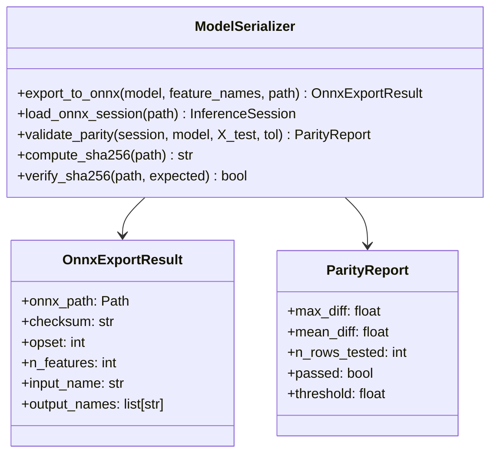
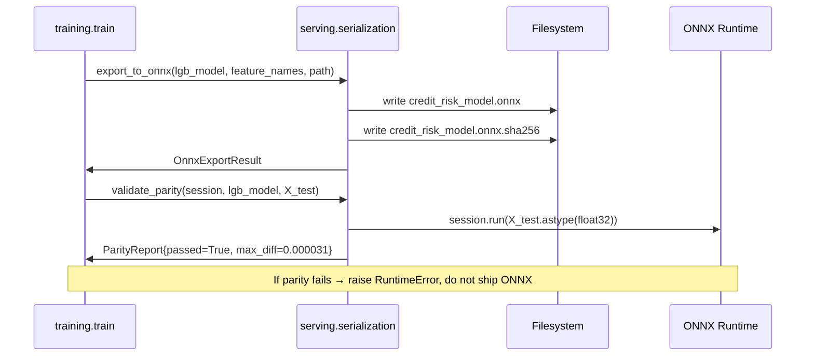

# Day 22 — Model Serialization: ONNX, Pickle Risk, Safetensors

## Why Serialization Matters

A trained model must outlive the Python process that produced it. Serialization converts
in-memory objects to a portable binary format. The wrong choice leads to:

- **Security holes** — arbitrary code execution on deserialization (pickle)
- **Portability failures** — model loads only on the exact Python + library version it was trained on
- **Silent numeric drift** — format conversion changes floating-point precision

---

## Format Comparison

| Format | Pros | Cons | Use when |
|---|---|---|---|
| **Pickle / joblib** | Works for any Python object; one line to save/load | Code execution on load; version-locked; no cross-language | Dev/research only, never production |
| **ONNX** | Cross-language, cross-runtime (C++, Java, mobile); hardware-optimized via ORT | Lossy for custom ops; requires conversion step; debugging harder | Production CPU/GPU serving |
| **Safetensors** | Safe (no code exec); fast mmap; supports PyTorch/JAX/NumPy tensors | Tensors only — not full model graphs | Deep-learning weights (Phase B/C) |
| **PMML** | XML-based; vendor-neutral; readable | Verbose; limited to classical ML; rarely supported by modern frameworks | Legacy enterprise integration |
| **MLflow `log_model`** | Wraps any format; adds metadata + dependencies | Requires MLflow to load; not truly portable | MLflow-centric deployment stacks |

---

## Pickle: The Security Risk

```python
# NEVER deserialize pickle from untrusted sources
import pickle

class Exploit:
    def __reduce__(self):
        import os
        return (os.system, ("rm -rf /",))   # executes on pickle.load()

payload = pickle.dumps(Exploit())
pickle.loads(payload)   # ← arbitrary code execution
```

### Pickle Risk Checklist

- [ ] Model artifact comes only from your own CI pipeline
- [ ] Artifact hash is verified before load (SHA-256 checksum stored in registry)
- [ ] No user-supplied pickles are ever deserialized
- [ ] Prefer ONNX in production; keep pickle only in the registry for debugging

---

## ONNX Export: LightGBM Workflow

```
LightGBM Booster
      │  lightgbm.basic.Booster.dump_model() → JSON
      │
      ▼
onnxmltools.convert_lightgbm()
      │  skl2onnx provides the base type system
      │
      ▼
ONNX proto (credit_risk_model.onnx)
      │
      ▼
onnxruntime.InferenceSession.run()
      └─▶ numpy arrays — no Python ML deps at inference time
```

### Key ONNX Concepts

| Concept | Description |
|---|---|
| **Op Set** | Version of ONNX operator definitions (e.g., opset 17). Pins operator semantics. |
| **Input shape** | Defined at export time. `None` for dynamic batch size: `[None, n_features]`. |
| **Output names** | Must be queried from session — typically `label` and `probabilities`. |
| **Parity check** | Run the same input through sklearn and ONNX; assert predictions match within 1e-5. |

---

## ONNX Export: Step-by-Step

```python
from onnxmltools import convert_lightgbm
from onnxmltools.convert.common.data_types import FloatTensorType

initial_type = [("float_input", FloatTensorType([None, n_features]))]
onnx_model = convert_lightgbm(lgb_model, initial_types=initial_type, target_opset=17)

with open("models/credit_risk_model.onnx", "wb") as f:
    f.write(onnx_model.SerializeToString())
```

---

## Parity Validation

Numeric parity between the original and ONNX model must be verified at export time:

```
Compare sklearn predict_proba(X_test)
     vs ONNX session.run(X_test.astype(float32))

Tolerance: max absolute difference < 1e-4
Flag if: any row differs by > threshold
```

### Why parity can fail

- `float32` vs `float64` precision loss — ONNX uses float32 by default
- Operator mapping gaps — some custom LightGBM ops not supported in older opsets
- Feature ordering mismatch — ONNX input must match training column order exactly

---

## Artifact Layout

```
models/
  credit_risk_model.pkl          ← joblib (registry/debug only)
  credit_risk_model.onnx         ← production serving artifact
  credit_risk_model.onnx.sha256  ← checksum for integrity verification
  reference_stats.json           ← training distribution snapshot (Phase 3)
```

---

## Class and Flow Diagram



---

## Serialization Flow



---

## Debugging Table

| Symptom | Likely Cause | Fix |
|---|---|---|
| `onnxmltools.convert_lightgbm` fails | Unsupported LightGBM objective | Use `num_class=1` + `binary` objective |
| ONNX output shape mismatch | `batch_size` is 1, output is `(1,)` not `(1,2)` | Use `probabilities` output, reshape |
| Parity diff > 1e-4 | float64→float32 precision loss | Cast tolerance to 5e-4 for float32 |
| `FileNotFoundError` on load | Path relative to wrong cwd | Use absolute `Path(__file__).parent` |
| `InvalidGraph` during convert | opset incompatibility | Try `target_opset=12` or `15` |

---

## Key Invariants

1. **Never deploy pickle to production** — ONNX only for the serving path.
2. **Verify checksum before loading** — catch corrupted or tampered artifacts.
3. **Parity check at export time, not at inference time** — fail fast, before deployment.
4. **Pin the opset** — the same opset must be used at export and at ORT load.
5. **Float32 is the ONNX default** — pass `X.astype(np.float32)` to `session.run()`.
