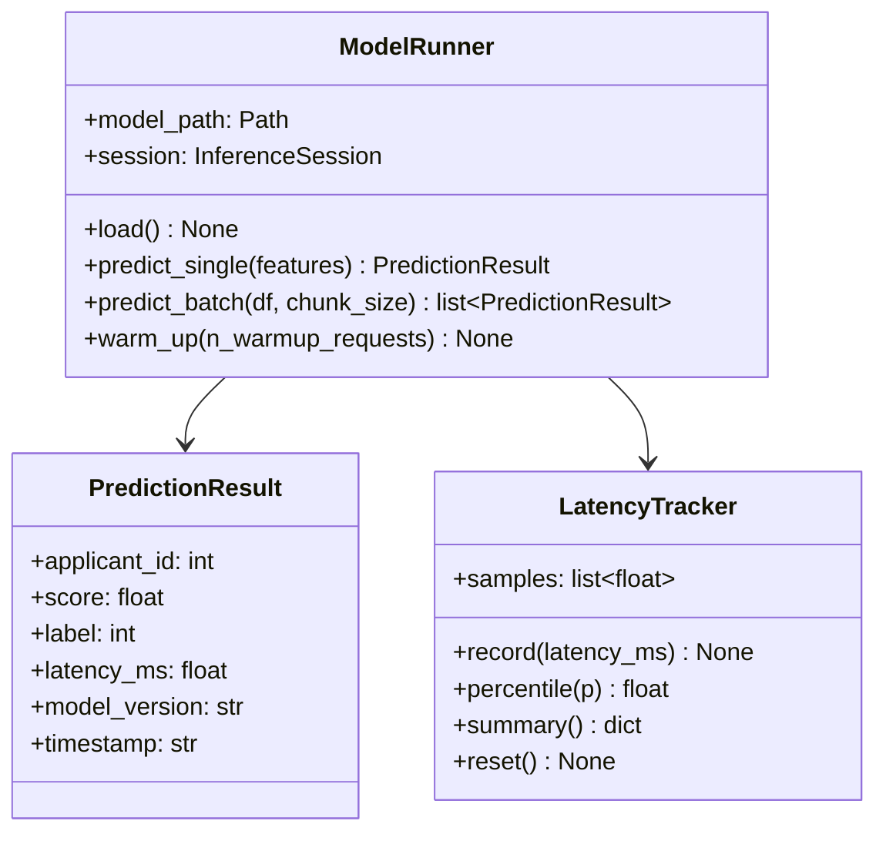
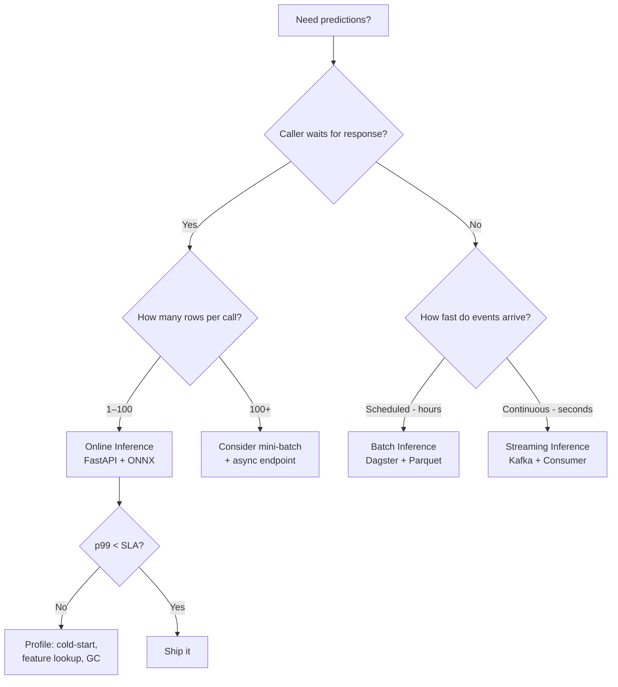

# Day 23 — Inference Patterns: Online, Batch, Streaming & Latency Budgets

## The Three Patterns

Every production ML system routes predictions through one of three inference patterns.
Choosing wrongly either wastes compute (batch when you need real-time) or breaks SLAs
(online when you need throughput).

---

## Pattern Comparison

| Dimension | Online | Batch | Streaming |
|---|---|---|---|
| **Trigger** | Per-request (synchronous) | Scheduled job | Event/message arrival |
| **Latency SLA** | p99 < 200ms typical | Hours acceptable | Seconds to minutes |
| **Throughput** | Low–medium (thousands/min) | Very high (millions/run) | Medium (thousands/sec) |
| **Caller waits?** | Yes — blocking | No — async poll or callback | No — consumer reads result |
| **Failure mode** | Timeout → caller error | Partial failure → rerun | Lag → stale predictions |
| **State** | Stateless per request | Stateful per batch run | Stateful (watermarks) |
| **Credit risk use** | Fraud check at transaction time | Nightly portfolio scoring | Streaming transaction events |

---

## Online Inference

```
Client ──HTTP POST /v1/predict──▶ FastAPI ──▶ ModelRunner
                                               │
                                               ▼
                                          ONNX Session
                                               │
                                         ◀── response ──
```

### Latency Budget (200ms target)

| Stage | Budget | Notes |
|---|---|---|
| Network (ingress) | 5ms | TLS handshake amortised via keep-alive |
| Request parsing + validation | 3ms | Pydantic v2 fast validation |
| Feature assembly | 20ms | If features come pre-computed |
| ONNX inference | 2–15ms | CPU, ~40 features, single row |
| Post-processing | 2ms | Threshold, explain |
| Response serialisation | 2ms | JSON |
| Network (egress) | 5ms | |
| **Total** | **~37ms** | Leaves 163ms headroom |

The 163ms headroom is consumed by: feature store lookup, cold-start JIT (first request),
database calls for audit logging, and tail-latency variance at high load.

### What Blows the Budget

1. **Cold-start** — loading the ONNX session on first request. Fix: pre-load at startup.
2. **Synchronous feature store lookup** — a 50ms Redis miss + fallback. Fix: cache locally.
3. **Blocking I/O** — writing audit logs synchronously. Fix: async fire-and-forget.
4. **GC pressure** — allocating large arrays per request. Fix: pre-allocate input buffer.

---

## Batch Inference

```
Scheduler ──trigger──▶ BatchJob
                           │
                      read features (Parquet/S3)
                           │
                      chunk into N=1024 rows
                           │
                      ModelRunner.predict_batch()
                           │
                      write results (Parquet/S3)
                           │
                      write manifest (JSON)
```

### Idempotency in Batch Jobs

A batch job must be safe to re-run after a partial failure without corrupting results:

```
Idempotency key = (model_version, data_partition, run_date)

Before writing output:
  1. Check if manifest exists for this key
  2. If exists AND checksum matches → skip (already done)
  3. If exists AND checksum mismatch → DELETE old output → re-run
  4. If not exists → run → write → write manifest
```

---

## Streaming Inference

```
Kafka topic: transactions
       │
       ▼
Consumer Group
  ├── Worker 1 ──▶ ONNX infer ──▶ Kafka: predictions
  ├── Worker 2 ──▶ ONNX infer ──▶ Kafka: predictions
  └── Worker 3 ──▶ ONNX infer ──▶ Kafka: predictions
       │
       ▼
Consumer: downstream alerts / dashboards
```

### Streaming Challenges

| Challenge | Description | Fix |
|---|---|---|
| **Lag** | Consumer falls behind producer | Scale workers, tune batch.size |
| **Out-of-order events** | Late arrivals disrupt time windows | Watermarks + allowed lateness |
| **Exactly-once** | Duplicate processing with retries | Idempotent sink + transactional producer |
| **Feature staleness** | Feature computed at t-1, used at t | Point-in-time feature joins |

---

## Latency Percentiles

Do not use average latency as an SLA metric. Use percentiles:

| Percentile | Meaning | SLA use |
|---|---|---|
| p50 | Median — "typical" user | Internal health check |
| p90 | 90% of requests faster than this | Team alert threshold |
| p95 | 95% below | External SLA contract |
| p99 | 99% below | High-traffic tail guarantee |
| p999 | 99.9% below | Critical-path absolute worst-case |

**Why p99 > mean × 10 is normal:**
- A small fraction of requests hit GC pauses, cold cache, or network jitter
- Under load, queuing creates multiplicative delays (Little's Law)
- At 1000 req/s, 1% is 10 requests/sec experiencing tail latency

### Latency Measurement

```python
import time

start = time.perf_counter()
result = model.predict(X)
latency_ms = (time.perf_counter() - start) * 1000

# Collect into histogram, then compute percentiles
np.percentile(latency_samples, [50, 90, 95, 99])
```

---

## Class and Flow Diagram



---

## Inference Decision Flow



---

## Debugging Table

| Symptom | Likely Cause | Fix |
|---|---|---|
| p99 >> p50 | GC pauses or cold cache | Pre-warm; tune GC; profile heap |
| Batch job partial failure | No idempotency key | Add manifest with checksum |
| Consumer lag growing | Workers too slow | Scale workers; increase batch.size |
| First request 10× slower | ONNX session not pre-loaded | Call `runner.load()` at startup |
| Streaming out-of-order | No watermarks | Add `allowed_lateness` to window |

---

## Key Invariants

1. **Never load the model inside the request handler** — load once at startup, reuse forever.
2. **p99, not mean** — SLAs defined by percentiles catch tail latency that mean hides.
3. **Batch jobs must be idempotent** — safe to re-run without double-counting or corrupt output.
4. **Streaming uses event-time, not processing-time** — watermarks prevent stale predictions.
5. **Warm up ONNX before taking traffic** — JIT compilation hits first N requests otherwise.
