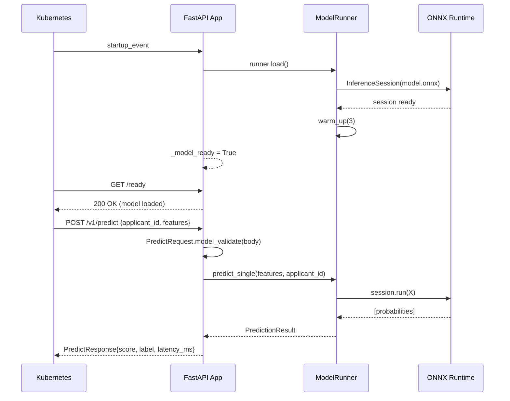
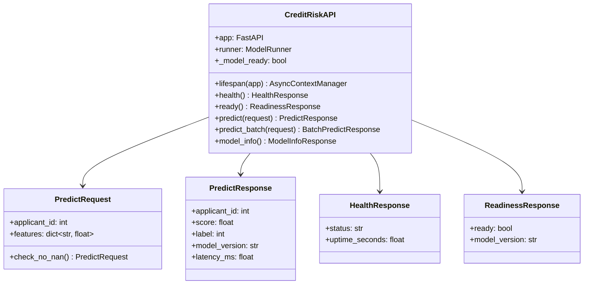

# Day 24 — FastAPI: Pydantic Schemas, Health/Readiness, Versioned Endpoints

## Why FastAPI for ML Serving

FastAPI is the current industry default for Python ML serving because:

- **Pydantic v2** — schema validation in Rust; input errors are caught before inference
- **Async-native** — non-blocking I/O for feature store calls and audit logging
- **Auto-generated OpenAPI** — `/docs` and `/openapi.json` come free
- **Type annotations = schema** — no separate schema file; types are the contract

---

## Endpoint Design

### Core Endpoints

| Endpoint | Method | Purpose |
|---|---|---|
| `/health` | GET | Liveness probe — is the process alive? Returns 200 always |
| `/ready` | GET | Readiness probe — is the model loaded and ready for traffic? |
| `/v1/predict` | POST | Single-row online inference |
| `/v1/predict/batch` | POST | Multi-row batch inference (small batches, < 1000 rows) |
| `/v1/model/info` | GET | Model version, feature count, threshold metadata |
| `/metrics` | GET | Prometheus-style metrics (latency histogram, request count) |

### Why /health vs /ready

```
Kubernetes probes:

livenessProbe  →  /health  — if this fails, K8s RESTARTS the pod
readinessProbe →  /ready   — if this fails, K8s REMOVES the pod from the load balancer
                             (pod stays alive but receives no traffic until model loads)

Startup is slow (ONNX session load = 100–500ms).
During startup: /health = 200, /ready = 503.
After model load: /health = 200, /ready = 200.
```

---

## Pydantic Schema Design

### Request Schema

```python
class PredictRequest(BaseModel):
    applicant_id: int = Field(gt=0, description="Unique applicant identifier")
    features: dict[str, float] = Field(min_length=1)

    model_config = ConfigDict(strict=True)

    @model_validator(mode="after")
    def check_no_nan(self) -> "PredictRequest":
        for k, v in self.features.items():
            if v != v:  # IEEE 754 NaN check
                raise ValueError(f"NaN not allowed in feature '{k}'")
        return self
```

### Response Schema

```python
class PredictResponse(BaseModel):
    applicant_id: int
    score: float = Field(ge=0.0, le=1.0)
    label: int = Field(ge=0, le=1)
    model_version: str
    latency_ms: float
```

---

## API Versioning Strategy

```
/v1/predict  ─▶ current production version
/v2/predict  ─▶ next version (canary during rollout)

Rules:
  v1 → v2: additive (new optional fields) = MINOR bump (backward compatible)
  v1 → v2: remove field / change type       = MAJOR bump (breaking; run both simultaneously)

Deprecation: 
  1. Deploy v2 alongside v1
  2. Set `Deprecation: version=v1, sunset=2026-09-01` response header on v1
  3. After sunset date: remove v1 router
```

---

## Application Lifecycle



---

## Error Handling

| Scenario | HTTP Status | Detail |
|---|---|---|
| Invalid feature (NaN, wrong type) | 422 Unprocessable Entity | Pydantic ValidationError body |
| Model not yet loaded | 503 Service Unavailable | `{"detail": "Model not ready"}` |
| Internal inference error | 500 Internal Server Error | Logged; generic message to client |
| Unknown endpoint | 404 Not Found | FastAPI default |
| Body too large | 413 Payload Too Large | Set via middleware |

---

## Class and Flow Diagram



---

## Middleware Stack

```
Request
   │
   ▼
CORS Middleware          (allow configured origins)
   │
   ▼
Request Logging          (log method, path, status, latency)
   │
   ▼
Request Size Limit       (reject bodies > 1MB)
   │
   ▼
Route Handler            (/v1/predict, /health, /ready ...)
   │
   ▼
Exception Handler        (map RuntimeError → 500, ValidationError → 422)
   │
   ▼
Response
```

---

## Debugging Table

| Symptom | Likely Cause | Fix |
|---|---|---|
| 422 on valid request | Strict mode rejects extra fields | Use `model_config = ConfigDict(extra="ignore")` |
| `/ready` returns 503 during test | Model not loaded in test client | Mock runner or call `runner.load()` in fixture |
| p99 latency spike at startup | Session loaded on first request | Pre-load in `lifespan` startup handler |
| OpenAPI schema shows `object` for features | Missing type annotations | Use `dict[str, float]` not `dict` |
| 500 on float("inf") input | ONNX can't process inf | Add `check_no_inf` validator |

---

## Key Invariants

1. **Load the model in `lifespan` startup, not in the route handler** — one load, many requests.
2. **Validate with Pydantic before inference** — catch bad input at the boundary, not mid-pipeline.
3. **Return 503 (not 500) when model is not ready** — 503 is retriable; 500 signals a bug.
4. **Version the URL (`/v1/`)** — allows running v1 and v2 in parallel during migration.
5. **Separate `/health` (liveness) from `/ready` (readiness)** — wrong mapping causes K8s restart loops.
