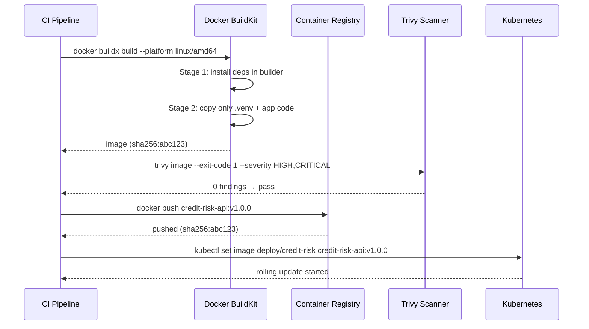

# Day 25 — Containerize: Multi-Stage Build, Non-Root, Image Scanning

## Why Containerization Matters for ML Serving

Without a container:
- "It works on my machine" — reproducibility breaks in production
- Dependency version drift between dev and prod
- No isolation between multiple model versions running simultaneously
- No way to roll back to a known-good image

With a container (OCI image):
- Immutable artifact — the same image runs in dev, staging, prod
- SHA-256 pinned → exact binary reproducibility
- K8s can roll back to any previous image tag in seconds
- Image scanner can audit every layer for CVEs

---

## Multi-Stage Build: Why

A single-stage build includes the full build toolchain (GCC, pip, dev headers) in the runtime image.
Multi-stage separates build from runtime:

```
Stage 1 (builder):  uv + pip + wheels (large)
Stage 2 (runtime):  Python + .venv only (small, no build tools)
```

Typical size reduction: 1.2GB → 350MB for a Python ML image.

---

## Non-Root User: Why

Running as root inside a container means a container escape gives the attacker full host access.
Running as a non-root user limits blast radius:

```dockerfile
RUN groupadd --gid 1001 appgroup && \
    useradd --uid 1001 --gid 1001 --no-create-home appuser
USER appuser
```

PCI-DSS and SOC 2 both require non-root for running services.

---

## Dockerfile: Multi-Stage for Credit Risk API

```
┌─────────────────────────────────┐
│  Stage 1: builder               │
│  FROM python:3.11-slim          │
│  RUN pip install uv             │
│  COPY pyproject.toml .          │
│  RUN uv sync --no-dev           │
└─────────────┬───────────────────┘
              │ COPY --from=builder /app/.venv
              ▼
┌─────────────────────────────────┐
│  Stage 2: runtime               │
│  FROM python:3.11-slim          │
│  RUN adduser appuser            │
│  COPY --from=builder .venv      │
│  COPY serving/ models/          │
│  USER appuser                   │
│  EXPOSE 8080                    │
│  CMD ["uvicorn", ...]           │
└─────────────────────────────────┘
```

---

## Security Layers

| Layer | Tool | What it catches |
|---|---|---|
| **Base image** | `python:3.11-slim` (not `-full`) | Fewer pre-installed packages = smaller attack surface |
| **No root at runtime** | `USER appuser` | Container escape doesn't give host root |
| **Read-only filesystem** | `--read-only` (K8s `readOnlyRootFilesystem: true`) | Prevents in-container file modification |
| **No new privileges** | `allowPrivilegeEscalation: false` | Prevents `setuid` binary privilege escalation |
| **CVE scanning** | `trivy image <image>` | Scans all layers for known vulnerabilities |
| **SBOM** | `syft <image>` | Software Bill of Materials for provenance |
| **Secrets** | Never in Dockerfile; use K8s Secrets | Prevents secrets in image history (`docker history`) |

---

## Threat Checkpoint: Serving Surface

The Day 25 curriculum marks this as a **Threat Checkpoint**. Before deploying:

```
Attack Surface Assessment:

1. Network:
   - Which ports are exposed? (only 8080)
   - Is TLS terminated at ingress or at the pod? (ingress)
   - Are internal services reachable from the container? (only via K8s NetworkPolicy)

2. Runtime:
   - User: non-root (UID 1001)
   - Filesystem: read-only (only /tmp writable for temp files)
   - Capabilities: drop ALL, add only NET_BIND_SERVICE if needed

3. Dependencies:
   - Who produces the base image? (Docker Hub python:3.11-slim = official)
   - Are all pip packages pinned? (uv.lock)
   - Are any dev dependencies included? (NO -- uv sync --no-dev)

4. Secrets:
   - Model artifact: mounted from K8s Secret/ConfigMap, not baked in
   - API keys: injected via K8s Secrets as env vars
   - Never in Dockerfile ENV or COPY

5. Drift:
   - Base image must be re-pulled and rebuilt weekly for OS patches
   - Trivy scan must pass (CRITICAL=0, HIGH=0 policy) before push to registry
```

---

## Image Scanning with Trivy

```bash
# Install
brew install aquasecurity/trivy/trivy

# Scan an image
trivy image credit-risk-api:v1.0.0

# Fail CI on HIGH or CRITICAL findings
trivy image --exit-code 1 --severity HIGH,CRITICAL credit-risk-api:v1.0.0

# Scan for specific package CVEs
trivy image --vuln-type library credit-risk-api:v1.0.0
```

### Understanding Trivy Output

| Severity | Action |
|---|---|
| CRITICAL | Block merge immediately; patch or upgrade base image |
| HIGH | Fix within 24h SLA |
| MEDIUM | Fix within 7 days |
| LOW | Track; fix in next sprint |
| UNKNOWN | Investigate; treat as HIGH if unclear |

---

## .dockerignore

The `.dockerignore` must exclude:
- `.git/` — prevents Git history in image
- `*.egg-info/`, `__pycache__/` — stale build artifacts
- `tests/` — not needed at runtime
- `data/raw/` — large raw data not for serving
- `.env`, `*.env` — secrets must never enter the image

---

## Build Flow



---

## Debugging Table

| Symptom | Cause | Fix |
|---|---|---|
| Image size > 1GB | Build deps in runtime stage | Use multi-stage build |
| `Permission denied` in container | Missing write perms for non-root | `chmod` relevant dirs in Dockerfile |
| Secret visible in `docker history` | Used `ENV` or `ARG` for secret | Use K8s Secrets mounted as env vars |
| Trivy HIGH findings in base image | Outdated base | Update FROM to latest patch tag |
| `python: not found` in stage 2 | Wrong FROM base | Use same Python version in both stages |
| Health check fails at startup | Model not pre-loaded | Set `CMD` to start uvicorn with `--timeout-keep-alive` |

---

## Key Invariants

1. **Multi-stage: build deps never ship to production** — keep runtime image minimal.
2. **Non-root user in runtime stage** — limit container escape blast radius.
3. **No secrets in Dockerfile** — use K8s Secrets + env var injection.
4. **Trivy scan before every registry push** — block HIGH/CRITICAL in CI.
5. **Pin the base image digest** — `python:3.11-slim@sha256:...` prevents supply-chain surprises.
