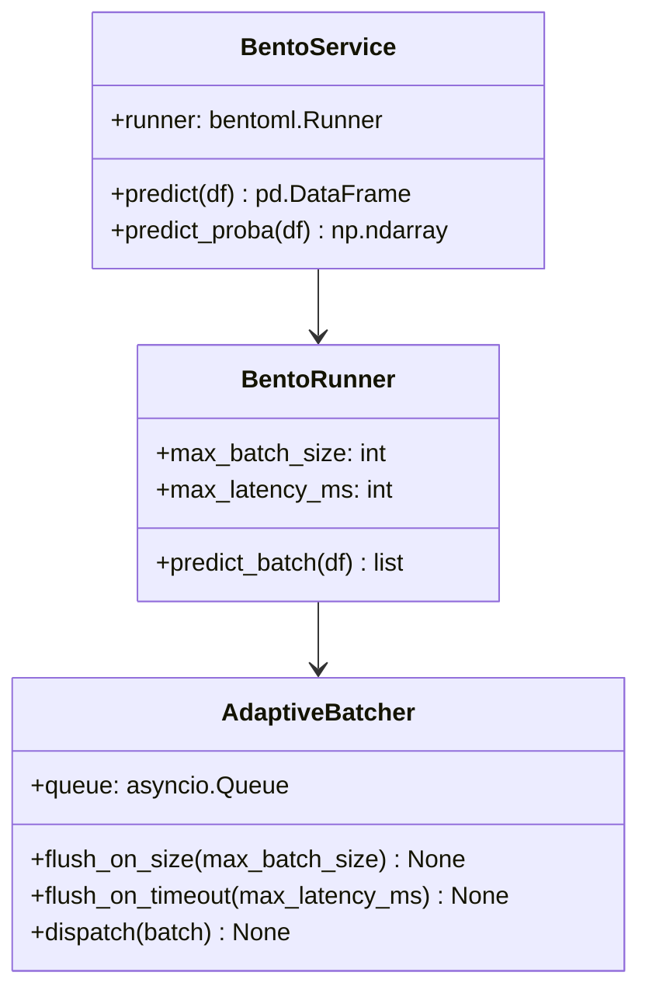
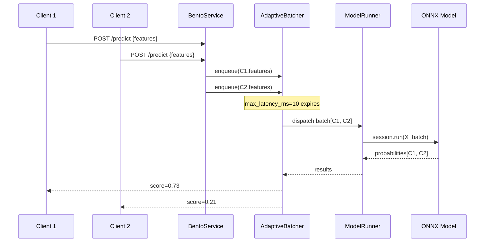

# Day 26 — BentoML: Bentos, Runners, Adaptive Batching

## What is BentoML

BentoML is an ML serving framework that sits between the raw FastAPI layer and a full
Kubernetes inference server (KServe). It provides:

- **Runner abstraction** — wraps a model for thread-safe parallel inference
- **Adaptive batching** — queues individual requests and groups them into batches
- **Bento packaging** — bundles model + code + dependencies into a portable artifact
- **Built-in metrics** — Prometheus metrics, distributed tracing out of the box
- **OCI image build** — `bentoml containerize` produces a production Docker image

---

## Key Concepts

### Runner

A Runner is a BentoML-managed inference worker:
- Runs in its own process pool (CPU-bound inference doesn't block the async web layer)
- Can be scaled independently from the HTTP layer
- Exposes `runner.run(input)` as an async call from the service

```python
runner = bentoml.lightgbm.get("credit_risk_model:latest").to_runner()
```

### Adaptive Batching

Without batching: 1000 clients × 1-row requests = 1000 ONNX calls.
With batching: 1000 clients → queued → dispatched as one 1000-row call.

```
Clients:  ──── R1 ── R2 ── R3 ── R4 ────────────────
                 │    │    │    │
Batcher:    ─── └────┴────┴────┘ ─── batch(R1..R4) → ONNX
                                       ─── split results back
```

BentoML's batcher has two tunable parameters:
- `max_batch_size`: maximum rows per batch (default 100)
- `max_latency_ms`: maximum time to wait for the batch to fill (default 10ms)

If `max_latency_ms` expires before `max_batch_size` is reached, the partial batch is dispatched.
This is the "adaptive" part — it fills what it can within the latency budget.

### Bento

A Bento is the deployable artifact:

```
credit_risk_model.bento/
  ├── README.md
  ├── bento.yaml          ← metadata (name, version, labels)
  ├── apis/
  │   └── openapi.yaml    ← generated API spec
  ├── models/             ← bundled model artifacts
  │   └── credit_risk_model/v1.0.0/
  ├── src/                ← application code
  └── requirements.txt    ← dependency manifest
```

---

## FastAPI vs BentoML vs KServe

| Feature | FastAPI | BentoML | KServe |
|---|---|---|---|
| Async batching | Manual | Built-in | Built-in |
| Model packaging | Manual | `bentoml build` | Custom manifests |
| Horizontal scaling | External (K8s) | Runner scaling | KServe autoscale |
| Multi-model serving | Manual | Single bento | Multiple models |
| GPU affinity | Manual | Per-runner | Pod-level |
| Protocol | Custom HTTP | HTTP + gRPC | HTTP + gRPC + V2 |
| Best for | Flexibility | MLOps teams | Enterprise K8s |

**Decision for this project:**
- Phase 4 (local/staging): FastAPI for simplicity + BentoML for batching
- Phase 5 (K8s production): KServe

---

## BentoService Architecture



---

## Request Flow



---

## Adaptive Batching Tuning

| Traffic | `max_batch_size` | `max_latency_ms` | Effect |
|---|---|---|---|
| Low (< 10 RPS) | 32 | 5 | Small batches, low latency |
| Medium (100 RPS) | 128 | 10 | Balanced |
| High (> 1000 RPS) | 512 | 20 | Large batches, higher throughput |

**Rule of thumb:** `max_latency_ms` adds to p99 when traffic is low (batch never fills).
Set it ≤ 10% of your p99 budget. If p99 SLA = 100ms, set `max_latency_ms ≤ 10`.

---

## Debugging Table

| Symptom | Cause | Fix |
|---|---|---|
| High p99 at low traffic | `max_latency_ms` too large | Reduce max_latency_ms |
| Low throughput at high traffic | `max_batch_size` too small | Increase max_batch_size |
| Runner OOM | Batch too large for RAM | Reduce max_batch_size |
| `Runner is not ready` | Cold runner start | Pre-warm with `runner.init_local()` |
| Bento build fails | Missing files in `include` | Check `bentofile.yaml` include patterns |

---

## Key Invariants

1. **Adaptive batching reduces ONNX call overhead** by ~10–50× at moderate traffic — but adds `max_latency_ms` to every request's minimum latency.
2. **Runners run in a separate process** — they don't share memory with the HTTP layer; communication is via IPC/gRPC.
3. **Bento is immutable** — once built and pushed to the registry, the artifact should never be modified.
4. **`max_latency_ms` adds a floor to p99** — never set it higher than your latency SLA.
5. **BentoML wraps any framework** — the same `Service` API works for sklearn, LightGBM, PyTorch, ONNX Runtime.
