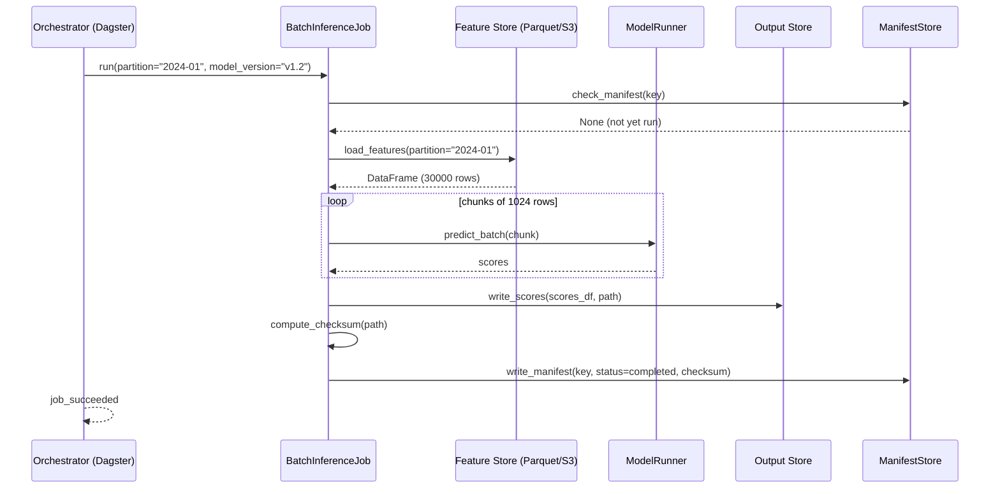
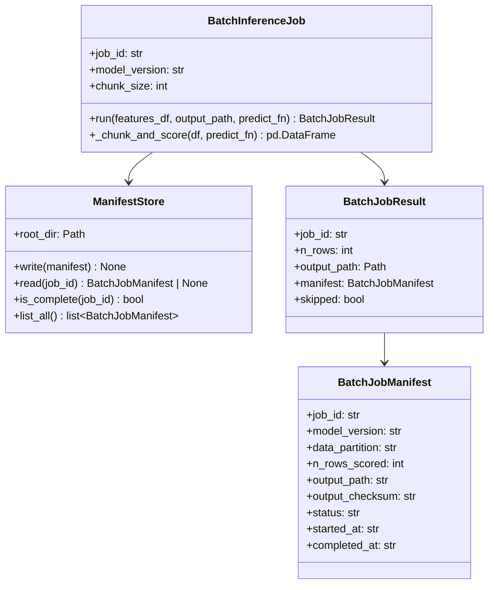

# Day 27 — Batch Inference: Idempotency, Backfills

## Why Batch Inference is Different from Online

Online inference is stateless — each request is independent. Batch inference operates
over a large, stateful dataset and writes its output to persistent storage. This makes
two problems critical:

1. **Idempotency** — re-running the job after a failure must not corrupt output
2. **Backfills** — scoring historical data with a new model must be resumable

---

## Idempotency: The Core Invariant

A batch job is **idempotent** if running it N times has the same effect as running it once.

Without idempotency:
```
Job run 1: writes rows 1–500   ✅
Job crashes at row 501
Job run 2: writes rows 1–500 again (DUPLICATES) + rows 501–1000
Result: rows 1–500 duplicated in output 💥
```

With idempotency:
```
Job run 1: writes rows 1–500, writes manifest: {partition=2024-01, rows=500, checksum=abc}
Job crashes at row 501
Job run 2: sees manifest for partition=2024-01 → skips (already done)
Job run 2: writes rows 501–1000, writes manifest: {partition=2024-01_p2, ...}
Result: correct output ✅
```

### Idempotency Key

```
key = (model_version, data_partition, run_date, job_type)

Example:
  key = ("v1.2", "2024-01", "2024-06-15", "nightly_score")
```

The manifest stores this key + output checksum. Before writing, check if the key
already exists with a matching checksum.

---

## Manifest Pattern

```json
{
  "job_id": "nightly_score_2024-01-15_v1",
  "model_version": "v1.2",
  "data_partition": "2024-01",
  "run_date": "2024-01-15",
  "n_rows_scored": 30000,
  "output_path": "s3://bucket/scores/2024-01/scores.parquet",
  "output_checksum": "sha256:abc123...",
  "status": "completed",
  "started_at": "2024-01-15T02:00:00Z",
  "completed_at": "2024-01-15T02:14:33Z",
  "duration_seconds": 873
}
```

---

## Backfill Strategy

A backfill re-scores historical data with a new model version. It must:
1. Never overwrite the original scores (append to a new partition)
2. Be resumable (if it fails mid-run, restart from the last successful partition)
3. Have a completion marker (the backfill is "done" only when all partitions are scored)

```
Backfill plan:
  model_version: v2.0
  partitions: [2023-01, 2023-02, ..., 2023-12]
  output_prefix: s3://bucket/scores/backfill_v2/

Execution:
  For each partition:
    if manifest exists AND status=completed → skip
    else: score → write → write manifest

Completion check:
  all(manifest.status == "completed" for partition in partitions)
```

---

## BatchInferenceJob Flow



---

## Class and Flow Diagram



---

## Debugging Table

| Symptom | Cause | Fix |
|---|---|---|
| Duplicate rows in output | No idempotency check | Add manifest check before writing |
| Job re-runs from scratch on failure | Manifest not written until end | Write per-chunk manifests (mini-commits) |
| Memory error on large partition | Entire partition loaded at once | Chunk loading from Parquet using `pd.read_parquet(chunksize=N)` |
| Backfill never completes | No completion checker | Add `is_backfill_complete()` check in orchestrator |
| Checksum mismatch on resume | Output file partially written | Delete and rewrite if checksum fails |

---

## Key Invariants

1. **Idempotency key = (model_version, partition, run_date)** — always check before writing.
2. **Write manifest last** — output file must be complete before manifest marks it done.
3. **Never overwrite existing completed partitions** — append to new path for backfills.
4. **Checksums for output integrity** — detect corrupted or truncated output files.
5. **Resume from last successful partition** — the orchestrator re-triggers failed partitions, not the whole backfill.
