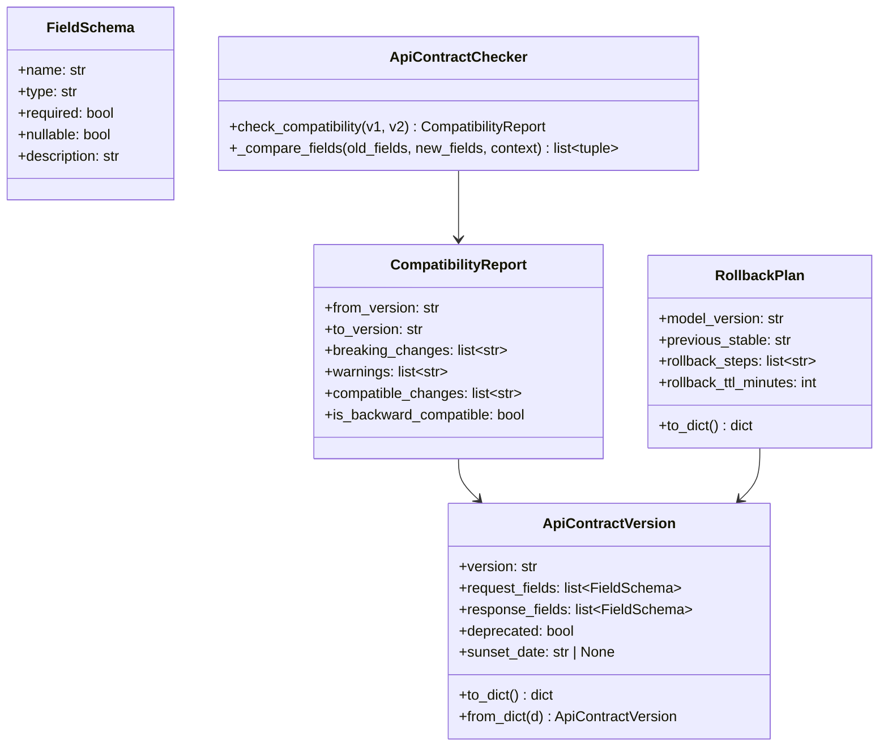

# Day 28 — Model API Contract: Versioning, Compatibility, Rollback

## What is a Model API Contract

A Model API Contract defines the formal agreement between:
- **Producer** — the ML team that trains and deploys the model
- **Consumer** — any downstream system that calls the inference API

The contract specifies:
1. Request schema (fields, types, constraints)
2. Response schema (fields, types, guarantees)
3. Version lifecycle (when versions are introduced, deprecated, removed)
4. Rollback plan (how to revert to a previous version safely)

Breaking this contract without notice causes downstream failures and incidents.

---

## Schema Versioning

### Backward Compatibility (SAFE — minor version bump)

Change is backward compatible if consumers using v1 schemas still work:

| Change Type | Backward Compatible? | Example |
|---|---|---|
| Add optional request field | ✅ Yes | `add features.new_col (optional)` |
| Add optional response field | ✅ Yes | `add response.explanation` |
| Widen constraint | ✅ Yes | `applicant_id > 0` → `applicant_id >= 0` |
| Remove optional request field | ✅ Yes | Consumer sends it; server ignores |
| Remove required request field | ❌ No | Consumer still sends it; server breaks |
| Change field type | ❌ No | `score: float` → `score: int` breaks consumers |
| Rename field | ❌ No | Consumer looks for old name |
| Tighten constraint | ❌ No | `score [0,1]` → `score [0,0.5]` may reject valid input |

### Breaking Change Protocol

```
1. Deploy v2 endpoint alongside v1:  /v1/predict  AND  /v2/predict
2. Migrate consumers to v2 (canary → full traffic)
3. Add Deprecation header to v1: Deprecation: version=v1, sunset=2026-09-01
4. Monitor v1 traffic → zero consumers remaining
5. Remove v1 router after sunset date
```

---

## Versioned Rollback Plan

The rollback plan answers: "if v2 is broken in production, how do we revert in < 5 minutes?"

```
Step 1 — Detection:
  Alert fires: error_rate > 1% OR p99 > 500ms (Grafana → PagerDuty)

Step 2 — Decision (< 2 minutes):
  On-call engineer confirms: "This is a model regression, not a traffic spike"

Step 3 — Rollback (< 3 minutes):
  Option A (K8s): kubectl set image deploy/credit-risk credit-risk-api:v1.0.0
  Option B (K8s): kubectl rollout undo deployment/credit-risk
  Option C (feature flag): toggle MODEL_VERSION env var via K8s ConfigMap

Step 4 — Verify:
  Check /ready returns 200 with model_version=v1.0.0
  Confirm error rate returns to baseline

Step 5 — Post-mortem:
  Document root cause, detection time, rollback time
```

---

## Contract Compatibility Checker

The `ApiContractChecker` class validates two schemas against each other
and classifies each change as COMPATIBLE, WARNING, or BREAKING.

```
v1_schema → v2_schema: compatibility report

COMPATIBLE: added optional field `explanation` in response
WARNING:    removed optional field `confidence_interval` (consumers may read it)
BREAKING:   changed field type `score` from float → int
BREAKING:   removed required field `applicant_id`
```

---

## Rollback Plan Document

The rollback plan document is versioned alongside the model:

```yaml
# models/rollback_plan_v2.yaml
model_version: "v2.0"
previous_stable: "v1.2"
rollback_steps:
  - step: "Alert fires on error_rate or p99 breach"
    owner: "on-call"
    max_duration_minutes: 2
  - step: "kubectl rollout undo deployment/credit-risk"
    owner: "on-call"
    max_duration_minutes: 3
  - step: "Verify /ready returns v1.2"
    owner: "on-call"
    max_duration_minutes: 2
rollback_ttl_minutes: 7
canary_traffic_pct: 10
```

---

## Class and Flow Diagram



---

## Debugging Table

| Symptom | Cause | Fix |
|---|---|---|
| Consumer 422 after deploy | Removed required field | Keep v1 endpoint alive; deploy as v2 |
| Consumer gets `null` for expected field | Field renamed | Add deprecated alias in response |
| Rollback takes > 10 min | Manual kubectl steps | Automate with ArgoCD rollback hook |
| v1 still receiving traffic after sunset | Consumer not migrated | Add hard deadline; send warning headers |
| Score range changed silently | Type widened without notice | Bump minor version + announce |

---

## Key Invariants

1. **Never remove a required field without a version bump** — this breaks all consumers.
2. **Additive changes = minor bump, breaking changes = major bump** — and never in-place.
3. **Run old and new versions in parallel** during migration — never a hard cutover.
4. **Rollback must complete in < 7 minutes** — automate it; test it quarterly.
5. **Sunset headers, then sunset date, then removal** — three-step deprecation, never one step.
