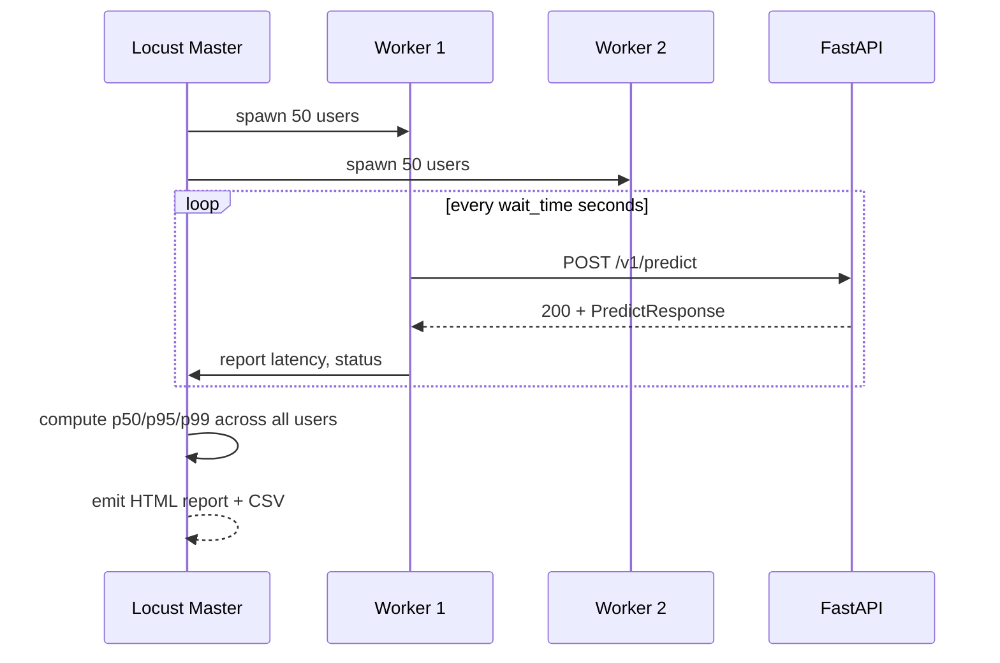
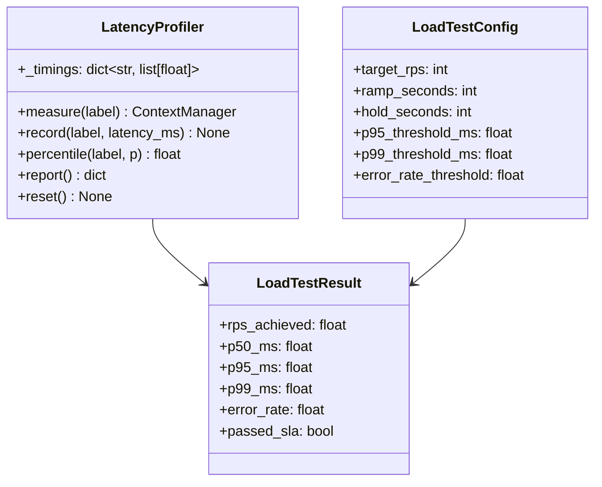

# Day 29 — Load Testing: k6/Locust, p50/p95/p99, Profiling

## Why Load Test Before Shipping

Unit tests and integration tests verify correctness on a single request.
Load tests verify performance under realistic concurrency:

- Does p99 latency stay within SLA at 100 RPS?
- Does memory leak under sustained load?
- At what RPS does the server start dropping requests?
- How long does a cold start take under concurrent pressure?

---

## Load Testing Tools

### k6

Go-based, scriptable in JavaScript. Designed for CI integration.

```javascript
// k6/predict_load_test.js
import http from 'k6/http';
import { check } from 'k6';

export const options = {
  stages: [
    { duration: '30s', target: 50 },   // ramp up to 50 users
    { duration: '1m',  target: 50 },   // hold
    { duration: '10s', target: 0 },    // ramp down
  ],
  thresholds: {
    'http_req_duration': ['p(95)<200', 'p(99)<500'],
    'http_req_failed': ['rate<0.01'],
  },
};

export default function () {
  const res = http.post('http://localhost:8080/v1/predict', JSON.stringify({
    applicant_id: 1,
    features: { LIMIT_BAL: 50000, AGE: 35 },
  }), { headers: { 'Content-Type': 'application/json' } });

  check(res, {
    'status 200': (r) => r.status === 200,
    'latency < 200ms': (r) => r.timings.duration < 200,
  });
}
```

### Locust

Python-based, scriptable in Python. Better for complex scenario logic.

```python
# locustfile.py
from locust import HttpUser, task, between

class CreditRiskUser(HttpUser):
    wait_time = between(0.1, 0.5)  # seconds between requests

    @task(weight=9)
    def predict_single(self):
        self.client.post("/v1/predict", json={
            "applicant_id": 1,
            "features": {"LIMIT_BAL": 50000.0, "AGE": 35.0},
        })

    @task(weight=1)
    def health_check(self):
        self.client.get("/health")
```

---

## Load Test Phases

```
Phase 1: Baseline (10 RPS, 2 min)
  Purpose: Establish p50/p95/p99 at zero stress
  Expected: p99 < 50ms

Phase 2: Ramp (10 → 100 RPS, 5 min)
  Purpose: Find inflection point (where p99 starts rising)
  Expected: p99 < 200ms at 100 RPS

Phase 3: Soak (100 RPS, 30 min)
  Purpose: Detect memory leaks and connection pool exhaustion
  Watch: RSS memory stable within ±10MB

Phase 4: Spike (100 → 500 RPS, 30 sec)
  Purpose: Verify graceful degradation under sudden traffic burst
  Expected: 503s acceptable, p99 should recover within 60s
```

---

## Latency Profiler

A `LatencyProfiler` collects timings during a load test and produces
a p50/p95/p99 report. Use it to:

1. Identify which code path contributes the most latency
2. Compare p99 before and after an optimization
3. Detect if a bottleneck is in inference, I/O, or serialisation

```python
profiler = LatencyProfiler()

with profiler.measure("onnx_inference"):
    scores = session.run(None, {input_name: X})

with profiler.measure("json_serialise"):
    response = PredictResponse(...).model_dump()

print(profiler.report())
# {
#   "onnx_inference": {"p50": 3.1, "p95": 5.2, "p99": 8.4, "n": 1000},
#   "json_serialise": {"p50": 0.3, "p95": 0.6, "p99": 1.1, "n": 1000},
# }
```

---

## Load Test Results Interpretation

```
Normal (healthy server):

  RPS    p50    p95    p99
  10    3ms    8ms   12ms    ← baseline
  50    4ms   12ms   25ms    ← slight queuing
  100   6ms   25ms   80ms    ← acceptable
  200   15ms   95ms  350ms   ← approaching SLA
  300+  50ms  400ms  1200ms  ← overloaded; p99 > SLA

Signs of trouble:
  - p99 >> p95 × 3 : extreme tail latency (GC pauses, lock contention)
  - p50 rising linearly with RPS : no parallelism / blocking calls
  - Memory growth after phase 3 : memory leak
  - Error rate > 1% : worker pool exhausted
```

---

## Locust Scenario Flow



---

## Class Diagram



---

## Debugging Table

| Symptom | Cause | Fix |
|---|---|---|
| p99 >> p95 × 5 | GC pause / lock contention | Profile heap; use `gc.freeze()` before traffic |
| p50 linear with RPS | Blocking I/O in request handler | Use `async` for I/O; run inference in threadpool |
| Memory grows in soak test | Object leak in request path | Profile with `tracemalloc`; check circular refs |
| 503 errors at low RPS | Model not loaded / wrong readiness probe | Check `/ready` returns 200 before test |
| Locust can't reach target RPS | Client-side bottleneck | Run multiple Locust workers |

---

## Key Invariants

1. **Test p99, not mean** — SLAs must be defined by percentiles to catch tail latency.
2. **Soak test for memory leaks** — run at target RPS for 30+ minutes.
3. **Profile before optimizing** — measure where latency comes from before changing code.
4. **Load test is a gate, not an afterthought** — run in CI before every production deploy.
5. **Spike test validates graceful degradation** — the server must recover, not crash.
