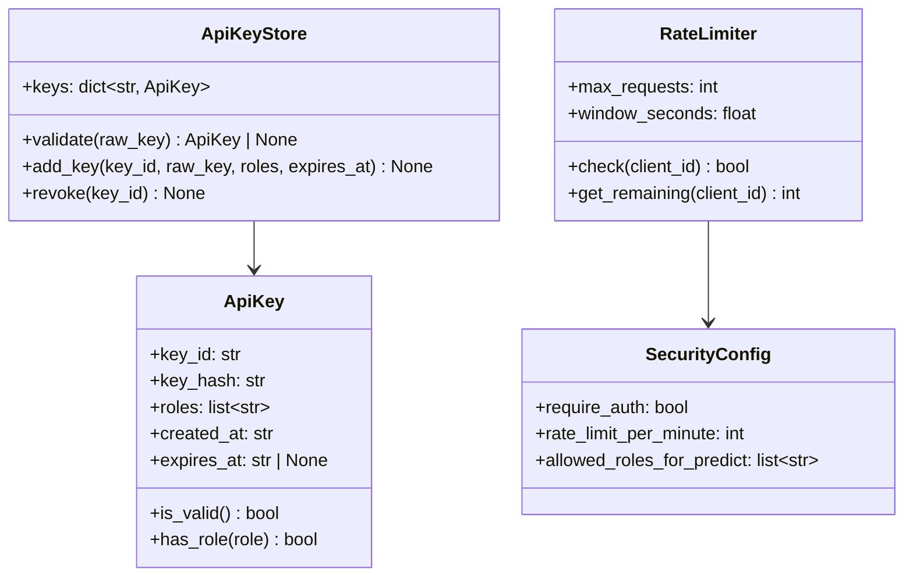
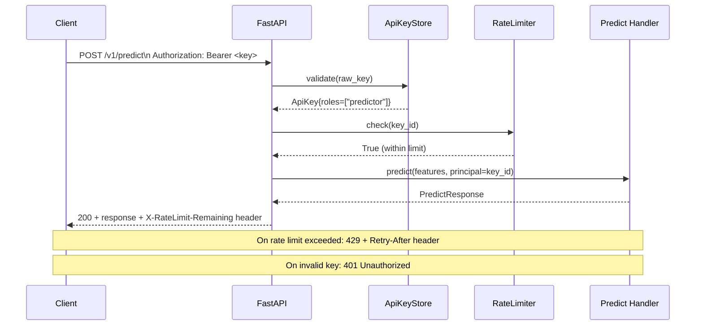

# Day 30 — Serving Security: AuthN/AuthZ, Rate Limits, Secrets + Serving Gate

## Why Serving Security is a Gate

The curriculum defines six production gates. One is the **Serving gate**:

> Deploy, roll back, load-test, and explain p95/p99.

Day 30 adds the security dimension: a service is not ready to ship if any of these are unresolved:

| Gate Check | Pass Condition |
|---|---|
| Authentication | Every request has a valid API key or OAuth token |
| Authorization | Only authorised principals can call sensitive endpoints |
| Rate limiting | No single client can exhaust server capacity |
| Secrets | No credential in code, logs, or image history |
| mTLS | Internal service-to-service traffic is encrypted + authenticated |
| Audit trail | Every request is logged with who, what, when, outcome |

---

## Authentication (AuthN)

For Phase 4 (internal API), API Key authentication is appropriate:

```
Request:
  Authorization: Bearer <API_KEY>

Server:
  1. Extract key from header
  2. Hash it (SHA-256) and compare to stored hash — never compare raw keys
  3. If no match → 401 Unauthorized
  4. If expired → 401 Unauthorized
  5. If valid → attach principal to request context
```

Why hash the stored key:
- If the key store is compromised, raw keys leak to attackers
- Hashed keys are useless to an attacker (one-way)
- Same principle as password hashing

### Production evolution

```
Phase 4 (internal API): API Key (simple)
Phase 5 (K8s + external): OAuth2 + JWT (OIDC, Keycloak)
Phase 5 (service-to-service): mTLS (mutual TLS, both sides present certificate)
```

---

## Authorization (AuthZ)

Even authenticated principals should be scoped:

| Role | Allowed Endpoints |
|---|---|
| `reader` | GET /health, GET /ready, GET /v1/model/info |
| `predictor` | All reader + POST /v1/predict, POST /v1/predict/batch |
| `admin` | All endpoints including debug/reload |

```python
# FastAPI dependency
async def require_role(role: str, principal = Depends(authenticate)):
    if role not in principal.roles:
        raise HTTPException(403, "Insufficient permissions")
```

---

## Rate Limiting

Rate limiting prevents:
- Accidental DoS from a runaway batch job
- Intentional abuse (scraping predictions)
- Cascading failures (one client consuming all threads)

```
Token bucket algorithm:
  Each client (by API key or IP) gets N tokens per second.
  Each request consumes 1 token.
  If bucket empty → 429 Too Many Requests

Implementation:
  In-process: simple dict[client_id → (tokens, last_refill_time)]
  Redis: shared across multiple instances
  K8s: nginx-ingress rate limit annotations
```

---

## Secrets Management

| Anti-pattern | Why bad | Fix |
|---|---|---|
| `os.environ["DB_PASSWORD"]` hardcoded in code | Commits to git | Use K8s Secret + env injection |
| `ENV DB_PASSWORD=...` in Dockerfile | Visible in image history | Remove from Dockerfile; inject at runtime |
| Print/log the secret | Appears in log aggregators | Never log secrets; redact in middleware |
| Secret in URL query param | Appears in nginx access logs | Use `Authorization` header instead |

**Production secret flow:**
```
Vault/AWS Secrets Manager
         │
         ▼
K8s Secret (encrypted at rest in etcd)
         │
         ▼
Pod ENV var (injected at runtime, never in image)
         │
         ▼
FastAPI application (reads from os.environ)
```

---

## mTLS (Mutual TLS)

Standard TLS: client verifies server certificate only.
mTLS: both sides present certificates. Used for service-to-service.

```
credit-risk-api (client cert)
       │────── TLS handshake ──────▶
                                    downstream-service (server cert)
                                    ◀── verifies client cert ──
```

In K8s: implemented via Istio or Linkerd service mesh — no application code change needed.

---

## Serving Gate Dry-Run Checklist

Before marking Phase 4 as complete, verify all six gate criteria:

```
☐ Deployment
  ✅ ONNX model loaded at startup (not per-request)
  ✅ /ready returns 503 during startup, 200 after model load
  ✅ Rolling update tested: kubectl rollout restart deployment
  ✅ Rollback tested: kubectl rollout undo; /ready returns v1.x

☐ Load Test (Day 29)
  ✅ p99 < 200ms at 100 RPS (measured with Locust or k6)
  ✅ Error rate < 1% at 100 RPS
  ✅ Memory stable after 30min soak

☐ Security (Day 30)
  ✅ API Key authentication on predict endpoints
  ✅ Rate limiting: 100 req/min per key (429 on excess)
  ✅ No secrets in Dockerfile ENV or image
  ✅ Trivy scan: 0 CRITICAL, 0 HIGH findings
  ✅ All requests logged with principal + status

☐ Explain p95/p99
  ✅ LatencyProfiler traces: inference vs serialization vs I/O
  ✅ Documented bottleneck and mitigation
```

---

## Class Diagram: Security Module



---

## Request Security Flow



---

## Debugging Table

| Symptom | Cause | Fix |
|---|---|---|
| 401 on all requests | Key not in store / wrong header name | Use `Authorization: Bearer <key>`; check store |
| 403 on valid key | Key lacks required role | Add role to key; check `has_role()` |
| 429 at low traffic | Window too short | Increase window_seconds or max_requests |
| Secret in logs | Logging request body | Redact Authorization header in log middleware |
| mTLS handshake fails | Certificate mismatch | Check CN/SAN in cert against service hostname |

---

## Key Invariants

1. **Never compare raw API keys — hash and compare hashes** — prevents key store compromise from leaking secrets.
2. **Rate limit per client, not globally** — one abusive client shouldn't affect all others.
3. **401 for missing/invalid auth; 403 for valid auth but wrong role** — clients can distinguish expired key from insufficient permission.
4. **Secrets injected at runtime via K8s Secrets** — never in image or repository.
5. **Audit log includes principal + outcome for every request** — required for SOC 2 and PCI-DSS.
