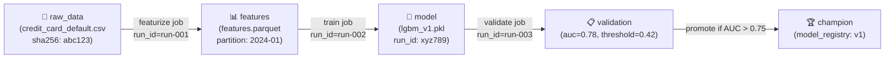
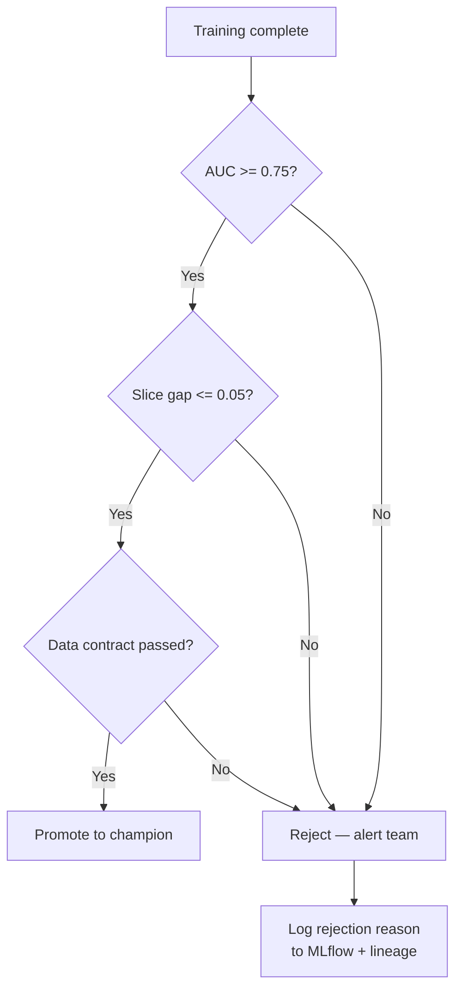
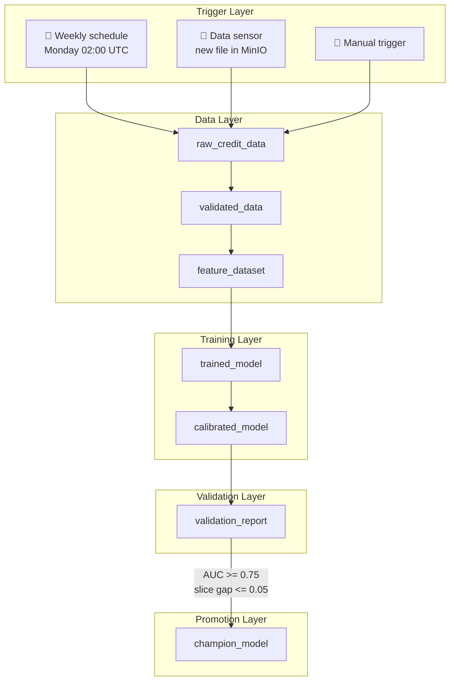

# Day 31 — Orchestration Principles: DAGs, Assets, Idempotency, Retries, Lineage

## Why Orchestration is the Pipeline Gate

The curriculum's **Pipeline gate** requires:

> A failed training job retries safely without corrupting artifacts.

Without an orchestrator you get:
- **Bash scripts that can't retry** — a partial failure leaves corrupted outputs
- **No lineage** — you can't answer "which model used which data cut?"
- **No conditional promotion** — every training run promotes, even failing ones
- **Invisible failures** — silent partial writes that poison downstream jobs

An orchestrator solves all four.

---

## Core Vocabulary

| Concept | Definition | Why it matters |
|---|---|---|
| **DAG** | Directed Acyclic Graph — tasks with dependency edges, no cycles | Enables parallel execution, clear dependency order |
| **Asset** | A persistent artifact produced by a task (Parquet file, model, report) | New Dagster model: think "what did this produce?" not "what did this do?" |
| **Run** | One execution of the DAG or a subset | Has a unique ID, timestamp, status, and lineage |
| **Task / Op** | A unit of computation in the graph | Should do one thing and be retryable |
| **Backfill** | Re-running the pipeline for past time partitions | Critical for correcting historical data errors |
| **Idempotency** | Running a task twice produces the same result | Prerequisite for safe retry and backfill |
| **Retry** | Re-attempting a failed task automatically | Must be safe (idempotent) or it corrupts |
| **Sensor** | Waits for an external condition before triggering | E.g., "new data file arrived in S3" |
| **Schedule** | Time-based trigger (cron expression) | E.g., "retrain at 02:00 UTC every Monday" |
| **Lineage** | Graph of what produced what | Enables "trace this model to the raw data that created it" |
| **Conditional promotion** | Promote model only if validation gate passes | Prevents bad models reaching production |

---

## DAG vs Asset-Oriented Orchestration

Traditional orchestrators (Airflow, Prefect) are **task-centric**:
- You define *operations* and wire them with dependencies
- The artifact is implicit — you must track it yourself

Modern orchestrators (Dagster 1.x) are **asset-centric**:
- You define *data assets* that have computation attached
- The orchestrator tracks what exists, what's stale, what needs updating

```
Task-centric DAG:
  [download] → [featurize] → [train] → [validate] → [promote]
  (what operations ran)

Asset-centric DAG:
  [raw_data] → [features] → [trained_model] → [validation_report] → [champion_model]
  (what artifacts exist and their freshness)
```

Asset-centric is superior for ML because:
- Assets map directly to MLflow artifacts (version them the same way)
- You can materialise individual assets on demand (partial backfill)
- Lineage is automatic — the graph IS the lineage

---

## Idempotency Invariant

A step is idempotent if: **running it N times with the same inputs produces the same output**.

### Pattern 1: Write-then-rename (atomic)

```
write features.parquet.tmp
validate tmp
rename tmp → features.parquet   # atomic on POSIX filesystems
```

### Pattern 2: Check manifest before writing

```python
if manifest.exists(job_id):
    return manifest.read(job_id)   # skip
else:
    result = compute()
    manifest.write(job_id, result)  # idempotent write
    return result
```

### Pattern 3: Content-addressed output

```
output_path = f"features_{sha256(input_path + config)}.parquet"
# If this path exists, computation is already done
```

### What breaks idempotency:

| Anti-pattern | Consequence |
|---|---|
| `model_v{timestamp}.pkl` — new path every run | Re-runs create extra artifacts; old ones linger |
| Appending to a CSV log | Duplicate rows on retry |
| Incrementing a counter in DB on each run | Counter wrong after retry |
| Writing partial output before validation | Corrupt partial artifact if process dies mid-write |

---

## Retry Strategy

### Safe retries require:
1. **Idempotent steps** — re-running is safe
2. **Partial output cleanup** — on failure, delete the partial output before retrying
3. **Bounded retries** — don't retry forever; alert a human after N attempts
4. **Exponential back-off** — space retries to let transient failures resolve

```
Attempt 1: immediate
Attempt 2: +2s
Attempt 3: +4s
Attempt 4: +8s
→ alert after attempt 4
```

### What NOT to retry:
- Validation failures (data quality gate failure is not transient)
- Schema violations (a new column appearing is not transient)
- Business logic errors (code bugs don't fix themselves)

Only retry **infrastructure failures**: network timeouts, S3 throttling, transient DB errors.

---

## Backfill Strategy

A backfill re-runs a pipeline for past time partitions, usually because:
- A bug was fixed and historical outputs need correction
- New features were added to the feature pipeline
- Training data was updated

```
time window:  [2024-01]  [2024-02]  [2024-03]  [2024-04]
status:       COMPLETE   COMPLETE   FAILED     COMPLETE

backfill:     skip       skip       run        skip
```

**Idempotency is mandatory for backfill** — the same partition is re-run and must overwrite correctly.

---

## Lineage Architecture

Lineage connects: **raw data → features → trained model → serving endpoint → predictions**



Lineage enables:
- **Root-cause analysis**: "why did AUC drop?" → trace to which data partition changed
- **Impact analysis**: "if raw_data changed, which models are stale?"
- **Audit trail**: "prove this model was trained on data before the label leak"

---

## Conditional Promotion

A model is only promoted to champion if it passes validation gates:



---

## Orchestration Tool Comparison

| Dimension | Airflow | Dagster | Prefect | ZenML |
|---|---|---|---|---|
| **Mental model** | Task-centric DAG | Asset-centric graph | Flow/task (hybrid) | Pipeline + steps |
| **ML-native?** | No — general purpose | No — general purpose | No | Yes — built for ML |
| **Lineage** | Limited (XCom) | First-class (asset graph) | Task output | First-class (artifact store) |
| **Local dev** | Heavy (Docker) | Simple (dagster dev) | Simple | Simple |
| **K8s native** | KubernetesExecutor | K8s agent | K8s work pool | Kubernetes orchestrator |
| **UI** | Airflow UI | Dagster UI (Launchpad) | Prefect UI (Orion) | Dashboard |
| **Best for** | General ETL | ML + data assets | General pipelines | Pure ML teams |

**This curriculum choice: Dagster** (asset-centric fits ML artifacts naturally).

---

## Pipeline Architecture for Credit-Risk



---

## The Five Orchestration Invariants

1. **Every step is idempotent** — re-running the full pipeline for the same input produces the same output.
2. **Lineage is captured at asset boundaries** — every output records which input produced it (hash, version, run_id).
3. **Failures clean up partial outputs** — a failed step never leaves a corrupt artifact that downstream sees as valid.
4. **Promotion is gated** — a model only reaches the registry after validation gates pass; pipeline code cannot bypass the gate.
5. **Backfill is safe** — running the pipeline for past partitions produces the same result as the original run.

---

## Debugging Table

| Symptom | Cause | Fix |
|---|---|---|
| Retry produces different output | Step is not idempotent | Check if step appends, uses timestamps, or writes to non-atomic path |
| Downstream sees partial data | Write without rename-trick | Use write-to-tmp then atomic rename |
| DAG cycle detected | Circular dependency | Draw dependency graph; split shared dependency into a common ancestor |
| Backfill pollutes live data | Shared mutable state | Use partition-keyed output paths; never share state across partitions |
| Promotion ran despite AUC < 0.75 | Gate not wired into DAG edge | Gate must be a DAG step that raises on failure, not just a log warning |
| Lineage missing | OpenLineage emitter not called | Emit START + COMPLETE/FAIL events wrapping every asset materialisation |
