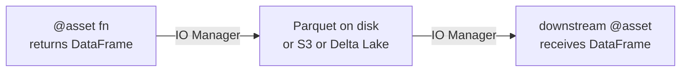
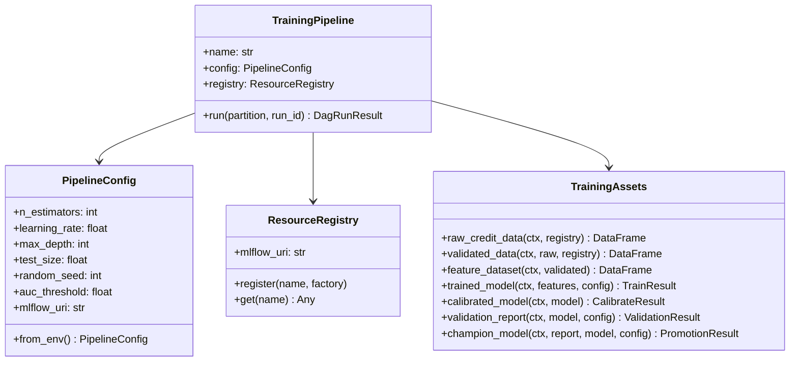

# Day 32 — Dagster Training Pipeline (Deep Build)

## Why Dagster for ML Pipelines

Dagster's core insight: **think in assets, not tasks**.

Traditional orchestrators ask: "What operations should run?"
Dagster asks: "What data should exist, and what's the freshest state of each asset?"

This maps naturally to ML:

| ML artifact | Dagster Asset |
|---|---|
| `data/processed/features.parquet` | `feature_dataset` |
| `models/credit_risk_lgbm.pkl` | `trained_model` |
| `metrics/calibration_report.json` | `calibration_report` |
| `models/champion_model.pkl` | `champion_model` |

When you add a new feature, Dagster knows `feature_dataset` is stale → `trained_model` is stale → `calibration_report` is stale. This propagation is automatic.

---

## Dagster Core Concepts

```mermaid
graph TD
    subgraph "Definitions"
        OP[op\nfn decorated with @op]
        JOB[job\nset of ops with config]
        ASSET[asset\n@asset — data-centric]
        RESOURCE[resource\nshared client/config]
        SENSOR[sensor\nevent-driven trigger]
        SCHEDULE[schedule\ncron-based trigger]
    end

    subgraph "Runtime"
        LAUNCHPAD[Launchpad\nUI config override]
        RUN[Run\none execution instance]
        EVENT[Event Log\nasset checks, metadata]
    end

    JOB -->|contains| OP
    ASSET -->|compiled to| JOB
    RESOURCE -->|injected into| OP
    SENSOR -->|triggers| RUN
    SCHEDULE -->|triggers| RUN
    LAUNCHPAD -->|creates| RUN
    RUN -->|emits| EVENT
```

### Key Abstractions

| Abstraction | Decorator | Purpose |
|---|---|---|
| **Op** | `@op` | A single computation unit (function) |
| **Graph** | `@graph` | Wires ops together with dependencies |
| **Job** | `@job` | Executable unit (graph + resources + config) |
| **Asset** | `@asset` | Data-centric — produces a named persistent artifact |
| **Resource** | `@resource` | Shared dependency (DB connection, MLflow client, S3) |
| **IO Manager** | `IOManager` | Controls how asset values are serialised/deserialised |
| **Config** | `Config` | Pydantic-validated config for ops/jobs/assets |

---

## Asset Graph for Credit-Risk Training

```mermaid
graph LR
    RAW["📄 raw_credit_data\n(MinIO: data/raw/*.csv)"]
    VALIDATED["✅ validated_data\n(passes Pandera schema)"]
    FEATURES["📊 feature_dataset\n(data/processed/features.parquet)"]
    SPLIT["✂️ train_test_split\n(X_train, X_test, y_train, y_test)"]
    MODEL["🤖 trained_model\n(models/credit_risk_lgbm.pkl)"]
    CALIBRATED["📐 calibrated_model\n(models/credit_risk_calibrated.pkl)"]
    REPORT["📋 validation_report\n(metrics/validation_report.json)"]
    CHAMPION["🏆 champion_model\n(model_registry: champion)"]

    RAW -->|validate_data op| VALIDATED
    VALIDATED -->|featurize op| FEATURES
    FEATURES -->|split op| SPLIT
    SPLIT -->|train op| MODEL
    MODEL -->|calibrate op| CALIBRATED
    CALIBRATED & SPLIT -->|validate op| REPORT
    REPORT -->|promote op\nif AUC >= 0.75| CHAMPION
```



---

## Op vs Asset — When to Use Each

| Use `@op` | Use `@asset` |
|---|---|
| Computation with no persistent output | Computation whose output is a data artifact |
| Intermediate in-memory transformation | Feature dataset stored to disk/S3 |
| Validation check (raises or passes) | Model checkpoint saved to registry |
| Side-effect only (send Slack alert) | Metrics report written to JSON |

**Rule of thumb:** if you'd ever want to query "what version of X exists?", use `@asset`.

---

## Dagster Resource Pattern

Resources are shared, configured dependencies injected into ops/assets:

```python
from dagster import resource, InitResourceContext

@resource(config_schema={"tracking_uri": str})
def mlflow_resource(context: InitResourceContext):
    import mlflow
    mlflow.set_tracking_uri(context.resource_config["tracking_uri"])
    return mlflow

# In an op:
@op(required_resource_keys={"mlflow"})
def train_model(context, features_df):
    mlflow = context.resources.mlflow
    with mlflow.start_run():
        ...
```

Our implementation simulates this with a `ResourceRegistry` — injectable dependencies without requiring Dagster installed.

---

## Dagster Config System

Dagster uses Pydantic-based config validation:

```python
from dagster import Config

class TrainConfig(Config):
    n_estimators: int = 200
    learning_rate: float = 0.05
    max_depth: int = 6
    early_stopping_rounds: int = 20
    test_size: float = 0.2
    random_seed: int = 42
```

Config flows through the Launchpad (UI) or YAML files, making every run reproducible.

---

## Dagster IO Manager

IO Managers decouple *how* assets are stored from *what* they compute:



```python
from dagster import IOManager, io_manager

class ParquetIOManager(IOManager):
    def handle_output(self, context, obj):
        path = f"data/{context.asset_key[-1]}.parquet"
        obj.to_parquet(path)

    def load_input(self, context):
        path = f"data/{context.asset_key[-1]}.parquet"
        return pd.read_parquet(path)
```

This means the same asset code works with local Parquet, S3, or Delta Lake by swapping the IO Manager — no code change.

---

## Asset Partitioning

Partitioned assets process data in slices, enabling incremental materialisation:

```python
from dagster import asset, MonthlyPartitionsDefinition

monthly = MonthlyPartitionsDefinition(start_date="2023-01-01")

@asset(partitions_def=monthly)
def monthly_features(context) -> pd.DataFrame:
    partition_key = context.partition_key   # "2023-01"
    start, end = context.asset_partitions_time_window_for_output()
    return load_data_for_window(start, end)
```

For credit-risk: monthly retraining over rolling 12-month windows, each month is a partition.

---

## Asset Checks

Dagster 1.5+ supports asset checks — validation attached to an asset:

```python
from dagster import asset_check, AssetCheckResult

@asset_check(asset="feature_dataset")
def row_count_not_empty(feature_dataset):
    return AssetCheckResult(
        passed=len(feature_dataset) > 0,
        description=f"Feature dataset has {len(feature_dataset)} rows",
    )
```

Asset checks appear in the Dagster UI as ✅/❌ next to each asset node.

---

## Training Pipeline Class Diagram



---

## Dagster Sensor Pattern for New Data

```python
from dagster import sensor, RunRequest, SkipReason, SensorEvaluationContext

@sensor(job=training_job, minimum_interval_seconds=3600)
def new_data_sensor(context: SensorEvaluationContext):
    new_files = check_minio_for_new_files(
        bucket="credit-risk-data",
        since=context.last_run_key or "1970-01-01",
    )
    if not new_files:
        return SkipReason("No new files since last check")

    for f in new_files:
        yield RunRequest(
            run_key=f.key,             # deduplicate: same file → same run_key → skip
            run_config={"ops": {"load_raw": {"config": {"path": f.path}}}},
        )
```

The `run_key` is idempotency at the trigger level — if the sensor fires twice for the same file, Dagster deduplicates.

---

## Dagster vs Airflow Deep Comparison

| Dimension | Airflow | Dagster |
|---|---|---|
| **Failure recovery** | Re-run from failed task | Rematerialise stale assets |
| **Data model** | Tasks push/pull via XCom (limited) | Typed asset values via IO Manager |
| **Testing** | Hard — DAGs are global, implicit state | Easy — assets are pure functions, testable in isolation |
| **Config validation** | Manual (Python dict) | Pydantic (compile-time type checking) |
| **UI** | Task-centric view | Asset graph view + Launchpad |
| **Backfill** | Re-run DAG runs | Re-materialise asset partitions (selective) |
| **Asset checks** | Not native | First-class (Dagster 1.5+) |
| **Local dev** | Needs scheduler + webserver | `dagster dev` — single process |
| **Type safety** | None | Full (Pydantic-based) |

---

## Debugging Table

| Symptom | Cause | Fix |
|---|---|---|
| Asset materialises but downstream is stale | IO Manager mismatch | Check that load_input path matches handle_output path |
| Sensor fires but run is skipped | run_key already used | Check deduplication — expected if same event fires twice |
| Config validation error | Wrong type in YAML | Check Pydantic schema vs YAML keys |
| Partitioned asset missing some partitions | Partition key format wrong | Use same format as MonthlyPartitionsDefinition |
| Asset check fails silently | Check not wired to job | Add check to `asset_checks` parameter in `define_asset_job` |
| Resources not injected | `required_resource_keys` missing | Add resource key to the op decorator |

---

## Key Invariants

1. **Assets are the source of truth** — the Dagster asset graph IS the lineage graph.
2. **IO Managers decouple storage from computation** — swap Parquet for Delta Lake without touching asset code.
3. **Config flows through Launchpad** — no hardcoded values in asset code; all parameters in `Config` subclass.
4. **Asset checks are mandatory gates** — promotion logic lives in an asset check, not ad-hoc code.
5. **Sensors are idempotent via run_key** — the same external event triggers at most one run.
