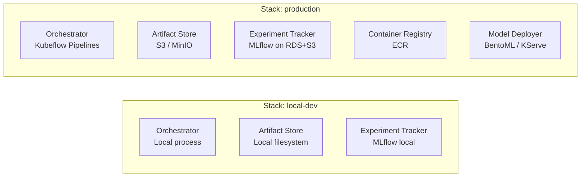
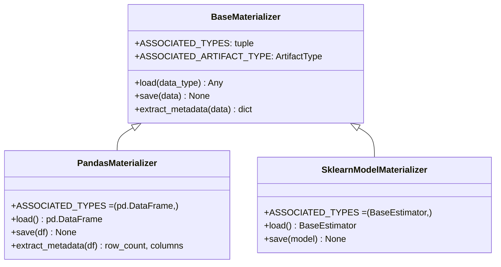
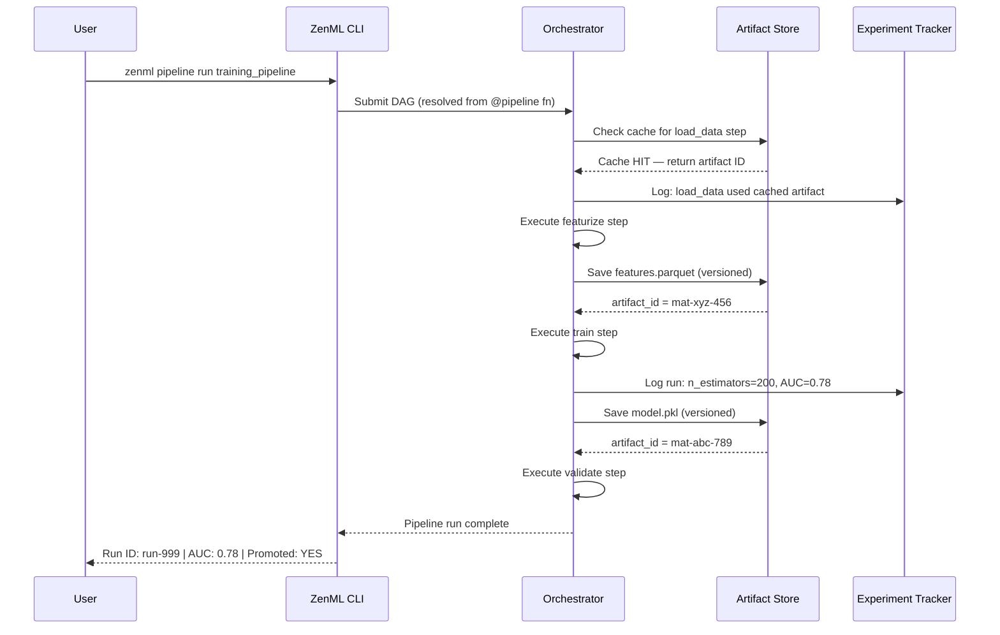

# Day 33 — ZenML: ML-Native Pipeline (Principles-Focused)

## Why ZenML Exists

ZenML was built to solve ML-specific problems that general-purpose orchestrators (Airflow, Dagster) don't address natively:

| Problem | General orchestrator | ZenML |
|---|---|---|
| Model versioning | Manual — you write it | Automatic — every step output is versioned |
| Artifact store | Plugin + custom code | First-class (Parquet/pickle/JSON, cloud-native) |
| Stack configuration | Hard-coded | Abstract — swap dev↔prod stack in one command |
| Experiment tracking | Manual MLflow calls | Automatic — ZenML wraps MLflow/W&B/Comet |
| Reproducibility | Your responsibility | Built-in — every pipeline run is reproducible |
| Step caching | Not available | Automatic — cached if inputs unchanged |

---

## ZenML Core Concepts

### The Stack

ZenML's central abstraction is the **stack** — a set of configured infrastructure components:



**The same pipeline code runs on both stacks.** You switch stacks with:
```bash
zenml stack set production
zenml pipeline run credit_risk_training
```

### Step

A ZenML `@step` is a function decorated with `@step`. It:
- Takes typed inputs
- Returns typed outputs
- Is automatically cached if input artifact hashes match
- Emits logs, metrics, and metadata to the experiment tracker

```python
from zenml import step
from zenml.materializers.pandas_materializer import PandasMaterializer

@step(output_materializers={"features": PandasMaterializer})
def featurize(raw_data: pd.DataFrame) -> pd.DataFrame:
    return raw_data.drop(columns=["id"]).fillna(0)
```

### Pipeline

A `@pipeline` is a function that calls steps and wires their outputs:

```python
from zenml import pipeline

@pipeline
def training_pipeline(data_path: str = "data/processed/features.parquet"):
    raw = load_data(data_path=data_path)
    validated = validate_data(raw)
    features, split = featurize_and_split(validated)
    model = train(features, split)
    report = validate_model(model, split)
    promote_if_passing(model, report)
```

ZenML compiles this into a DAG automatically from the data flow.

---

## ZenML Materializer

A materializer controls how a Python object is serialised when stored as an artifact:



Our `NativeMaterializer` replicates this pattern for the credit-risk project without requiring ZenML.

---

## Step Caching

ZenML's killer feature for ML development:

```
Pipeline run 1:
  load_data()  → hash: abc123 → NOT in cache → run → store
  featurize()  → hash: def456 → NOT in cache → run → store
  train()      → hash: ghi789 → NOT in cache → run → store

Pipeline run 2 (after changing only train config):
  load_data()  → hash: abc123 → IN CACHE ✓ → skip (0.01s)
  featurize()  → hash: def456 → IN CACHE ✓ → skip (0.01s)
  train()      → hash: xyz999 → NOT in cache → run → store (30s)
```

Cache key = `hash(step_name + step_source_code + all_input_artifact_hashes + config_hash)`

This means:
- Changing data invalidates cache for all downstream steps
- Changing only `n_estimators` only invalidates the `train` step
- Re-running the exact same pipeline is instant after the first run

---

## ZenML vs Dagster vs Airflow

| Feature | Airflow | Dagster | ZenML |
|---|---|---|---|
| **Primary user** | Data engineers | ML + data teams | ML engineers |
| **Mental model** | Task graph | Asset graph | Step pipeline |
| **Step caching** | ✗ | Partial | ✓ First-class |
| **Stack abstraction** | ✗ | ✗ | ✓ Core feature |
| **Artifact versioning** | ✗ | Via IO Managers | ✓ Automatic |
| **Experiment tracking** | ✗ | Plugin | ✓ Built-in integration |
| **Model deployment** | ✗ | Via custom ops | ✓ Model Deployer component |
| **Cloud portability** | Low | Medium | High |
| **Local dev experience** | Poor (Docker) | Good | Excellent |
| **General ETL** | ✓ Best choice | ✓ Good | ✗ ML-specific |

---

## ZenML Pipeline Sequence (Training Flow)



---

## Step Output Versioning

Every step output in ZenML becomes an **artifact** with:

```
artifact_id:     mat-abc-123
pipeline_name:   credit_risk_training
step_name:       train
output_name:     model
data_type:       sklearn.ensemble.GradientBoostingClassifier
uri:             s3://artifacts/credit_risk_training/train/model/mat-abc-123/
created_at:      2024-01-15T09:30:00Z
artifact_type:   ModelArtifact
```

This is how ZenML answers: **"which model version was used for prediction on 2024-01-20?"** — by querying the artifact store.

---

## Our Native Implementation

Since ZenML is not installed, we implement the patterns natively:

| ZenML concept | Our implementation |
|---|---|
| `@step` | `StepDef` dataclass with `fn`, `name`, `cache_policy` |
| `@pipeline` | `ZenPipeline` — ordered steps with output threading |
| `Materializer` | `NativeMaterializer` — JSON serialisation of step outputs |
| `ArtifactStore` | `ArtifactStore` — file-based versioned artifact storage |
| `CachePolicy` | `CachePolicy` — hash-based input caching |
| Stack | `StackConfig` — pluggable artifact_uri + tracking_uri |

---

## Debugging Table

| Symptom | Cause | Fix |
|---|---|---|
| Cached step runs again | Step source code changed | Expected — cache key includes source hash |
| Cache never hits | UUID in step output | Remove non-determinism from step outputs |
| Artifact not found | Wrong materializer | Register correct materializer for output type |
| Stack not found | `zenml stack set` not run | Run `zenml stack set <name>` before pipeline |
| Pipeline compile error | Type mismatch | Ensure output type of step A = input type of step B |
| Experiment not tracked | Tracker not configured in stack | Add experiment tracker to active stack |

---

## Key Invariants

1. **Every step output is a versioned artifact** — you can always reproduce which version was used.
2. **Cache key is deterministic** — same code + same inputs → same cache key → always hits.
3. **Stack decouples infra from code** — swap local↔cloud by changing the stack, not the pipeline.
4. **Step inputs/outputs are typed** — type mismatches are caught at pipeline compile time.
5. **Re-running the same pipeline is safe** — cached steps are skipped; failed steps restart from the failure point.
