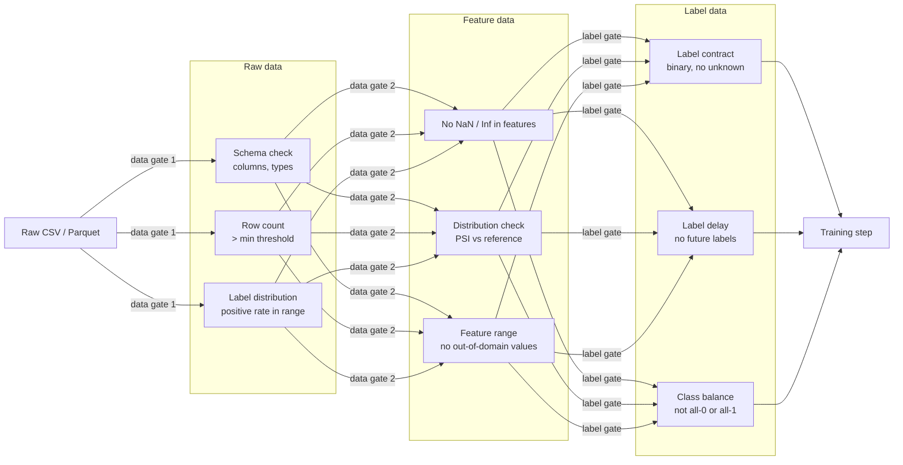
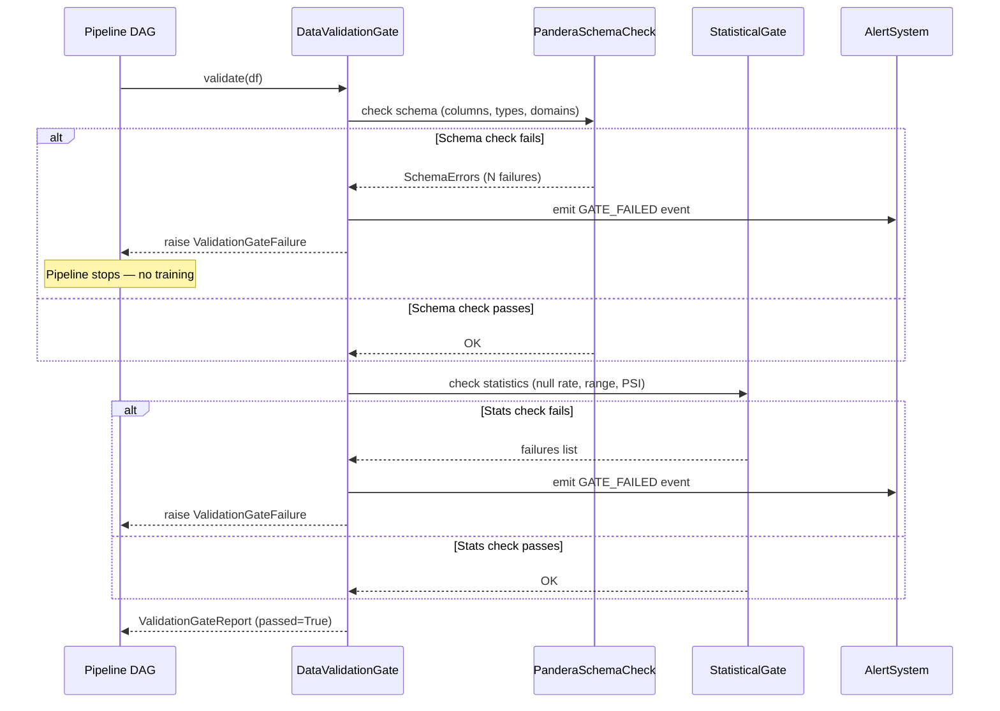
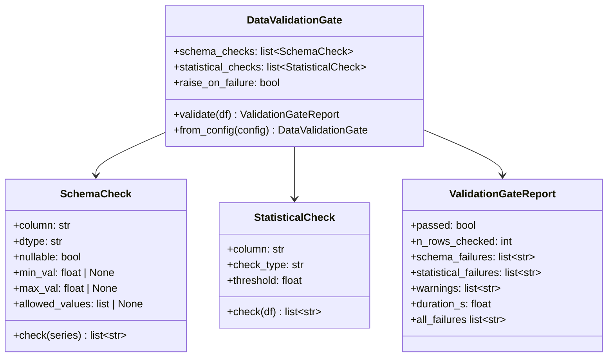

# Day 34 — Data Validation Gate (Pandera + Great Expectations in Pipeline)

## Why Validation is a Gate, Not a Log Message

Without a gate, a data quality failure:
1. Silently trains on corrupted data
2. Produces a model with high offline metrics (trained on wrong data)
3. Fails in production when serve-time data is different

A **gate** stops the pipeline. A **log** is ignored.

```
LOG:    logger.warning("null rate 12% in LIMIT_BAL")   # pipeline continues
GATE:   raise ValidationFailure("null rate 12% > 5%")  # pipeline stops, alert fires
```

The Pipeline gate requires:
> A failed training job retries safely without corrupting artifacts.

A data gate is the first line of defense — if data is bad, no training should start.

---

## What to Validate at Each Stage



---

## Pandera Integration Pattern

Pandera validates DataFrames against a schema. Two integration styles:

### Style 1: Decorator (inline, simple)

```python
import pandera as pa

schema = pa.DataFrameSchema({
    "LIMIT_BAL": pa.Column(float, pa.Check.gt(0)),
    "AGE": pa.Column(int, pa.Check.between(18, 100)),
    "default.payment.next.month": pa.Column(int, pa.Check.isin([0, 1])),
})

@pa.check_input(schema)
def featurize(df: pd.DataFrame) -> pd.DataFrame:
    ...
```

### Style 2: Explicit gate step (recommended for pipelines)

```python
def validate_raw_data(df: pd.DataFrame, schema: pa.DataFrameSchema) -> pd.DataFrame:
    try:
        schema.validate(df, lazy=True)   # lazy=True collects ALL errors before raising
        return df
    except pa.errors.SchemaErrors as exc:
        raise ValidationGateFailure(
            f"Raw data failed {exc.failure_cases.shape[0]} checks"
        ) from exc
```

`lazy=True` is critical for pipelines — you want the full list of failures in the exception, not just the first one.

---

## Great Expectations Integration Pattern

Great Expectations (GE) checks statistical properties of data:

```python
import great_expectations as gx

context = gx.get_context()
validator = context.sources.pandas_default.read_dataframe(df)

# Expectation suite
validator.expect_column_values_to_not_be_null("LIMIT_BAL")
validator.expect_column_values_to_be_between("AGE", min_value=18, max_value=100)
validator.expect_column_mean_to_be_between("LIMIT_BAL", min_value=50_000, max_value=400_000)
validator.expect_column_pair_values_a_to_be_greater_than_b("PAY_AMT1", "BILL_AMT1", or_equal=False)

result = validator.validate()
if not result.success:
    raise ValidationGateFailure(f"{result.statistics['unsuccessful_expectations']} expectations failed")
```

Our native `StatisticalGate` implements the same checks without requiring GE installed.

---

## Validation Gate Pipeline Integration



---

## Gate Failure Modes

| Failure | Correct response | Wrong response |
|---|---|---|
| Schema violation (new column) | STOP pipeline, alert — may be intentional schema change | Continue with missing column (silent NaN) |
| Row count too low | STOP — data might be truncated | Train on partial data (biased model) |
| Label null rate > 5% | STOP — labels corrupted | Train with NaN labels (meaningless model) |
| Positive rate = 0% | STOP — all one class | Train (model predicts all-negative trivially) |
| PSI > 0.25 (high drift) | WARNING + human review | STOP — might be valid distribution shift |
| Feature out of domain | WARNING or STOP depending on severity | Continue silently (extrapolation risk) |

---

## Combining Pandera + Statistical Checks

Our `DataValidationGate` applies:
1. **Schema layer**: column existence, types, null constraints (Pandera-style)
2. **Domain layer**: value ranges, set membership
3. **Statistical layer**: null rates, class balance, row count

All three must pass. Report contains failure details from all three layers.

---

## Class Diagram: Validation Gate Module



---

## Debugging Table

| Symptom | Cause | Fix |
|---|---|---|
| Gate always fails on first column check | `lazy=False` — stops at first failure | Use `lazy=True` to collect all failures |
| Gate passes but model AUC is low | Statistical checks too lenient | Tighten null rate threshold; add PSI check |
| Pipeline blocked by spurious drift | Reference stats stale | Update reference stats file after intentional data change |
| Gate fails in prod but not dev | Different column ordering | Use column name (not position) in checks |
| Slow gate | Checking all rows for domain validity | Sample 10% for statistical checks; check all for schema |

---

## Key Invariants

1. **Gate raises, not warns** — `raise ValidationGateFailure` stops the pipeline; `log.warning` does not.
2. **All failures collected before raising** — `lazy=True` mode collects the full failure list.
3. **Gate is idempotent** — running it twice on the same data produces the same result.
4. **Gate is a DAG step, not an inline call** — it appears in the lineage as a named step.
5. **Gate produces a report artifact** — the `ValidationGateReport` is stored for every run.
