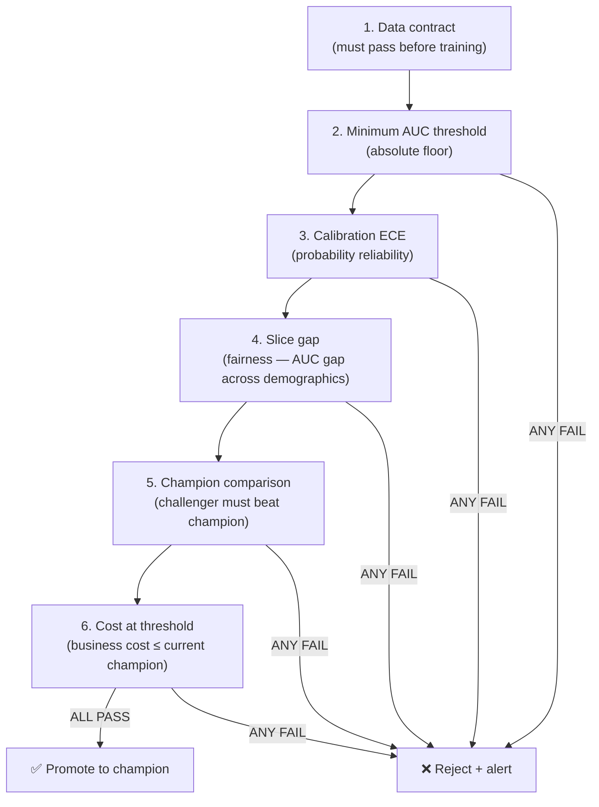
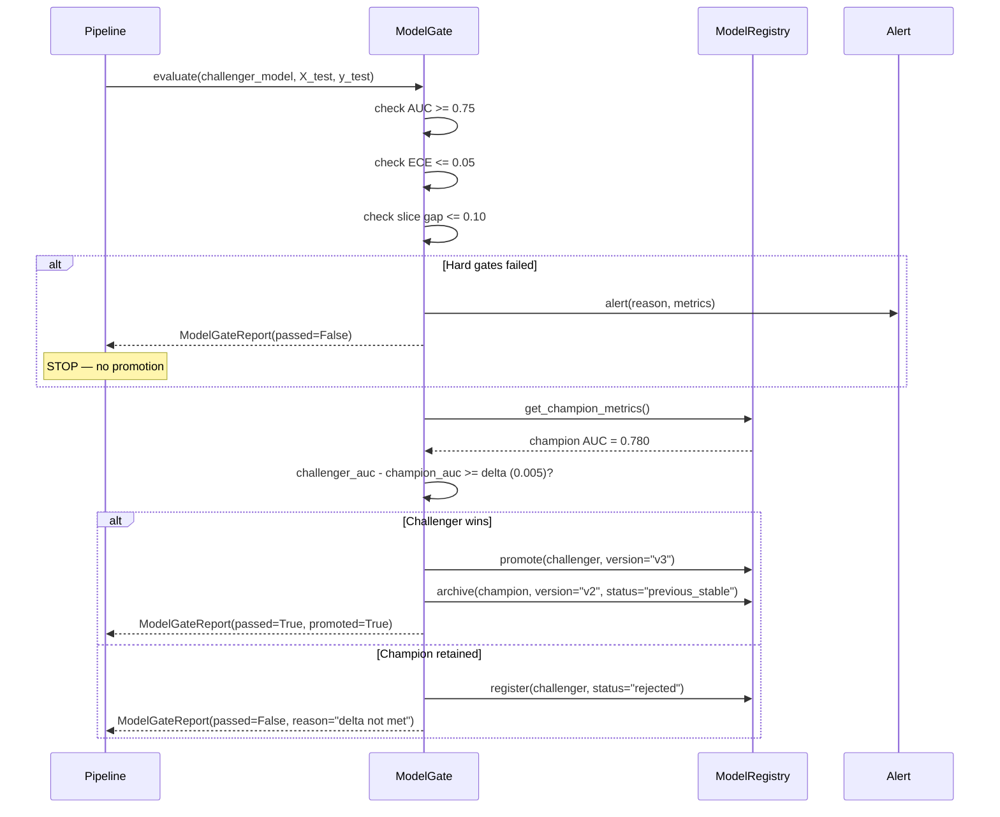
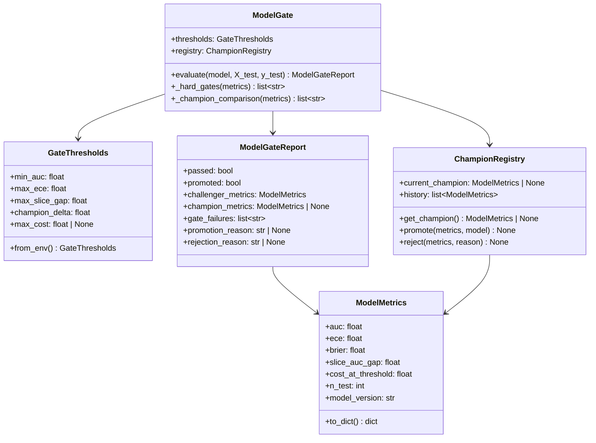

# Day 35 — Model Validation Gate: Thresholds, Champion/Challenger, Auto-Promote

## Why Model Validation is a Gate

A data gate (Day 34) prevents bad data from reaching the training step.
A **model gate** prevents a bad model from reaching the serving endpoint.

Without a model gate:
- A model trained on drifted data gets promoted automatically
- A model that is worse than the current champion gets deployed
- Fairness violations (slice AUC gap > threshold) reach production silently

With a model gate:
- Every candidate model passes the same criteria as the current champion
- Champion/challenger comparison is explicit and audited
- Promotion is a DAG step, not an implicit side-effect

---

## Metric Hierarchy

Not all metrics are equal. The model gate enforces a priority order:



---

## Champion / Challenger Framework

```
Champion:   current production model (the baseline)
Challenger: newly trained candidate model

Rules:
  1. Challenger must pass ALL hard gates (AUC threshold, calibration, fairness)
  2. Challenger must beat champion on the primary metric (AUC) by at least delta
  3. If champion doesn't exist yet, ANY model passing hard gates is promoted
  4. If challenger loses, champion stays; challenger is logged to registry as "rejected"
```

### Delta threshold

The "delta" prevents churning models for negligible improvements:

```
AUC champion = 0.780
AUC challenger = 0.783
delta = 0.005 (minimum improvement required)

challenger AUC gain = 0.003 < 0.005 → REJECT (not better enough)
```

Why delta matters: deploying a new model has cost (rollout risk, cache invalidation, retraining feature store). Marginal improvement doesn't justify this cost.

---

## Champion / Challenger Sequence



---

## Auto-Promote Logic

Auto-promote is conditional, not unconditional:

```python
def auto_promote(challenger, champion):
    # Hard gates: must pass regardless of champion
    assert challenger.auc >= AUC_THRESHOLD
    assert challenger.ece <= ECE_THRESHOLD
    assert challenger.slice_gap <= SLICE_GAP_THRESHOLD

    # Champion comparison: challenger must be better
    if champion is None:
        return promote(challenger)   # first model ever

    delta = challenger.auc - champion.auc
    if delta >= DELTA_THRESHOLD:
        return promote(challenger)
    else:
        return reject(challenger, reason=f"delta={delta:.4f} < {DELTA_THRESHOLD}")
```

---

## Model Gate Class Diagram



---

## Rollback Strategy

When a promoted model misbehaves in production:

```
champion_model (v3) → shows AUC regression in production monitoring
         │
         ▼
ModelGate.rollback()
         │
         ├── previous_stable = ChampionRegistry.history[-2]  (v2)
         ├── promote(v2) as champion
         └── tag v3 as "rolled_back"

Target: rollback in < 7 minutes (K8s `kubectl rollout undo`)
```

---

## Key Invariants

1. **Hard gates are absolute** — AUC threshold is never relaxed for champion comparison.
2. **Champion comparison requires delta** — prevents churning models for noise.
3. **No champion means any passing model is promoted** — first run bootstraps cleanly.
4. **Rejection is logged as a versioned artifact** — "rejected" models are auditable.
5. **Rollback is always available** — `previous_stable` is always stored in the registry.
