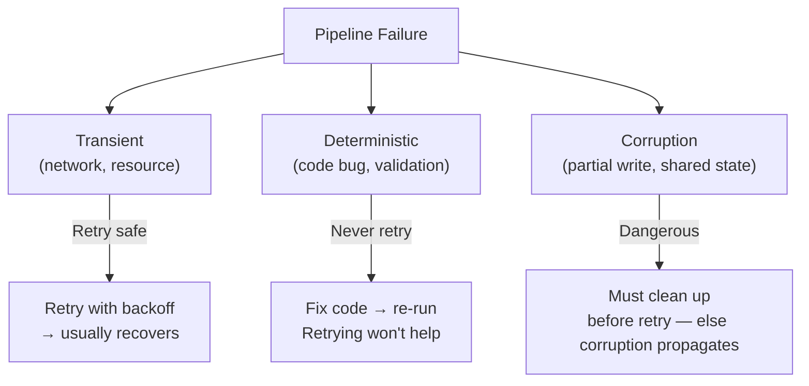
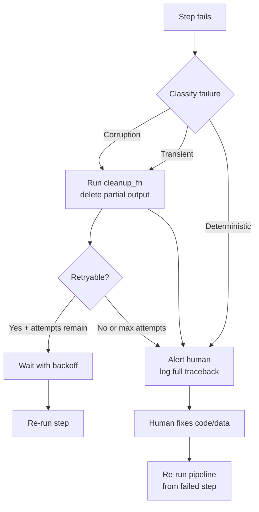
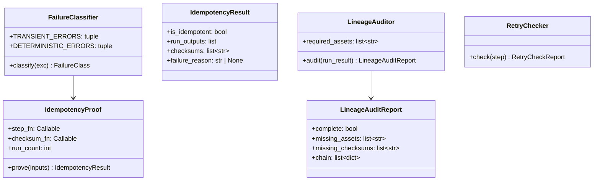

# Day 36 — Pipeline Failure Modes: Idempotency Proof, Retry-Safety, Lineage Audit

## The Three Failure Classes

Not all pipeline failures are equal:



| Class | Example | Action |
|---|---|---|
| **Transient** | S3 timeout, DB connection refused | Retry with backoff |
| **Deterministic** | Schema violation, validation gate failure | Fail fast — fix code |
| **Corruption** | Partial write to shared output, counter increment | Clean up before retry |

---

## Idempotency Proof

An idempotent step produces the same output when run N times with the same inputs.

### Proof Technique 1: Double-run test

```python
def test_featurize_is_idempotent(raw_df, config):
    result1 = featurize(raw_df, config)
    result2 = featurize(raw_df, config)
    pd.testing.assert_frame_equal(result1, result2)
```

### Proof Technique 2: SHA-256 checksum comparison

```python
def checksum(df) -> str:
    return hashlib.sha256(pd.util.hash_pandas_object(df).values.tobytes()).hexdigest()

assert checksum(run1_output) == checksum(run2_output)
```

### Proof Technique 3: Manifest idempotency

```python
# Already proven in Day 27 batch_inference.py:
job.run(df, output_path)   # run 1 → writes manifest
job.run(df, output_path)   # run 2 → reads manifest, skips computation
```

### What can break idempotency:

| Source | Example | Fix |
|---|---|---|
| Timestamp in output path | `model_{datetime.now()}.pkl` | Use content hash or run_id |
| Random seed not set | `np.random.rand()` | Set `random_state=seed` everywhere |
| Ordering-dependent ops | `df.groupby().first()` with ties | Sort before group |
| Append to existing file | `df.to_csv("out.csv", mode="a")` | Always overwrite |
| Network-fetched external state | `requests.get(url).json()` | Pin to immutable version |

---

## Retry Safety Checklist

Before marking a step as "safe to retry", verify:

```
☐ Writes to a temporary path first (not the final output path)
☐ Uses atomic rename (os.replace / S3 copy-then-delete) after validation
☐ Cleanup function registered to delete temp path on failure
☐ Does NOT append to existing output (always overwrites)
☐ Does NOT increment shared counters (or uses idempotent counters)
☐ Network calls are idempotent (GET, not POST with side-effects)
☐ Manifests checked before starting work (skip-if-done pattern)
```

---

## Lineage Audit

For reproducibility, every pipeline run must emit lineage that answers:

```
Query: "Which data produced model v2 (run_id=xyz789)?"

Answer from lineage:
  run_id=xyz789
  → asset: trained_model
    ← asset: feature_dataset (partition=2024-01, checksum=abc123)
      ← asset: validated_data (n_rows=29000)
        ← asset: raw_credit_data (path=s3://data/2024-01/credit.csv, sha256=def456)
```

A lineage audit verifies that every asset materialisation is recorded and traceable.

### Lineage audit steps:
1. Check that every DagStep recorded at least one AssetMaterialization
2. Check that each materialization has a checksum
3. Trace the dependency chain from champion_model back to raw_credit_data
4. Verify run_id is consistent across all materializations

---

## Failure Recovery Protocol

When a pipeline step fails:



---

## Failure Mode Class Diagram



---

## Key Invariants

1. **Classify before retrying** — transient errors retry, deterministic errors fail fast.
2. **Cleanup runs before retry** — a partial output must be deleted before the next attempt.
3. **Idempotency is proven, not assumed** — run the double-run test on every step.
4. **Lineage is complete before promotion** — if any asset is missing from lineage, the champion promotion step must fail.
5. **Manifest is the idempotency proof record** — the manifest IS the proof that a step ran successfully.
