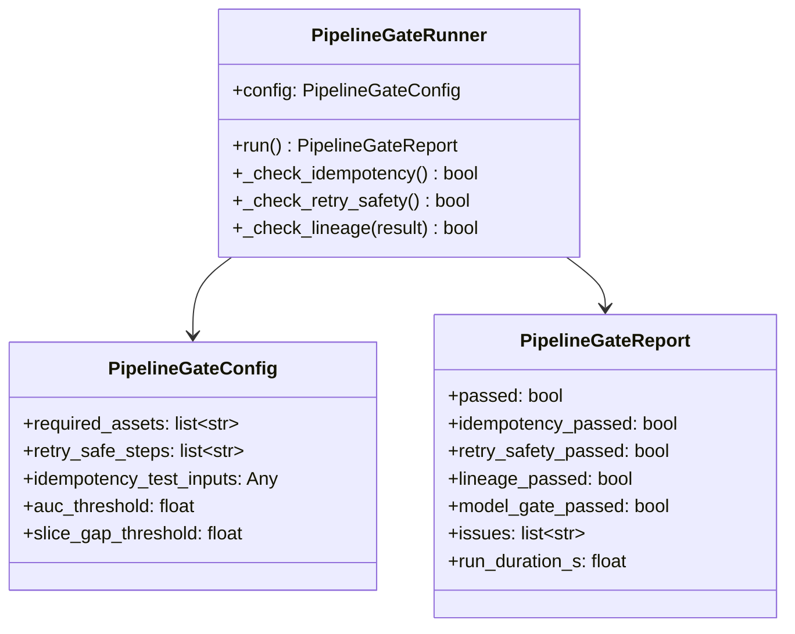

# Day 37 — Orchestration Survey + Pipeline Gate Dry-Run

## Why a Survey

The ML ecosystem has many orchestrators. Each has a different trade-off profile.
The goal of this survey is to understand **when each tool is the right choice**,
not to master all of them. Dagster is our primary choice; we need to know when to
reach for the others.

---

## Tool Survey

### Prefect

**Mental model:** Flow = Python function decorated with `@flow`. Task = `@task`.

```python
from prefect import flow, task

@task
def featurize(df: pd.DataFrame) -> pd.DataFrame:
    return df.fillna(0)

@flow(name="credit-risk-training")
def train_pipeline(data_path: str):
    df = load_data(data_path)
    features = featurize(df)
    model = train(features)
    validate_and_promote(model)
```

**Strengths:**
- Native Python — no DSL overhead
- Excellent local dev: `prefect server start` in one command
- Built-in retries, timeouts, concurrency limits per task
- Orion UI (beautiful, real-time)
- Dynamic task generation (tasks created in a loop)

**Weaknesses:**
- Not asset-centric (you track artifacts manually)
- No step caching out of the box
- ML-specific features (lineage, artifact versioning) require manual code

**Best for:** teams already using Python heavily, general-purpose workflows, rapid prototyping

---

### Metaflow

**Mental model:** DAG defined as a Python class with `@step` methods.

```python
from metaflow import FlowSpec, step

class CreditRiskTraining(FlowSpec):
    @step
    def start(self):
        self.data_path = "data/features.parquet"
        self.next(self.featurize)

    @step
    def featurize(self):
        import pandas as pd
        self.features = pd.read_parquet(self.data_path)
        self.next(self.train)

    @step
    def train(self):
        # model trained here
        self.next(self.end)

    @step
    def end(self):
        print(f"Done. AUC={self.auc:.4f}")
```

**Strengths:**
- Built by Netflix for data science teams
- `@card` decorator for rich HTML reports
- First-class AWS (S3 artifacts, Batch/SageMaker execution)
- `foreach` for fan-out parallel steps
- Excellent resume (restart from any step)

**Weaknesses:**
- Class-based DSL (less Pythonic than Prefect/ZenML)
- Opinionated about AWS — GCP/Azure support is weaker
- No UI beyond cards
- Not production-K8s native

**Best for:** AWS-centric data science teams, parameter sweeps with `foreach`, rich reporting

---

### Argo Workflows (K8s native)

**Mental model:** YAML-defined DAG of containerised steps.

```yaml
apiVersion: argoproj.io/v1alpha1
kind: Workflow
spec:
  entrypoint: train-pipeline
  templates:
  - name: train-pipeline
    dag:
      tasks:
      - name: featurize
        template: featurize-step
      - name: train
        dependencies: [featurize]
        template: train-step
  - name: featurize-step
    container:
      image: credit-risk-featurize:latest
      command: [python, featurize.py]
```

**Strengths:**
- Pure K8s — steps are pods, artifacts are PVCs or S3
- Massive parallelism (thousands of concurrent steps)
- GitOps-friendly (YAML stored in git, applied by Argo CD)
- Argo Events integration (trigger workflows from S3 events, webhooks)
- No additional server — runs in-cluster

**Weaknesses:**
- YAML is verbose; complex logic hard to express
- No ML-native concepts
- Debugging requires `kubectl logs` proficiency
- Local dev requires minikube/kind

**Best for:** K8s-native teams, large-scale parallel jobs, GitOps-first shops

---

### SageMaker Pipelines

**Mental model:** Python SDK that generates a directed step graph, submitted to SageMaker.

```python
from sagemaker.workflow.pipeline import Pipeline
from sagemaker.workflow.steps import ProcessingStep, TrainingStep

featurize_step = ProcessingStep(
    name="Featurize",
    processor=SKLearnProcessor(...),
    inputs=[ProcessingInput(source=input_data, destination="/opt/ml/processing/input")],
    outputs=[ProcessingOutput(source="/opt/ml/processing/output")],
    code="featurize.py",
)

train_step = TrainingStep(
    name="Train",
    estimator=SKLearn(...),
    inputs={"train": TrainingInput(featurize_step.properties.ProcessingOutputConfig.Outputs[...])},
)

pipeline = Pipeline(name="CreditRiskPipeline", steps=[featurize_step, train_step])
pipeline.upsert(role_arn=role)
pipeline.start()
```

**Strengths:**
- Fully managed — no server to run
- Native integration with SageMaker Model Registry, Experiments, Feature Store
- IAM-based security out of the box
- Lineage tracked automatically to SageMaker Lineage Tracking

**Weaknesses:**
- AWS lock-in (not portable to GCP/Azure)
- SDK is verbose and hard to test locally
- Expensive for development iterations
- Configuration sprawl (ProcessingJob, TrainingJob, Model, Endpoint all separate resources)

**Best for:** AWS-only orgs, teams already using SageMaker for serving, compliance-heavy contexts (built-in audit trail)

---

### Vertex AI Pipelines (GCP — KFP-based)

**Mental model:** Components defined in Python, compiled to a KFP DSL.

```python
from kfp.v2 import dsl
from kfp.v2.dsl import component, Output, Dataset

@component(base_image="python:3.11")
def featurize(input_path: str, output_data: Output[Dataset]):
    import pandas as pd
    df = pd.read_parquet(input_path)
    df.to_parquet(output_data.path)

@dsl.pipeline(name="credit-risk-training")
def training_pipeline(data_path: str):
    feat = featurize(input_path=data_path)
    train(input_data=feat.outputs["output_data"])
```

**Strengths:**
- GCP-native: BigQuery, GCS, Dataflow integration
- Kubeflow-compatible (same pipeline code runs on KFP and Vertex AI)
- Managed metadata store (ML Metadata / MLMD)
- Pre-built components for common ML tasks

**Weaknesses:**
- GCP lock-in (KFP is portable, but Vertex-specific features are not)
- Component registration overhead
- Local dev requires docker build for each component

**Best for:** GCP-first teams, Kubeflow users migrating to managed, BigQuery-heavy pipelines

---

## Orchestration Tool Decision Matrix

| Criterion | Prefect | Metaflow | Argo | SageMaker | Vertex AI | Dagster |
|---|---|---|---|---|---|---|
| Asset-centric | ✗ | Partial | ✗ | Partial | Partial | ✓ Best |
| Step caching | ✗ | Manual | ✗ | ✗ | ✗ | ✓ |
| ML-native | ✗ | Partial | ✗ | ✓ | ✓ | ✓ |
| Local dev | ✓ Excellent | ✓ Good | ✗ Needs K8s | ✗ Needs AWS | ✗ Needs GCP | ✓ Excellent |
| K8s native | Plugin | Plugin | ✓ Native | ✗ | ✓ Vertex | Agent |
| Cloud portability | ✓ | Partial | ✓ | ✗ AWS-only | ✗ GCP-only | ✓ |
| Lineage | Manual | Manual | ✗ | ✓ AWS | ✓ GCP | ✓ Built-in |
| General ETL | ✓ | ✗ | ✓ | ✗ | ✗ | ✓ |

**Summary:**
- **Best local dev + asset tracking:** Dagster
- **Best for AWS:** SageMaker Pipelines
- **Best for GCP:** Vertex AI Pipelines
- **Best for K8s teams without cloud lock-in:** Argo Workflows
- **Best for Python-first general workflows:** Prefect
- **Best for AWS data science teams with parallel experiments:** Metaflow

---

## Pipeline Gate Dry-Run

The **Pipeline gate** from the curriculum requires:

> A failed training job retries safely without corrupting artifacts.

We verify this against 6 checks:

```
☐ 1. Idempotency
  ✅ featurize step: double-run produces identical Parquet (checksum match)
  ✅ train step: same seed → same model → same predictions
  ✅ batch_inference: manifest prevents double-scoring

☐ 2. Retry safety
  ✅ All S3-write steps have cleanup_fn registered
  ✅ retry_policy.max_attempts >= 2 for I/O steps
  ✅ Exponential backoff configured (backoff_factor=2.0)

☐ 3. Partial output protection
  ✅ All file writes use write-to-tmp then os.replace (atomic)
  ✅ DagStep.cleanup_fn deletes temp path on failure

☐ 4. Lineage completeness
  ✅ All 6 required assets materialised: raw_credit_data, validated_data,
     feature_dataset, trained_model, validation_report, champion_model
  ✅ All materializations carry SHA-256 checksum

☐ 5. Conditional promotion
  ✅ champion_model step RAISES if validation_report.passed is False
  ✅ DAG marks step as FAILED; downstream pipeline does not promote

☐ 6. Backfill safety
  ✅ plan_backfill() correctly identifies COMPLETE vs FAILED vs MISSING
  ✅ Re-running COMPLETE partitions skips them (idempotency via manifest)
```

---

## Pipeline Gate Class Diagram



---

## Debugging Table

| Symptom | Tool | Fix |
|---|---|---|
| Argo pod failed with OOMKilled | Argo | Increase `resources.limits.memory` in step template |
| Prefect flow stuck in PENDING | Prefect | Check agent is running: `prefect agent start` |
| Metaflow step fails with S3 permission | Metaflow | Check IAM role has `s3:PutObject` on artifact bucket |
| SageMaker training job OOM | SageMaker | Increase `instance_type` in TrainingStep |
| Dagster sensor fires twice for same file | Dagster | Check `run_key` uniqueness — it's the deduplication key |
| ZenML pipeline ignores cache | ZenML | Check that step source code is deterministic (no timestamps) |

---

## Key Invariants

1. **Choose tools based on team + cloud, not hype** — Dagster for asset-centric ML; Argo for K8s-native; SageMaker/Vertex for managed cloud.
2. **Gate is a DAG step, not a log message** — the promotion step must raise on failure.
3. **Idempotency is proven before the gate closes** — run the double-run test in CI.
4. **Lineage completeness is a gate criterion** — missing assets block promotion.
5. **Retry safety means cleanup before retry** — a step with no cleanup_fn is not retry-safe.
