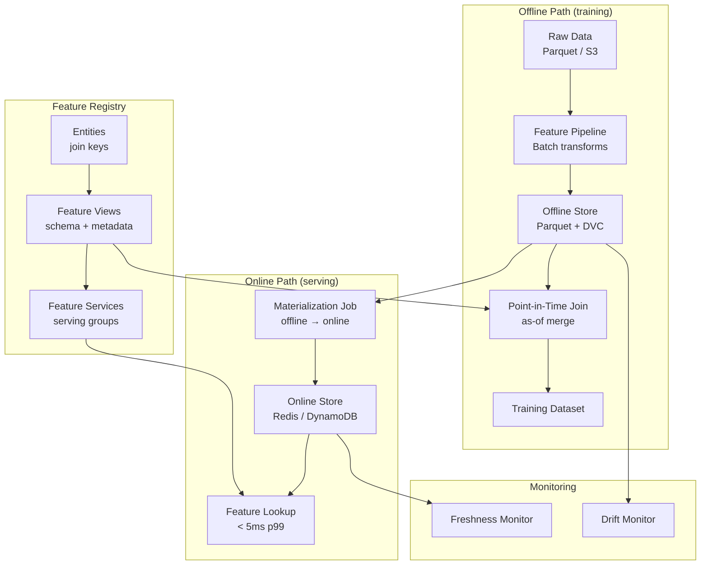
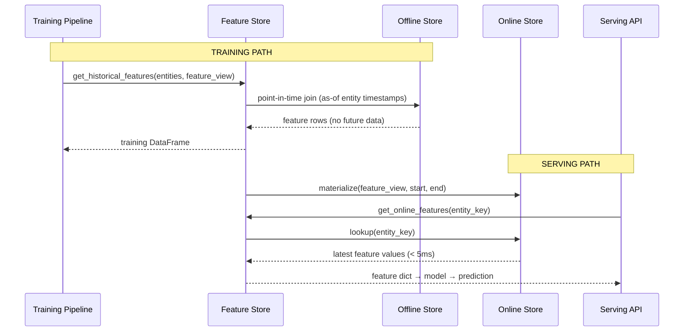

# Day 38 — The Feature Store Problem

## Why Feature Stores Exist

In a well-run ML system, the model is only as good as the features it sees at **serving time**.
The core problems a feature store solves are:

1. **Training-serving skew** — features computed differently in training vs serving
2. **Point-in-time correctness** — using future data to train on past events (data leakage)
3. **Feature reuse** — teams re-derive the same features, wasting compute and introducing drift

Without a feature store, these bugs are silent — the model trains fine, metrics look good, and
production silently degrades.

---

## The Three Failure Modes in Detail

### 1. Training-Serving Skew

```
Training pipeline             │  Serving pipeline
─────────────────────────────────────────────────
df['pay_ratio'] = df['PAY_AMT1'] / df['BILL_AMT1'].clip(1)   ← clips at 1
─────────────────────────────────────────────────
feature_dict['pay_ratio'] = pay_amt / bill_amt   ← no clip, division by zero
```

The model never sees `inf`. At serving time it gets `inf`. The predictions silently degrade.

**Root cause:** feature logic is duplicated across two codebases.

**Feature store fix:** one `compute_pay_ratio()` function, called from both training and serving.

---

### 2. Point-in-Time Correctness

Consider a credit-risk model trained on historical applications. Each row in training has:
- `application_date` — when the customer applied
- `payment_history_*` — their payment behaviour

If you join features **without** an as-of constraint, you may accidentally include payment history
from **after** the application date:

```
application_date = 2023-01-10
feature join: payment_history as of 2023-12-01   ← LEAKS future data
```

The model learns from the future. Live AUC at training: 0.82. AUC in production: 0.61.

**Point-in-time join:** for each row, retrieve feature values as they existed **at** `application_date`.

```
Correct join:
  row.application_date = 2023-01-10
  → use feature snapshot from 2023-01-09 23:59:59
```

---

### 3. Feature Reuse

| Without feature store | With feature store |
|---|---|
| Team A computes `avg_spend_30d` using their own SQL | Both teams use `feature_store.get("avg_spend_30d")` |
| Team B computes same feature — subtly different window | Identical computation, cached result |
| 3 teams × 40 features = 120 separate pipelines | 40 pipelines, shared |
| Silent divergence when one team updates | One update, everyone benefits |

---

## Feature Store Architecture



---

## The Five Invariants

| # | Invariant | Violation |
|---|---|---|
| 1 | **One definition per feature** | `pay_ratio` defined in two places diverges |
| 2 | **No future data in training** | PIT join must use `as-of` semantics |
| 3 | **Online latency ≤ SLA** | Feature lookup must be pre-materialised |
| 4 | **Freshness SLA per feature** | Stale online features = silent quality drop |
| 5 | **Schema contract survives model updates** | Renaming a feature breaks serving |

---

## Feature Store Tools: Comparison

| Tool | Offline Store | Online Store | PIT Join | Streaming | Self-hosted | Managed |
|---|---|---|---|---|---|---|
| **Feast** | Parquet/S3/Hive | Redis/DynamoDB/BigTable | ✓ Built-in | ✓ Push API | ✓ | ✗ |
| **Tecton** | Spark/Snowflake | DynamoDB/Redis | ✓ | ✓ Flink-native | ✗ | ✓ AWS/GCP |
| **Featureform** | Postgres/Spark | Redis/Cassandra | ✓ | ✓ | ✓ | ✓ |
| **SageMaker FS** | S3 | DynamoDB | ✓ | Partial | ✗ | ✓ AWS |
| **Vertex FS** | BigQuery | BigTable | ✓ | ✓ Pub/Sub | ✗ | ✓ GCP |
| **Manual** | Parquet | Redis | ✗ (must write) | ✗ | ✓ | ✗ |

**Our choice: Feast** — open-source, runs locally with Parquet offline + Redis online, production-ready on S3 + DynamoDB.

---

## What "Zero Train-Serve Skew" Means

A system has zero train-serve skew when:

```
feature_value_at_training == feature_value_at_serving
```

for every feature, every entity, every timestamp — provably. This means:

1. Same function computes the feature both times (no duplication)
2. PIT join used in training (no future leakage)
3. Freshness SLA met (online store not stale)
4. Schema unchanged between training and serving (no silent null introduction)

The final consolidation day (Day 45) verifies this end-to-end.

---

## Sequence Diagram: Training vs Serving Feature Flow



---

## Key Definitions

| Term | Definition |
|---|---|
| **Entity** | The thing a feature describes (customer, account, product) |
| **Feature View** | A group of features sharing an entity and a data source |
| **Feature Service** | A named group of feature views used together for one model |
| **Materialization** | Copying feature values from offline to online store |
| **TTL (Time-to-Live)** | How long a feature value in the online store is considered valid |
| **As-of join** | Join that only uses data available at or before a given timestamp |
| **Push source** | Streaming path to write features directly to online store in real-time |
