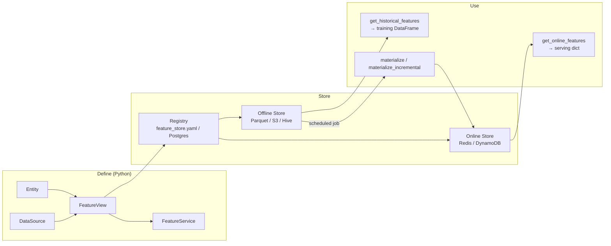
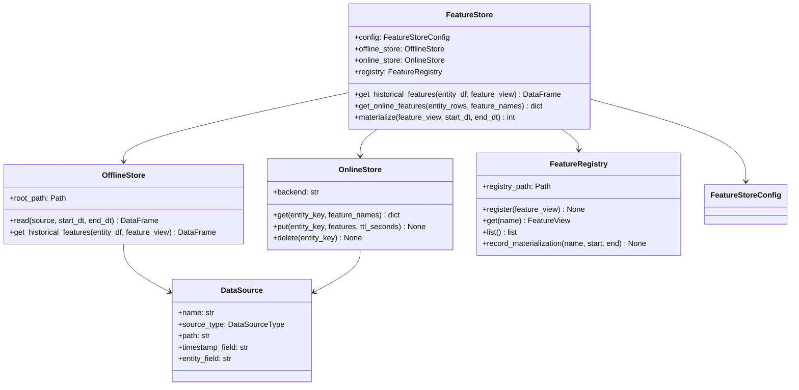

# Day 39 — Feast Architecture

## What Feast Is

Feast (Feature Store) is an open-source feature store that decouples feature computation from
feature serving. It defines features once, stores them in an offline store for training, and
materialises them to an online store for low-latency serving.

Core idea: **feature definitions live in Python, not in SQL or YAML**.

---

## Component Architecture



---

## The Registry

The registry is the source of truth for all feature definitions. It stores:
- Entity definitions (join key names + types)
- Feature view schemas (feature names, dtypes, data source links)
- Feature service groupings
- Materialization history (what was materialised, when)

In local mode: stored as a `registry.db` (SQLite). In production: Postgres or GCS/S3.

---

## Data Sources

Feast supports multiple source types:

| Source | When to use |
|---|---|
| `FileSource` (Parquet) | Local dev, DVC-managed datasets |
| `S3Source` / `GCSSource` | Production batch features |
| `BigQuerySource` | GCP-native large-scale features |
| `RedshiftSource` / `SnowflakeSource` | Data-warehouse-first teams |
| `PushSource` | Streaming/real-time features |
| `RequestSource` | Features computed per-request from payload |

Our stack: `FileSource` (local/dev with MinIO) → `S3Source` (production).

---

## Offline Store

The offline store handles **historical feature retrieval** for training. It implements
`get_historical_features(entity_df, feature_refs)` using a **point-in-time join**.

How PIT join works in Feast:
1. `entity_df` has one row per training example, with `entity_id` + `event_timestamp`
2. For each row, the offline store finds the **most recent** feature values at or before `event_timestamp`
3. Result: training dataset where no row has access to future data

```python
entity_df = pd.DataFrame({
    "customer_id": [1001, 1002, 1003],
    "event_timestamp": ["2023-01-10", "2023-02-15", "2023-03-20"],
})
training_df = store.get_historical_features(
    entity_df=entity_df,
    features=["credit_risk_features:pay_ratio", "credit_risk_features:util_rate"],
).to_df()
```

---

## Online Store

The online store handles **low-latency serving** (target: < 5ms p99). It stores only the
**latest** feature values per entity.

```python
features = store.get_online_features(
    features=["credit_risk_features:pay_ratio"],
    entity_rows=[{"customer_id": 1001}],
).to_dict()
```

Features are written to the online store via **materialization** (a scheduled batch job that
reads from offline → writes to online).

---

## Class Diagram



---

## Feast Config (feature_store.yaml equivalent)

```yaml
project: credit_risk
provider: local
registry: registry/feature_store.db
offline_store:
  type: file          # parquet files, DVC-managed
  path: data/features/offline/
online_store:
  type: redis
  connection_string: "localhost:6379"
  key_ttl_seconds: 86400   # 24h
entity_key_serialization_version: 2
```

In production, replace `provider: local` with `provider: aws` and offline_store with S3.

---

## Feast vs Manual Implementation

| Concern | Manual | Feast |
|---|---|---|
| PIT join | Write SQL / pandas merge | Built-in `get_historical_features` |
| Online serving | Write Redis client | `get_online_features` abstraction |
| Schema registry | Ad-hoc YAML | Typed `FeatureView` Python objects |
| Materialization | Cron job | `feast materialize-incremental` |
| Freshness tracking | Manual timestamps | Registry records last materialization |
| Monitoring | Custom | `feast feature-server` + Prometheus |

---

## Sequence: Feature Registration → Training → Serving

```mermaid
sequenceDiagram
    participant DEV as Developer
    participant REG as Registry
    participant OFF as Offline Store
    participant ONL as Online Store

    DEV->>REG: feast apply (register entities + feature views)
    REG-->>DEV: definitions saved

    DEV->>OFF: feast materialize 2023-01-01 to 2023-12-31
    OFF-->>ONL: feature values written (batch)

    Note over DEV,OFF: TRAINING
    DEV->>OFF: get_historical_features(entity_df)
    OFF-->>DEV: training DataFrame (PIT join applied)

    Note over DEV,ONL: SERVING
    DEV->>ONL: get_online_features({customer_id: 1001})
    ONL-->>DEV: feature dict → model → prediction
```

---

## Key Invariants

1. **Feature definitions are code** — checked into git, versioned, reviewed like code.
2. **Training always uses the offline store** — never the online store (no stale values).
3. **Serving always uses the online store** — never the offline store (no latency penalty).
4. **Materialization is idempotent** — re-running for the same window is safe.
5. **Registry changes are backward-compatible** — adding features OK; renaming requires migration.
