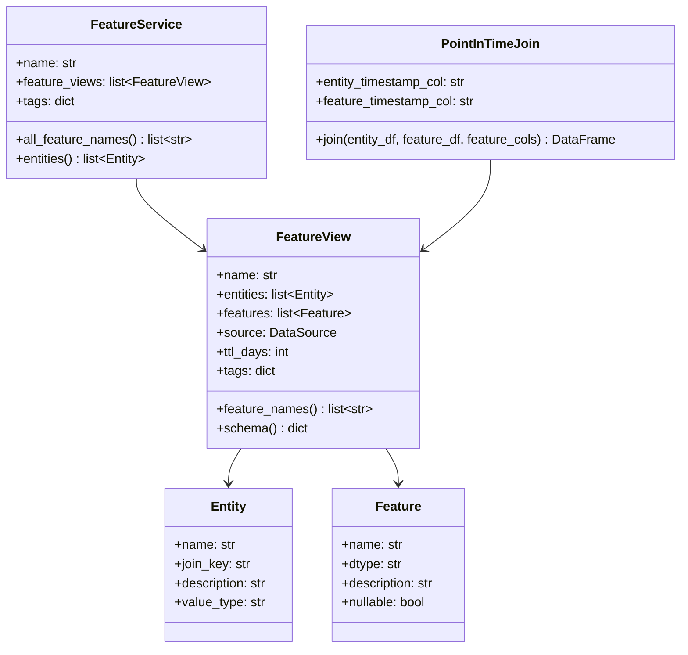

# Day 40 — Feature Views, Entities & Point-in-Time Joins

## What a Feature View Is

A **FeatureView** is the unit of feature organisation in a feature store. It groups:
- A set of features (names + types)
- An entity (the thing being described)
- A data source (where the values come from)
- A TTL (how long values stay valid in the online store)

Think of it as a table schema with a lifetime attached.

---

## Entities

An **entity** is the primary key of the feature domain. Everything a feature describes is
attributed to an entity.

| Domain | Entity | Join Key |
|---|---|---|
| Credit risk | Customer | `customer_id` |
| E-commerce | Product | `product_id` |
| Ride-sharing | Driver | `driver_id` |

A feature view declares which entity it belongs to. The entity's join key is used for:
1. PIT joins during training
2. Key lookups in the online store

---

## Feature Types

| Type | Example | Notes |
|---|---|---|
| `float` | `pay_ratio`, `util_rate` | Most ML features |
| `int` | `num_late_payments` | Counts |
| `bool` | `has_international_tx` | Binary flags |
| `string` | `risk_tier` | Categorical (encode before ML) |
| `timestamp` | `last_payment_date` | Often derived to age |

---

## Class Diagram



---

## Point-in-Time Join — The Algorithm

The PIT join is the most critical correctness mechanism in a feature store.

**Problem:** You have a training dataset where each row is a historical prediction request.
You want to add feature values. But if you do a naive `merge()`, you'll accidentally include
feature values from the future.

**Algorithm:**

```
For each entity row (entity_id=E, event_timestamp=T):
  1. Filter feature_df to rows where entity_id == E
  2. Filter further to rows where feature_timestamp <= T
  3. Take the row with the maximum feature_timestamp (most recent before T)
  4. Copy its feature values onto the entity row
```

This ensures no row in the training dataset has access to data that didn't exist at
the time of the prediction.

---

## PIT Join Example

```
entity_df (training examples):
  customer_id │ event_timestamp  │ label
  ─────────────────────────────────────
  C1          │ 2023-03-01       │ 1
  C1          │ 2023-09-01       │ 0

feature_df (feature history):
  customer_id │ feature_timestamp │ pay_ratio
  ──────────────────────────────────────────
  C1          │ 2023-01-01        │ 0.10   ← available at Mar, Sep
  C1          │ 2023-06-01        │ 0.25   ← NOT available at Mar, available at Sep

PIT join result:
  customer_id │ event_timestamp │ label │ pay_ratio
  ──────────────────────────────────────────────────
  C1          │ 2023-03-01      │ 1     │ 0.10   ✓ (Jan snap used)
  C1          │ 2023-09-01      │ 0     │ 0.25   ✓ (Jun snap used)
```

---

## Feature Service

A **FeatureService** groups multiple feature views for one model. It answers the question:
"Which features does the credit-risk model need?"

```python
credit_risk_service = FeatureService(
    name="credit_risk_v1",
    feature_views=[payment_features, balance_features, demographic_features],
)
# Retrieve all features for one entity:
features = store.get_online_features(
    entity_rows=[{"customer_id": "C1"}],
    feature_service=credit_risk_service,
)
```

---

## Sequence Diagram: PIT Join in Training

```mermaid
sequenceDiagram
    participant T as Training Job
    participant FS as FeatureStore
    participant PIT as PointInTimeJoin
    participant OFF as OfflineStore

    T->>FS: get_historical_features(entity_df, feature_view)
    FS->>OFF: read(source, full range)
    OFF-->>FS: feature_df (all historical rows)
    FS->>PIT: join(entity_df, feature_df, feature_cols)
    loop For each entity row
        PIT->>PIT: filter to entity_id + timestamp ≤ event_ts
        PIT->>PIT: take most-recent row
        PIT->>PIT: copy features onto entity row
    end
    PIT-->>FS: joined DataFrame (no future leakage)
    FS-->>T: training DataFrame
```

---

## Debugging PIT Join Failures

| Symptom | Root Cause | Fix |
|---|---|---|
| Training AUC much higher than prod | Future features leaked in training | Verify PIT join uses `<=` not `<` or `==` |
| All feature values NULL | Feature timestamps don't overlap entity timestamps | Check timezone handling — ensure UTC everywhere |
| Wrong entity gets features | Multiple entities share a join key | Check entity granularity — use composite key |
| Stale features in serving | Materialization window missed recent rows | Check `end_dt` in materialization job |
