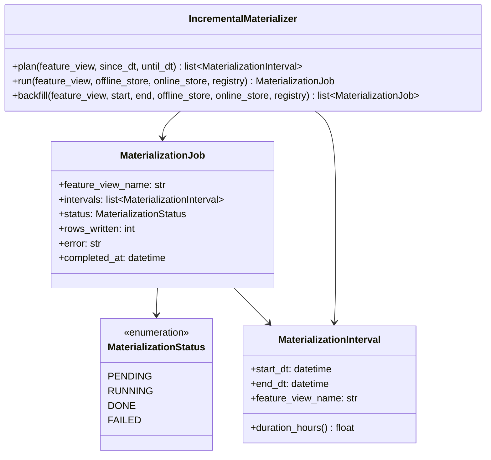

# Day 41 — Materialization & Online Store

## What Materialization Is

**Materialization** is the process of copying feature values from the offline store (Parquet/S3)
to the online store (Redis/DynamoDB) so they can be retrieved in < 5ms at serving time.

Without materialization:
- Online store is empty
- Every serving request must query the offline store → 100ms–10s latency → unusable

With materialization:
- Offline → online copy runs as a scheduled batch job
- Serving reads from online store → sub-5ms

---

## Materialization Strategies

| Strategy | When to use | How |
|---|---|---|
| **Full** | First run or rebuild | Copy all feature rows, all time |
| **Incremental** | Normal operation | Copy only rows since last materialization |
| **Backfill** | Fix a gap or re-process | Copy a specific historical window |
| **Point-in-time** | Training only | Not materialised; done per-query in offline store |

`feast materialize-incremental` implements incremental by default: it checks the registry for
`last_materialized_at`, then materialises from that timestamp to `now`.

---

## Materialization Flow

```mermaid
sequenceDiagram
    participant SCHED as Scheduler (cron/Dagster)
    participant MAT as IncrementalMaterializer
    participant REG as FeatureRegistry
    participant OFF as OfflineStore
    participant ONL as OnlineStore

    SCHED->>MAT: run(feature_view)
    MAT->>REG: last_materialized_at(feature_view_name)
    REG-->>MAT: 2024-01-01T00:00:00Z (or None)
    MAT->>MAT: plan(since_dt=last, until=now)
    MAT->>OFF: read(source, start_dt=last, end_dt=now)
    OFF-->>MAT: new feature rows
    MAT->>MAT: group by entity_key, take latest row
    MAT->>ONL: put(entity_key, features, ttl=view.ttl_seconds)
    MAT->>REG: record_materialization(start, end, row_count)
```

---

## Materialization Interval

A `MaterializationInterval` is a bounded window `[start_dt, end_dt)` for which features
will be read and written. The materializer splits long windows into smaller intervals
(e.g. daily) to enable parallelism and partial restarts.

---

## Idempotency

Materialisation is idempotent: running it twice for the same window overwrites the online
store with the same values. This is safe because:
1. Redis `SET` overwrites existing keys
2. The offline store is immutable (DVC-managed)
3. The registry records each completed interval — duplicate writes are harmless

---

## Class Diagram



---

## Online Store: Redis Key Design

In production (Redis), each entity is stored as a hash:

```
Key:   {project}:{feature_view}:{entity_key}
Value: hash field per feature

Example:
  credit_risk:payment_features:customer_id:C1
    → HSET pay_ratio 0.25
    → HSET util_rate 0.40
    → EXPIRE 86400
```

This design allows:
- Per-entity lookups in O(1)
- Per-feature reads (only fetch what you need)
- TTL on the whole entity hash

---

## Freshness SLA

| Feature view | Update frequency | Max allowed staleness |
|---|---|---|
| `payment_features` | Daily | 25 hours |
| `balance_features` | Daily | 25 hours |
| `streaming_features` | Real-time push | 10 minutes |

A monitoring job (Day 43) checks `last_materialized_at` vs `now()` and alerts if
`now() - last_materialized_at > max_staleness`.

---

## Debugging Materialization

| Symptom | Cause | Fix |
|---|---|---|
| Online store empty after materialize | Offline store path wrong | Check `DataSource.path` resolves |
| Old values served after re-train | TTL not expired | Call `delete()` on affected entities or set shorter TTL |
| Materialization runs but no new rows | `since_dt` already past data end | Check `end_dt` in planning window |
| Partial write (some entities missing) | Job crashed mid-run | Re-run (idempotent) or use `backfill()` |
