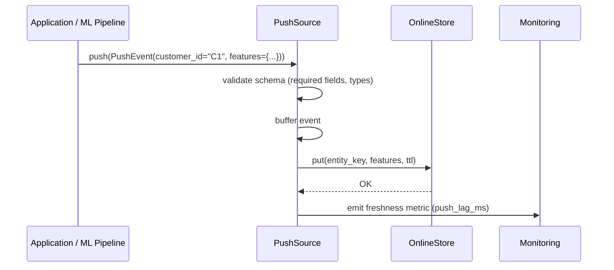
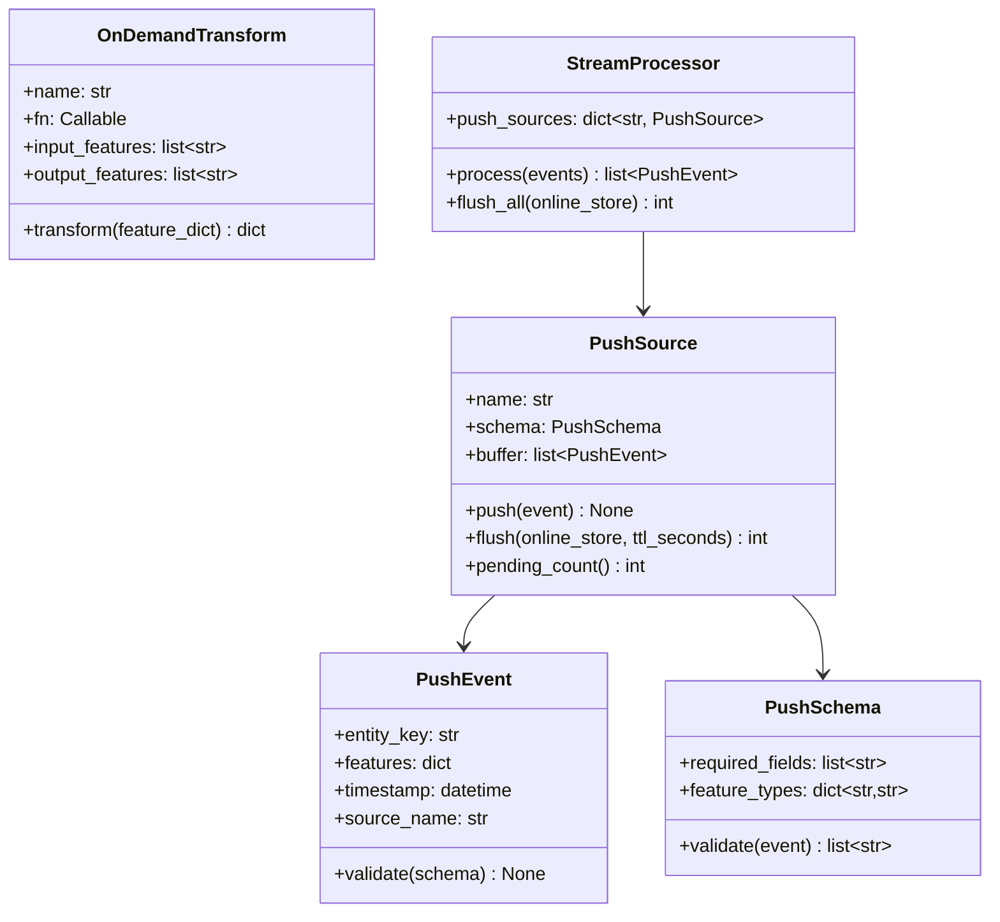

# Day 42 — Streaming Features

## Why Streaming Features?

Batch materialization has a freshness lag (daily or hourly at best). Some features need
to be **milliseconds fresh** — not hours.

| Feature | Acceptable staleness | Why |
|---|---|---|
| `avg_spend_30d` | Daily | Moves slowly |
| `tx_count_last_hour` | Minutes | Fraud signal |
| `last_payment_timestamp` | Seconds | Risk trigger |
| `current_session_page_count` | Real-time | Personalisation |

For these, **push sources** write directly to the online store, bypassing the batch path.

---

## Two Streaming Patterns

### 1. Push Source (Feast native)

The application sends feature events directly to the online store:

```python
store.push("tx_features", pd.DataFrame([{
    "customer_id": "C1",
    "event_timestamp": datetime.utcnow(),
    "tx_count_last_hour": 3,
    "last_tx_amount": 150.00,
}]))
```

The online store is updated immediately. No Flink or Kafka required.
Best for: low-volume, low-latency signals from application code.

### 2. Stream Processor (Flink / Spark Streaming)

A streaming job (Flink, Spark Structured Streaming, Kafka Streams) continuously reads
raw events, computes feature windows (sliding/tumbling), and pushes to online store.

```
Kafka topic → Flink job → aggregate(customer, window=1h) → Feast push source → Redis
```

Best for: high-throughput event streams requiring windowed aggregations.

---

## Push Source Flow



---

## On-Demand Feature View

An **on-demand feature view** computes features at **request time** from:
1. Features already retrieved from the online store
2. Data from the request payload

No materialization required. Examples:

```python
@on_demand_feature_view(inputs=["pay_ratio", "util_rate"])
def risk_score_features(features: dict) -> dict:
    return {
        "composite_risk": features["util_rate"] * 0.7 + (1 - features["pay_ratio"]) * 0.3,
        "high_risk_flag": int(features["util_rate"] > 0.8),
    }
```

These are computed in the serving path, not stored in the online store.

---

## Class Diagram



---

## Streaming vs Batch Features in Training

The key training challenge: **streaming features don't exist in the offline store**.

Two approaches:

| Approach | How | Trade-off |
|---|---|---|
| **Snapshot backfill** | Replay event stream through Flink, write to offline store | Accurate, expensive |
| **Approximate batch proxy** | Use coarser batch feature (e.g. 30d avg instead of 1h) | Fast, slight bias |
| **Training-time mock** | Flag streaming features, set to training-time average | Simple, loses signal |

Best practice: use snapshot backfill for production models. Use batch proxy in dev.

---

## Monitoring Push Sources

| Metric | Alert threshold | What it means |
|---|---|---|
| `push_lag_ms` | > 500ms | Push source slower than expected |
| `push_drop_rate` | > 0.1% | Events lost (schema validation failure) |
| `online_feature_age` | > 5 min for "streaming" features | Upstream stopped pushing |
| `push_event_count` | sudden drop | Upstream service down |
