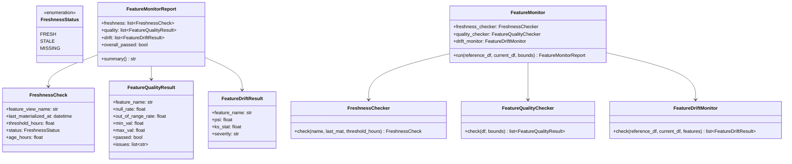
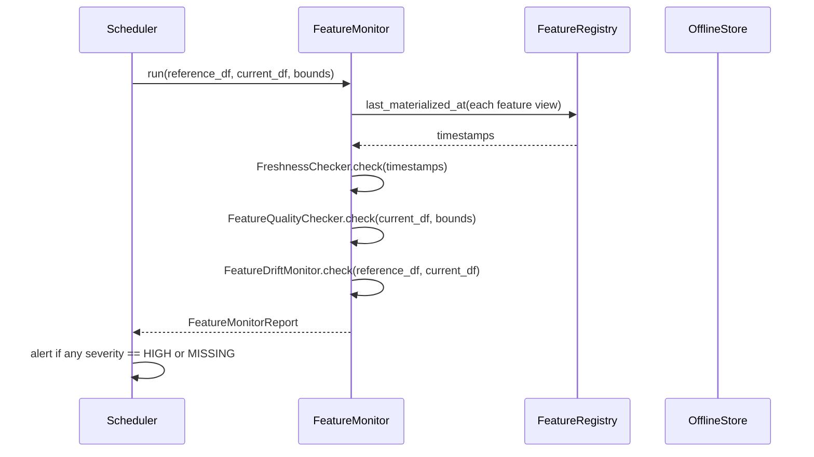

# Day 43 — Feature Monitoring

## Why Feature Monitoring Is Distinct From Model Monitoring

Model monitoring detects that **predictions have changed**. Feature monitoring detects **why**.

```
Alert: approval_rate dropped 8% this week
  → Model monitoring: prediction distribution shifted
  → Feature monitoring: util_rate mean jumped from 0.45 → 0.72
    → Root cause: upstream payment processor changed billing cycle
```

Feature monitoring is earlier in the signal chain — it catches issues before they reach the model.

---

## Three Monitoring Pillars

| Pillar | What it checks | Example failure |
|---|---|---|
| **Freshness** | Was the feature materialised recently enough? | Cron job failed; online store has 3-day-old data |
| **Data quality** | Are values within expected ranges? | `util_rate` suddenly 150% (>1.0) — impossible |
| **Feature drift** | Has the distribution shifted from training? | `avg_pay_ratio_6m` mean dropped due to COVID policy |

---

## Freshness Monitoring

Each feature view has a `ttl_days` and an expected materialization frequency. Freshness
monitoring compares `now()` with `last_materialized_at` from the registry.

```
FreshnessStatus:
  FRESH   → now - last_materialized_at < threshold_hours
  STALE   → threshold_hours ≤ now - last_materialized_at < 3 × threshold_hours
  MISSING → last_materialized_at is None or > 3 × threshold_hours
```

Alert on STALE; page on MISSING.

---

## Data Quality

Checks per-column constraints at inference time (or as a daily batch scan):

| Check | Example threshold | Severity |
|---|---|---|
| Null rate | < 1% for required features | CRITICAL if > 5% |
| Out-of-range rate | 0% for bounded features | WARNING if > 0.1% |
| Constant column | Variance > 0 | WARNING if stddev = 0 for > 1 day |
| Impossible values | `util_rate` ∈ [0, 1] | ERROR if any > 1.0 |

---

## Feature Drift

Uses the same PSI and KS statistics as the train/serve skew detector (Phase 3), but applied
**per feature view** on a rolling basis:

- **Reference distribution** → training snapshot (DVC-managed)
- **Current distribution** → last 7 days of inference feature log

| Metric | NONE | LOW | HIGH |
|---|---|---|---|
| PSI | < 0.10 | 0.10–0.20 | > 0.20 |
| KS stat | < 0.05 | 0.05–0.10 | > 0.10 |

HIGH drift on any feature → alert + trigger model revalidation.

---

## Class Diagram



---

## Monitoring Sequence



---

## Alerting Strategy

| Condition | Action |
|---|---|
| Any feature MISSING | Page on-call immediately |
| Any feature STALE | Slack alert + auto-retry materialization |
| Any feature PSI HIGH | Slack alert + block next model promotion |
| Any null rate > 5% | Slack alert |
| Any out-of-range > 0.1% | Log + investigate |
