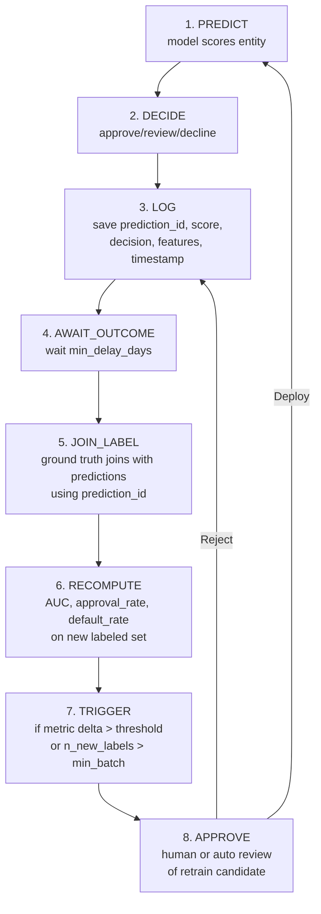
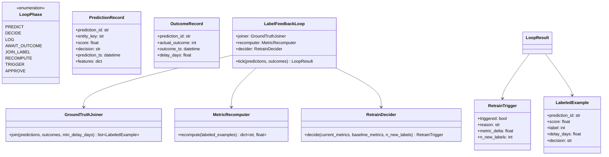

# Day 44 — Label Feedback Loop & Delayed Ground Truth

## The Closed Feedback Loop

The full ML lifecycle is a loop, not a pipeline:

```
Predict → Decide → Log → Await Outcome → Join Label → Recompute Metrics → Trigger Retrain → Approve → Deploy
```

In credit risk, the loop has a natural delay: a customer defaults 30–180 days after approval.
This is **delayed ground truth** — the model makes a prediction today, but the true label
arrives months later.

---

## Why Delayed Labels Break Naive Systems

```
Timeline:
  2023-01-10  Application → model scores 0.72 → APPROVE
  2023-04-15  Customer defaults (label = 1)

Naive join (wrong):
  Use 2023-01-10 prediction with 2023-04-15 label → looks fine

If you re-train too early:
  Label batch as of 2023-02-01 has only 20% of eventual defaults
  → Model learns on incomplete data → optimistic AUC → degrades in prod
```

The correct approach: only join labels where `outcome_date - prediction_date > min_delay_days`.

---

## The 8-Step Closed Feedback Loop



---

## Ground Truth Join

```
predictions table:
  prediction_id │ customer_id │ score │ decision │ prediction_ts

outcomes table:
  prediction_id │ actual_outcome │ outcome_ts │ source

join condition:
  predictions.prediction_id == outcomes.prediction_id
  AND outcome_ts - prediction_ts > min_delay_days
  AND actual_outcome IS NOT NULL
```

Rows that don't meet the delay condition are **provisional** — excluded from retraining.

---

## Retrain Trigger Logic

```python
if (
    n_new_labels >= MIN_BATCH_SIZE          # enough data for signal
    and abs(auc_delta) >= AUC_DRIFT_THRESHOLD  # meaningful metric change
):
    trigger_retrain()
```

Two conditions are required to avoid churn:
1. **Size condition** — avoids triggering on tiny batches with high variance
2. **Quality condition** — avoids triggering if performance is stable

---

## Class Diagram



---

## Active Learning Basics

Not all labels have equal value. **Active learning** prioritises labelling the examples
the model is most uncertain about.

| Strategy | How | When to use |
|---|---|---|
| **Uncertainty sampling** | Label examples where score ≈ 0.5 (most uncertain) | When labels are expensive |
| **Margin sampling** | Label examples in the "review" band | Natural fit for 3-class routing |
| **Diversity sampling** | Label examples spread across feature space | When uncertain examples may cluster |

In credit risk, review-band decisions are natural candidates for active learning — a human
already touched them, so the label is nearly free.

---

## Label Arrival Curve

Labels don't arrive all at once. The fraction confirmed by each delay window follows a curve:

| Horizon | Fraction confirmed |
|---|---|
| T+1 day | ~5% |
| T+7 days | ~20% |
| T+30 days | ~60% |
| T+90 days | ~85% |
| T+180 days | ~95% |

Retrain only when the arrival curve has stabilised (> 85% confirmed) to avoid building a model
on incomplete labels.
