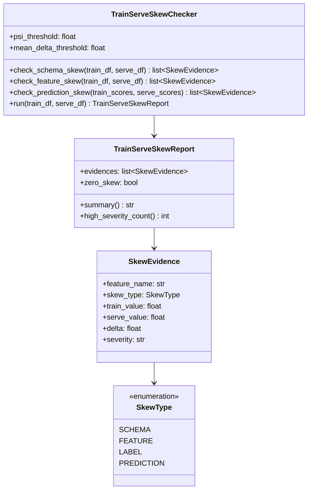

# Day 45 — Consolidation: Zero Train-Serve Skew

## The Goal

Phase 6 ends with a verifiable claim:

> **The feature values seen by the model during training are identical to the feature values
> seen at serving time, for the same entity at the same point in time.**

This is "zero train-serve skew." It's not a theoretical property — it must be provable.

---

## Four Types of Skew

| Type | Description | Detection |
|---|---|---|
| **Schema skew** | Column exists in training but not serving, or vice versa | Compare column sets |
| **Feature skew** | Same column, different computation or distribution | PSI / mean comparison |
| **Label skew** | Label distribution in training ≠ live default rate | Compare approval_rate / default_rate |
| **Prediction skew** | Model produces different score on same input in training vs serving | Exact score comparison on shared test set |

---

## Schema Skew

The most common and most dangerous skew. After renaming a feature:

```
Training:    df["pay_ratio"]   = pay_amt / bill_amt
Serving:     features["pay_ratio_v2"] = pay_amt / bill_amt.clip(1)
```

Result: `pay_ratio` is null at serving time. The model gets NaN. Predictions degrade silently.

**Fix:** Feature registry schema comparison before deploy.

---

## Feature Skew

Same feature name, different computation:

```
Training:    util_rate = bill_6m / limit  # average over 6 months
Serving:     util_rate = bill_last / limit  # only last month
```

PSI > 0.20 between training and serving distributions detects this.

**Fix:** Single feature computation function in `feature_views.py`, called from both paths.

---

## Prediction Skew

Even with correct features, the model might produce different scores if:
- Different sklearn / LightGBM version between training and serving containers
- Float precision differs between ONNX and Python runtime
- Feature order differs (e.g., some models are order-sensitive)

**Fix:** ONNX export + parity check (Phase 4 — Day 22).

---

## Zero-Skew Checklist

```
☐ Schema match:
  ✅ training_features.columns == serving_features.columns
  ✅ no NaN columns in serving that have values in training

☐ Feature skew:
  ✅ PSI < 0.10 for all features (training vs last-7-day serving sample)
  ✅ mean difference < 10% for all continuous features

☐ Label skew:
  ✅ label_positive_rate in training ≈ live default_rate
  ✅ approval_rate stable week-over-week

☐ Prediction skew:
  ✅ ONNX parity test passes (max delta < 1e-4 on 1000 test rows)
  ✅ same feature order in training DataFrame and serving request
```

---

## SkewChecker Class Diagram



---

## Sequence: Zero-Skew Integration Test

```mermaid
sequenceDiagram
    participant CI as CI Pipeline
    participant SC as SkewChecker
    participant OFF as OfflineStore
    participant ONL as OnlineStore

    CI->>OFF: sample training features (last training run)
    OFF-->>CI: train_df
    CI->>ONL: sample serving features (last 7 days of inference logs)
    ONL-->>CI: serve_df
    CI->>SC: run(train_df, serve_df)
    SC->>SC: check_schema_skew(train_df, serve_df)
    SC->>SC: check_feature_skew(train_df, serve_df)
    SC-->>CI: TrainServeSkewReport
    CI->>CI: assert report.zero_skew == True
    CI->>CI: if not: BLOCK promotion
```

---

## Phase 6 Summary

| Day | What was built | Key class |
|---|---|---|
| 38 | Feature store problem theory | — |
| 39 | Core feature store | `FeatureStore`, `OfflineStore`, `InMemoryOnlineStore` |
| 40 | Feature views + PIT join | `FeatureView`, `PointInTimeJoin` |
| 41 | Materialization | `IncrementalMaterializer`, `MaterializationJob` |
| 42 | Streaming features | `PushSource`, `OnDemandTransform`, `StreamProcessor` |
| 43 | Feature monitoring | `FeatureMonitor`, `FreshnessChecker`, `FeatureDriftMonitor` |
| 44 | Label feedback loop | `LabelFeedbackLoop`, `GroundTruthJoiner`, `RetrainDecider` |
| 45 | Zero-skew consolidation | `TrainServeSkewChecker`, `TrainServeSkewReport` |

**Total Phase 6 tests: see test suite**

The closed feedback loop is now established:
```
Model trains on features → Features materialised to online store →
Model serves using online store → Predictions logged →
Outcomes join after delay → Metrics recomputed →
Retrain triggered if drift detected → New model trained on same features
```
