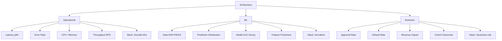
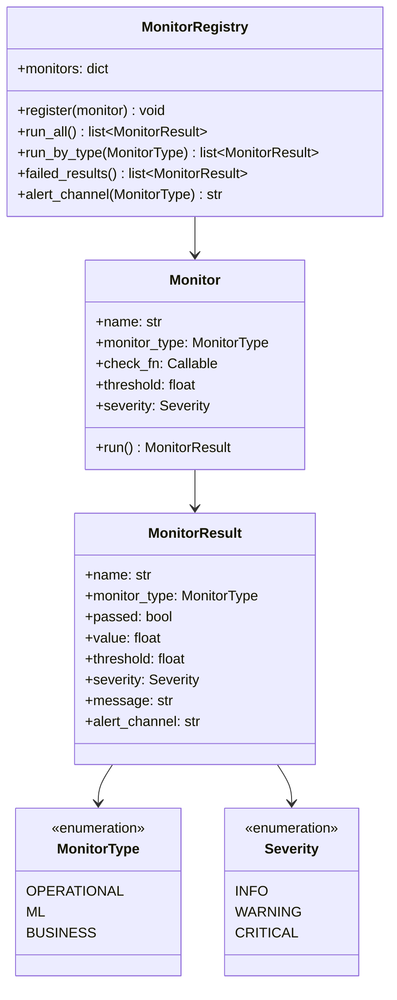
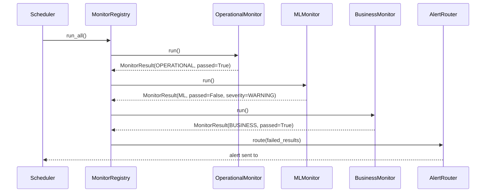

# Day 46 — Monitoring Taxonomy: Operational vs ML vs Business

## Why Taxonomy Matters

A common anti-pattern is to treat all alerts the same. A p99 latency spike, an AUC decay,
and a drop in approval revenue are three completely different events — they have different
owners, different SLOs, different remediation paths, and different escalation routes.

Mixing them into a single alert channel means:
- SREs get paged for AUC drops they can't action
- Data scientists miss latency regressions that corrupt their features
- Finance never sees revenue drift until it's too late

The taxonomy enforces **alert routing by monitor type**.

---

## Three Monitor Types

---

## Monitor Registry — Concepts

Each monitor has:
- **type** — `OPERATIONAL` / `ML` / `BUSINESS`
- **name** — unique identifier
- **check** — a callable that returns a `MonitorResult`
- **alert_channel** — routed by type automatically
- **severity** — `INFO` / `WARNING` / `CRITICAL`

---

## Alert Routing Table

| Monitor Type | Alert Channel | Owner | SLO | Remediation |
|---|---|---|---|---|
| OPERATIONAL | `#oncall-infra` | SRE | 99.9% uptime | Restart / scale out |
| ML | `#ml-alerts` | Data Scientist | AUC > 0.72 | Retrain / rollback |
| BUSINESS | `#business-risk` | Risk Officer | Approval rate 60–80% | Model review / policy update |

---

## Sequence: Monitor Run Cycle

---

## Five Monitor Invariants

| # | Invariant |
|---|---|
| 1 | Every monitor has exactly one type — no "mixed" monitors |
| 2 | Alert channel is determined by type, not by individual monitor |
| 3 | `CRITICAL` monitors block the serving gate on failure |
| 4 | `WARNING` monitors emit alerts but do NOT block promotion |
| 5 | `INFO` monitors are logged but never alert |

---

## What This Enables in Phase 7

Day 46 builds the taxonomy skeleton. Each subsequent day adds monitors of specific types:
- Day 47 — ML drift monitors (type = `ML`)
- Day 49 — Prometheus operational monitors (type = `OPERATIONAL`)
- Day 51 — Prediction logger feeds business monitors (type = `BUSINESS`)
- Day 52 — Closed loop monitor (type = `ML`)
- Day 53 — SLOs wire all three types together
