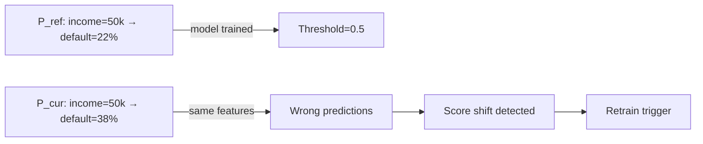
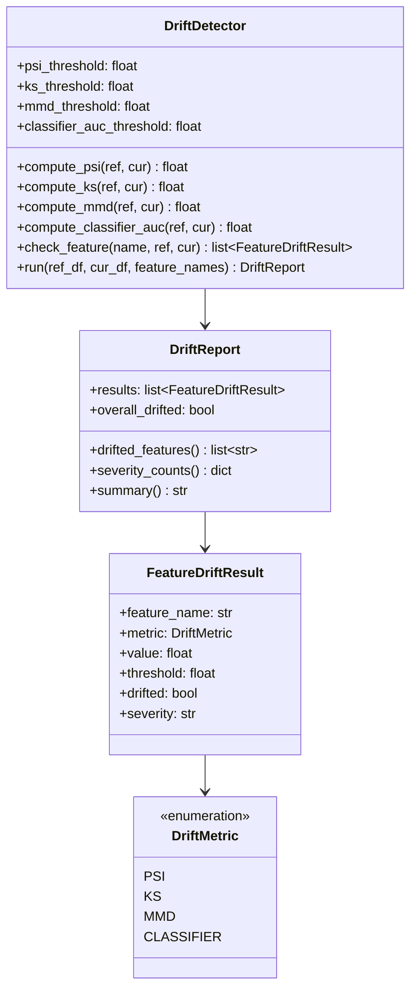
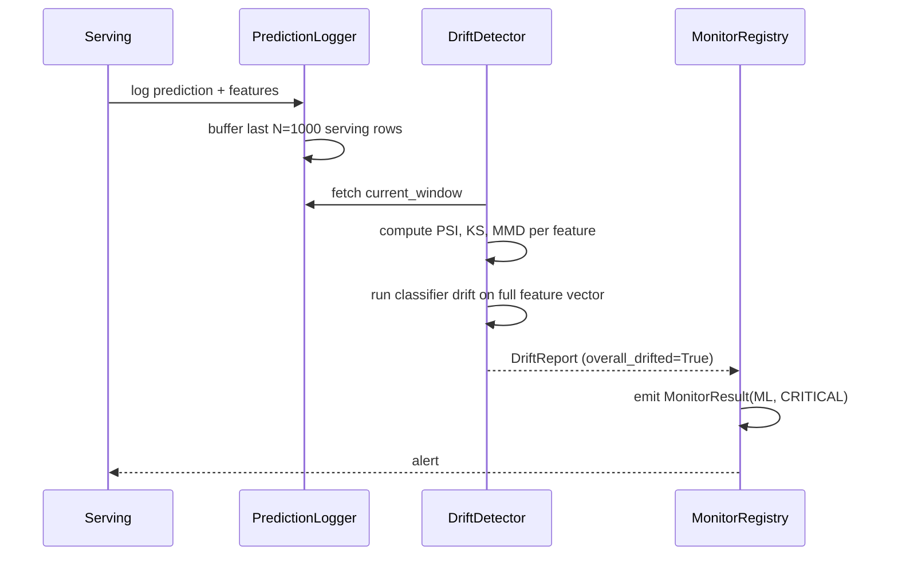

# Day 47 — Drift & Concept Drift

## What Is Drift?

A model is trained on a snapshot of reality. Reality keeps changing. **Drift** is the umbrella
term for the gap between the distribution the model was trained on and the distribution it
currently sees.

There are three distinct types:

| Type | What shifts | Example | Effect |
|---|---|---|---|
| **Data drift** (covariate shift) | Input feature distribution P(X) | Credit bureau mix changes | Model gets inputs it wasn't optimised for |
| **Concept drift** | Label conditional P(Y\|X) | Economic recession — same income, higher default rate | Model's learned mapping is wrong |
| **Label drift** | Marginal label P(Y) | Default rate rises from 22% to 35% | Threshold, approval rate, revenue all affected |

---

## Data Drift — Four Metrics

### PSI (Population Stability Index)
Standard in credit risk. Bins both distributions and compares fractions.

```
PSI = Σ (cur_pct - ref_pct) × ln(cur_pct / ref_pct)
```

| PSI | Interpretation |
|---|---|
| < 0.10 | Stable — no action |
| 0.10–0.20 | Slight shift — monitor closely |
| > 0.20 | Major shift — investigate / retrain |

### KS Statistic (Kolmogorov-Smirnov)
Max difference between empirical CDFs. Non-parametric. Best for detecting
a clear boundary shift.

```
KS = max|F_ref(x) − F_cur(x)|
```

Threshold: `KS > 0.10` triggers alert.

### Maximum Mean Discrepancy (MMD)
Kernel-based metric that compares distributions in a high-dimensional feature space.
Better than PSI for high-dimensional or multi-modal features.

```
MMD² = E[k(x,x')] − 2E[k(x,y)] + E[k(y,y')]
```

where k is the RBF kernel. No binning required — works on raw samples.

### Classifier-Based Drift
Train a binary classifier to distinguish reference from current samples.
If AUC > 0.7 → classifier can separate them → drift detected.

```
reference label = 0, current label = 1
AUC > 0.7 → HIGH drift
```

---

## Concept Drift

Concept drift is the hardest to detect because the input X looks fine but the
relationship Y|X has changed.

Detection methods:
1. **Label feedback** — compare model predicted rate vs observed default rate (needs delayed labels, 30–90 days)
2. **Score shift** — if P(score > 0.5) drops without feature drift, the model is miscalibrated against new reality
3. **ADWIN / Page-Hinkley** — sequential change-point algorithms on the error stream



---

## DriftReport Class Diagram



---

## Sequence: Drift Detection in Serving Pipeline



---

## Thresholds Summary

| Metric | Low Alert | High Alert / Retrain |
|---|---|---|
| PSI | > 0.10 | > 0.20 |
| KS | > 0.05 | > 0.10 |
| MMD | > 0.05 | > 0.10 |
| Classifier AUC | > 0.65 | > 0.70 |
