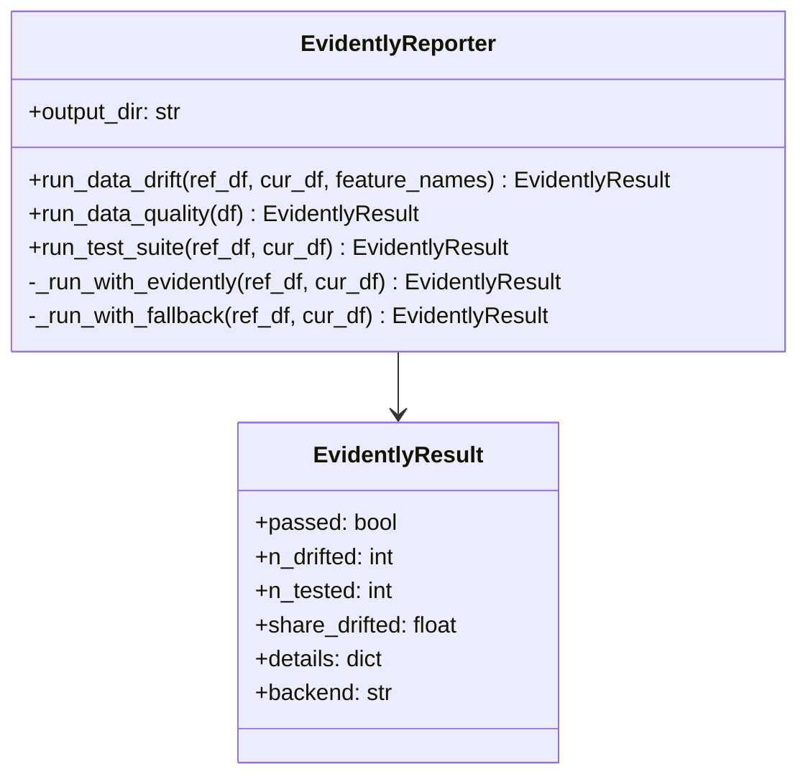
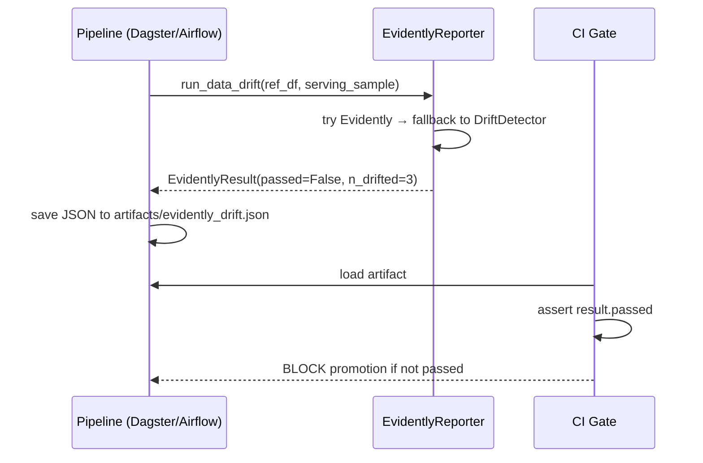

# Day 48 — Evidently: Reports, Test Suites & Pipeline Integration

## What Is Evidently?

Evidently is an open-source ML monitoring library that generates:
1. **Reports** — visual HTML / JSON summaries of dataset statistics and drift metrics
2. **Test suites** — pass/fail assertions over those metrics (for CI/gate integration)

It's designed to work both interactively (notebooks) and in-pipeline (programmatic JSON output).

---

## Two Core Concepts

### Report
A report answers: *"What do the data look like?"*

```python
from evidently.report import Report
from evidently.metric_preset import DataDriftPreset

report = Report(metrics=[DataDriftPreset()])
report.run(reference_data=ref_df, current_data=cur_df)
report.save_html("drift_report.html")
json_result = report.as_dict()
```

### Test Suite
A test suite answers: *"Did we pass?"* — returns pass/fail per assertion.

```python
from evidently.test_suite import TestSuite
from evidently.test_preset import DataDriftTestPreset

suite = TestSuite(tests=[DataDriftTestPreset()])
suite.run(reference_data=ref_df, current_data=cur_df)
results = suite.as_dict()
```

---

## Evidently Presets Used in This Project

| Preset | Type | What it checks |
|---|---|---|
| `DataDriftPreset` | Report | PSI / KS / Wasserstein per feature |
| `DataQualityPreset` | Report | Nulls, ranges, duplicates |
| `TargetDriftPreset` | Report | Label / prediction distribution shift |
| `DataDriftTestPreset` | Test | Pass/fail per feature drift threshold |
| `DataQualityTestPreset` | Test | Pass/fail per quality assertion |

---

## Architecture: EvidentlyReporter

Rather than calling Evidently directly throughout the codebase, we wrap it in a thin adapter
class that:
1. Falls back to our own `DriftDetector` if Evidently is not installed
2. Returns the same `DriftReport` type used by the rest of Phase 7
3. Can save JSON output to a path for CI artifacts



---

## Evidently in the Pipeline



---

## Why Adapter Pattern?

Evidently is a large dependency. Some environments (minimal CI, edge inference) can't install it.
The adapter means:
- Tests pass without Evidently installed (use `DriftDetector` fallback)
- In production, swap backend by installing `evidently`
- Same API throughout — callers never know which backend ran

---

## Evidently vs Our DriftDetector

| Feature | Evidently | DriftDetector (Day 47) |
|---|---|---|
| PSI | ✅ | ✅ |
| KS | ✅ | ✅ |
| Wasserstein | ✅ | ❌ |
| MMD | ❌ | ✅ |
| Classifier drift | ❌ | ✅ |
| HTML report | ✅ | ❌ |
| No extra deps | ❌ | ✅ |
| Pass/fail test suite | ✅ | Manual |

Use Evidently for the report artefact. Use `DriftDetector` for gates that must run dependency-free.
