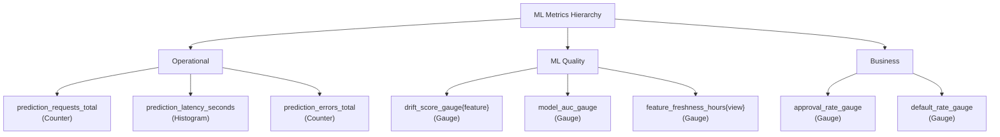
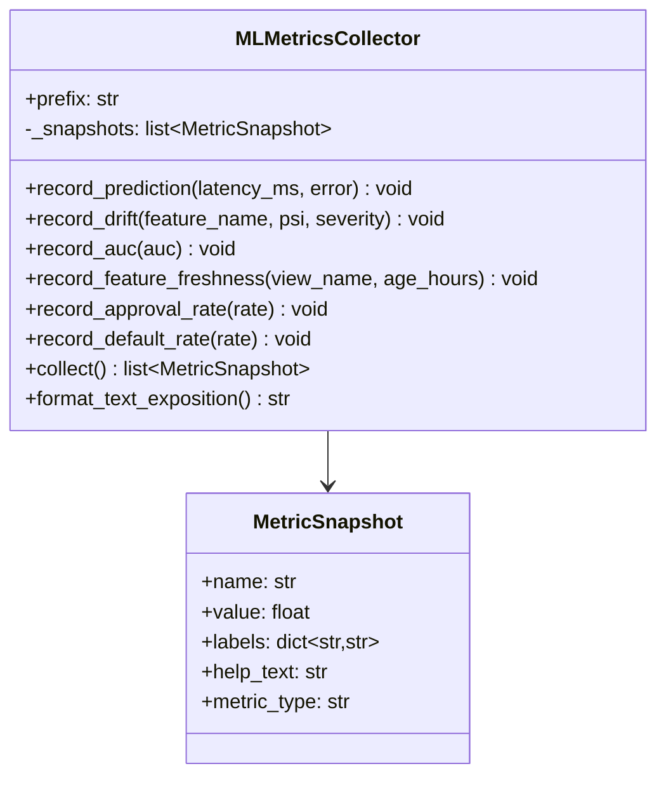
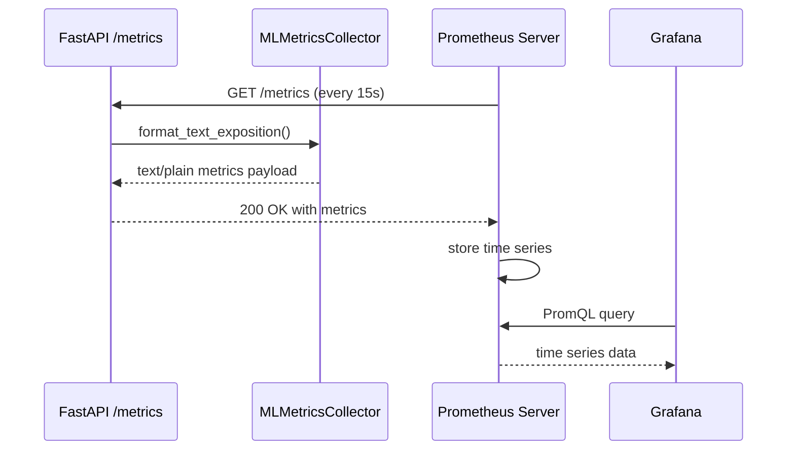

# Day 49 — Prometheus Custom ML Metrics

## Why Prometheus for ML?

Prometheus is the de-facto standard for infrastructure monitoring, but it's equally powerful
for ML — once you know which metric types to use for which ML concepts.

The key insight: **pull-based monitoring** fits ML perfectly because:
- The model doesn't need to know who is consuming metrics
- Multiple consumers (Grafana, alert rules, batch jobs) share one source of truth
- Retention is handled by Prometheus, not your model

---

## Four Prometheus Metric Types

| Type | Use case | ML example |
|---|---|---|
| **Counter** | Monotonically increasing total | `prediction_requests_total`, `errors_total` |
| **Gauge** | Current value (can go up/down) | `drift_score`, `auc_current`, `feature_freshness_hours` |
| **Histogram** | Distribution with bucket percentiles | `prediction_latency_seconds` (p50/p95/p99) |
| **Summary** | Client-side percentile calculation | Latency when bucket boundaries aren't known in advance |

---

## ML Metrics Hierarchy



---

## PromQL Examples

```promql
# p99 prediction latency over last 5 minutes
histogram_quantile(0.99, rate(prediction_latency_seconds_bucket[5m]))

# Error rate over last 1 minute
rate(prediction_errors_total[1m]) / rate(prediction_requests_total[1m])

# Features with PSI drift > 0.20
drift_score_gauge{severity="high"}

# Alert rule: AUC drops below 0.72
ALERT ModelAUCDrop
  IF model_auc_gauge < 0.72
  FOR 10m
  LABELS { severity="critical" }
  ANNOTATIONS { summary="Model AUC below threshold" }
```

---

## MLMetricsCollector Class Diagram



---

## Text Exposition Format

Prometheus scrapes metrics from `/metrics` endpoints in text format:

```
# HELP prediction_requests_total Total prediction requests served
# TYPE prediction_requests_total counter
prediction_requests_total 1042

# HELP prediction_latency_seconds_sum Sum of latencies
# TYPE prediction_latency_seconds_sum gauge
prediction_latency_seconds_sum 15.34

# HELP drift_score_gauge Current PSI drift score
# TYPE drift_score_gauge gauge
drift_score_gauge{feature="pay_ratio",severity="high"} 0.31
drift_score_gauge{feature="util_rate",severity="none"} 0.04
```

Our `format_text_exposition()` generates this format so the FastAPI `/metrics` endpoint
can serve it without requiring the `prometheus_client` library to be installed.

---

## Sequence: Metrics Scrape


