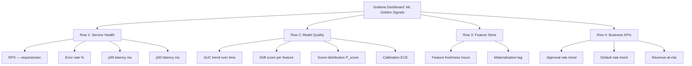
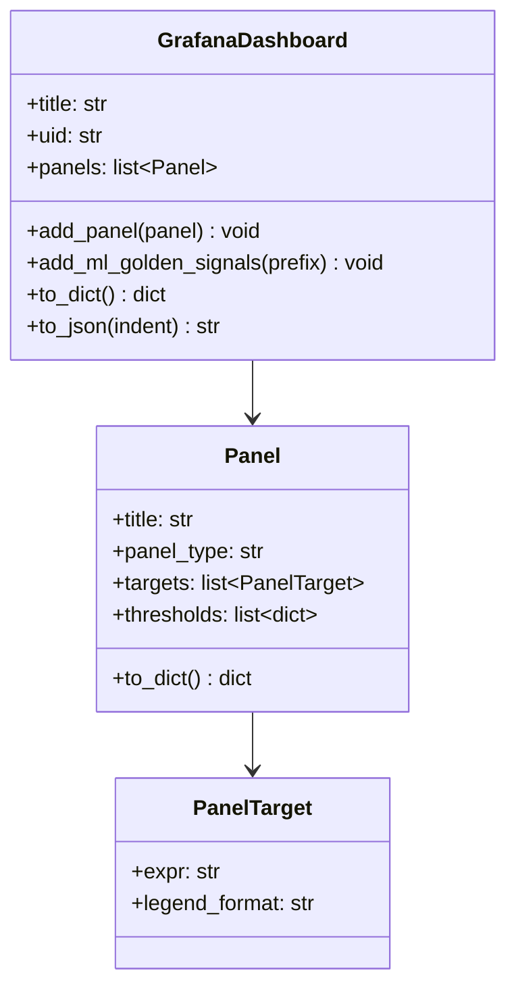
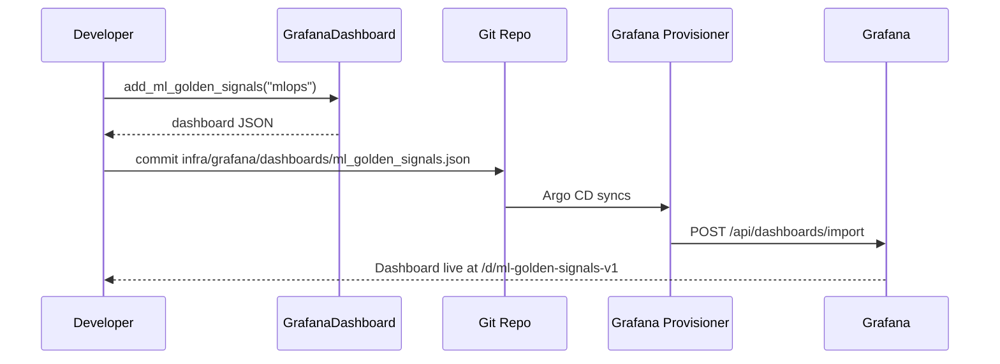

# Day 50 — Grafana: Golden Signals + ML Panels + Alerts

## The Four Golden Signals (Google SRE)

Google's SRE book defines four signals every service must monitor:

| Signal | Description | ML Example |
|---|---|---|
| **Latency** | Time to serve a request | p50/p99 prediction latency |
| **Traffic** | Request volume | predictions/second |
| **Errors** | Failed request rate | model errors / decode failures |
| **Saturation** | How "full" the system is | CPU%, queue depth, GPU memory |

For ML services, we add a fifth signal: **Model Quality** (AUC, drift score, calibration).

---

## ML-Specific Panels



---

## Dashboard JSON Structure

Grafana dashboards are JSON objects. Key fields:

```json
{
  "title": "ML Credit Risk — Golden Signals",
  "uid": "ml-golden-signals-v1",
  "panels": [
    {
      "title": "Prediction RPS",
      "type": "timeseries",
      "targets": [
        {"expr": "rate(mlops_prediction_requests_total[1m])", "legendFormat": "RPS"}
      ]
    },
    {
      "title": "Model AUC",
      "type": "stat",
      "targets": [
        {"expr": "mlops_model_auc", "legendFormat": "AUC"}
      ],
      "thresholds": [
        {"value": 0.72, "color": "red"},
        {"value": 0.76, "color": "yellow"},
        {"value": 0.80, "color": "green"}
      ]
    }
  ]
}
```

---

## Alert Rules

Two types of alert in Grafana:

1. **Grafana-managed alerts** — evaluate PromQL in Grafana, send to alert manager
2. **Prometheus alert rules** — `PrometheusRule` CRD on K8s (Day 58+)

Day 50 defines Grafana-managed alerts:

```yaml
# Credit Risk Model Alerts
- alert: ModelAUCDrop
  expr: mlops_model_auc < 0.72
  for: 10m
  labels:
    severity: critical
    channel: ml-alerts
  annotations:
    summary: "Model AUC dropped below 0.72"

- alert: FeatureDriftHigh
  expr: mlops_drift_score{severity="high"} > 0.20
  for: 5m
  labels:
    severity: warning
    channel: ml-alerts

- alert: FeatureStale
  expr: mlops_feature_freshness_hours > 26
  for: 1m
  labels:
    severity: critical
    channel: oncall-infra
```

---

## GrafanaDashboard Helper Class

Rather than managing raw JSON, we provide a `GrafanaDashboard` helper that:
- Generates valid panel JSON from structured Python objects
- Enforces the "four golden signals + ML quality" row structure
- Can export to JSON for GitOps-managed dashboard provisioning



---

## Sequence: GitOps Dashboard Deploy


