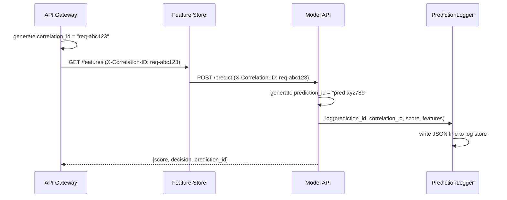
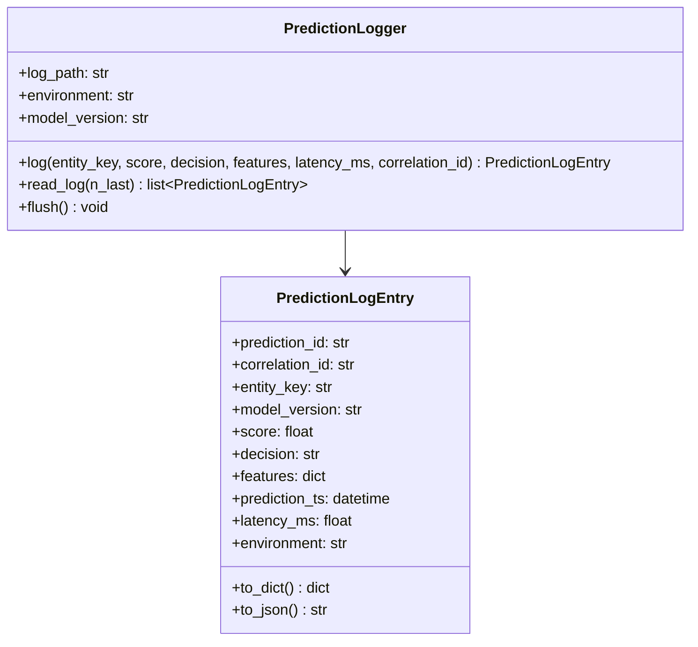

# Day 51 — Prediction Logging for Audit/Replay

## Why Log Predictions?

Predictions are ephemeral — without logging, you cannot:
1. **Debug** — reproduce a prediction that produced a wrong outcome
2. **Audit** — prove to regulators what the model decided for customer X on date Y
3. **Replay** — re-score historical predictions with a new model to estimate impact before promotion
4. **Feedback loop** — join predictions to outcomes (Phase 6 — Day 44)

A production prediction log is a **first-class artifact**, not an afterthought.

---

## Structured Log Schema

Every prediction log entry must contain:

| Field | Type | Description |
|---|---|---|
| `prediction_id` | str | UUID — unique per request, used for outcome join |
| `correlation_id` | str | Request-level ID for tracing across microservices |
| `entity_key` | str | Customer / entity identifier |
| `model_version` | str | Model version / run_id |
| `score` | float | Raw probability output (not thresholded) |
| `decision` | str | approve / review / decline |
| `features` | dict | Feature snapshot at inference time |
| `prediction_ts` | ISO8601 | When the prediction was made |
| `latency_ms` | float | How long inference took |
| `environment` | str | prod / staging / shadow |

---

## Correlation IDs

Every request generates two IDs:
- **correlation_id** — shared across all microservices for one request (e.g., same value in gateway, feature store, model API)
- **prediction_id** — unique to this model prediction (enables outcome join)



---

## PredictionLogger Class Diagram



---

## Log Storage Strategies

| Strategy | Format | Use case |
|---|---|---|
| **Local JSONL** | One JSON object per line | Dev, testing, small volume |
| **S3 / MinIO** | Parquet partitioned by date | Production — efficient batch read |
| **Kafka** | JSON stream | Real-time feedback loop integration |
| **Database** | PostgreSQL table | Audit trail — queryable, indexed |

Our implementation uses local JSONL (easy to test) with the same schema that works
for all other backends.

---

## Replay Use Case

Before promoting a new model, replay recent predictions through it:

```
1. Read last 30 days from prediction log
2. Re-score each entry with new model (same features captured in log)
3. Compare: new_score vs logged_score, new_decision vs logged_decision
4. Compute: AUC delta, approval rate delta, decision flip rate
5. If delta > threshold → human review required
```

The `features` field in `PredictionLogEntry` is the crucial replay enabler.
