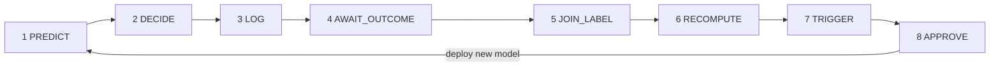
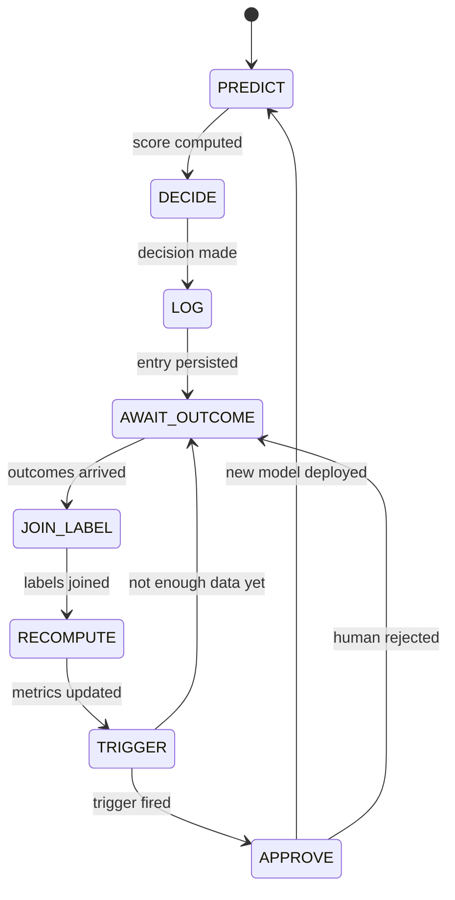
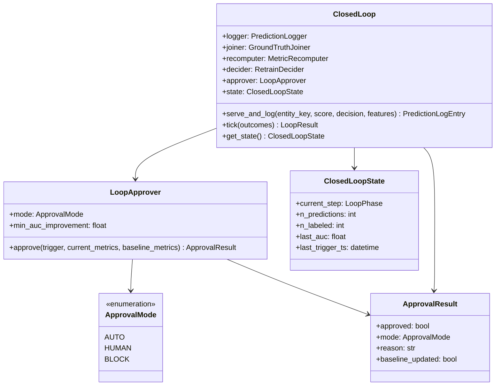

# Day 52 — Closed-Loop Learning System (8 Steps)

## What Is a Closed Loop?

An open-loop ML system trains once and serves forever. A closed-loop system continuously
updates itself using feedback from real-world outcomes.

The loop has **8 discrete steps** that must run in order:



---

## The 8 Steps

| Step | Class / Method | What happens |
|---|---|---|
| **PREDICT** | `ModelServingNode` | Model scores entity, returns probability |
| **DECIDE** | `DecisionNode` | Score → approve / review / decline via thresholds |
| **LOG** | `PredictionLogger.log()` | Entry written to JSONL with feature snapshot |
| **AWAIT_OUTCOME** | Time passes (30–180 days) | Outcome (default/no-default) arrives from external system |
| **JOIN_LABEL** | `GroundTruthJoiner.join()` | Predictions matched to confirmed outcomes |
| **RECOMPUTE** | `MetricRecomputer.recompute()` | AUC + approval rate recomputed on new labeled set |
| **TRIGGER** | `RetrainDecider.decide()` | Fire retrain if both batch size AND delta thresholds met |
| **APPROVE** | `LoopApprover.approve()` | Human or automated gate; updates baseline on approval |

---

## The Loop's Relationship to Phase 6

Phase 6 (Day 44) built the label feedback components:
- `GroundTruthJoiner` (Step 5)
- `MetricRecomputer` (Step 6)
- `RetrainDecider` + `LabelFeedbackLoop` (Step 7)

Day 52 wraps them into an **orchestrated ClosedLoop** that also handles:
- **Steps 1–3** via `ModelServingNode` + `PredictionLogger`
- **Step 8** — `LoopApprover` (human-in-the-loop gate)
- **State machine** — tracks which step the loop is currently in

---

## State Machine



---

## LoopApprover: Two Modes

| Mode | Description | When to use |
|---|---|---|
| **AUTO** | Approves automatically if AUC improved | Mature pipelines with stable data |
| **HUMAN** | Returns PENDING — waits for external signal | Regulated environments (e.g., credit) |
| **BLOCK** | Always rejects (for testing) | CI pipeline dry-run |

---

## Closed Loop Class Diagram



---

## Monitoring Integration

The closed loop emits metrics to `MLMetricsCollector` at each tick:

```python
metrics.record_auc(result.current_metrics["auc"])
metrics.record_approval_rate(result.current_metrics["approval_rate"])
```

This means Grafana always shows the current loop state without additional polling.
