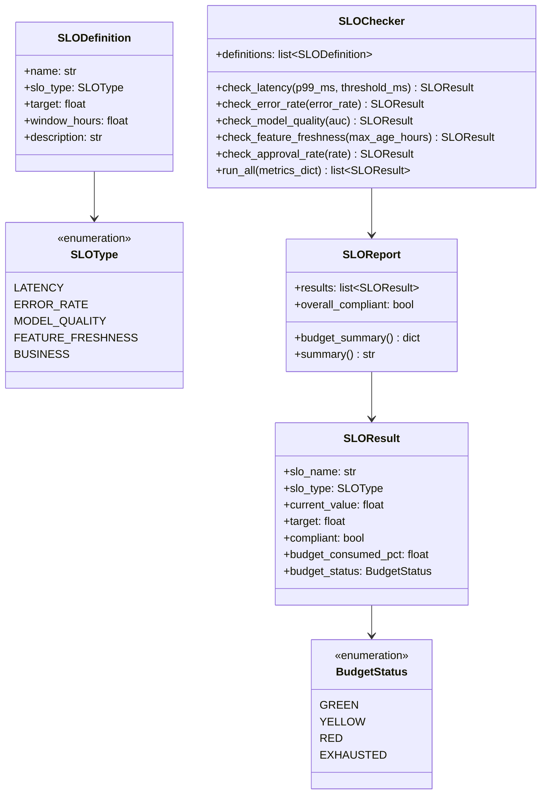
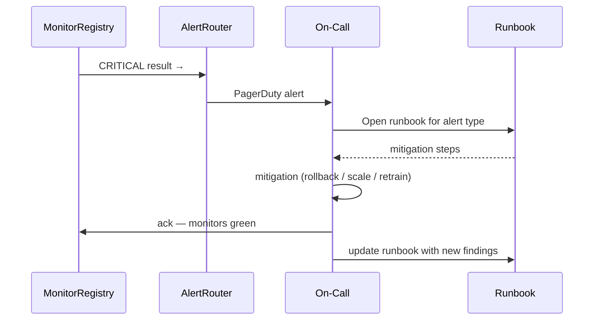

# Day 53 — SLOs, SLIs, Error Budgets + Monitoring Gate

## SLI / SLO / SLA Hierarchy

```
SLA (Service Level Agreement) — contractual commitment to customers
 └── SLO (Service Level Objective) — internal target that, if missed, depletes budget
      └── SLI (Service Level Indicator) — the measured metric
```

Example for the credit risk API:

| SLI | SLO | Error Budget |
|---|---|---|
| p99 prediction latency | < 500ms for 99.9% of requests | 43.2 min/month allowed above 500ms |
| Error rate | < 1% of requests return 5xx | 0.01 request budget per 100 |
| Model AUC | ≥ 0.72 for 95% of daily evaluations | 1.5 days/month AUC can be below target |
| Feature freshness | All views materialised within 26h for 99% of hours | 7.2 h/month stale allowed |
| Approval rate | 60–80% for 99% of hours | 7.2 h/month out of band allowed |

---

## Error Budget

An error budget is the amount of time/requests a service is **allowed to fail** its SLO
before the SLA is violated.

```
Error Budget = (1 - SLO target) × time window
             = (1 - 0.999) × 30 days × 24h × 60min
             = 43.2 minutes/month
```

Budget states:
- **GREEN** — > 50% budget remaining
- **YELLOW** — 10–50% remaining
- **RED** — < 10% remaining (freeze non-critical changes)
- **EXHAUSTED** — 0% remaining (SLA breach imminent)

---

## SLO Class Diagram



---

## Monitoring Gate Checklist (Day 53)

The Phase 7 gate requires ALL of the following to pass before promoting to production:

```
☐ OPERATIONAL monitors
  ✅ p99 latency < 500ms (last 1h window)
  ✅ error rate < 1%
  ✅ no CRITICAL monitors in MonitorRegistry

☐ ML monitors
  ✅ model AUC ≥ 0.72
  ✅ no HIGH PSI drift on any feature
  ✅ feature freshness < 26 hours for all views

☐ BUSINESS monitors
  ✅ approval rate 60–80%
  ✅ default rate within expected range (< 35%)

☐ SLO error budgets
  ✅ all SLOs GREEN or YELLOW (no RED / EXHAUSTED)

☐ Closed loop
  ✅ prediction log has entries from last 24h
  ✅ feedback loop last ticked < 48h ago
```

---

## Incident Response Intro

When a monitor fires:



Runbooks live in `docs/runbooks/` — one per alert type.
