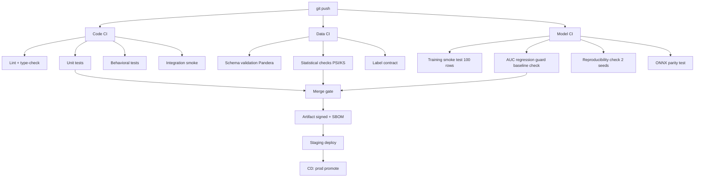
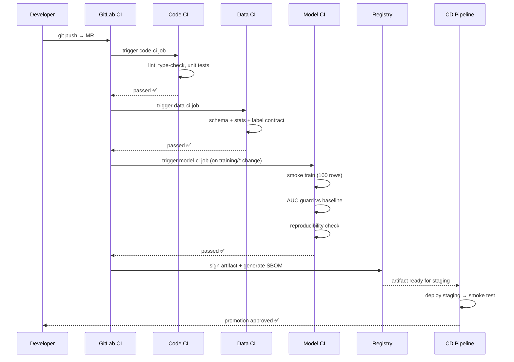

# Day 54 — CI/CD for ML: Code + Data + Model

## Why ML CI/CD Is Different

Traditional software CI checks: compile → unit test → integration test → deploy.

ML CI must additionally check:
- **Data** — is the schema still valid? Did statistical properties shift?
- **Model** — does training converge? Are metrics above baseline? Is the artifact reproducible?
- **Lineage** — can you trace this artifact back to its exact code + data + config?



---

## The ML Testing Pyramid

```
                    ┌─────────────────────────────┐
                    │   Model Quality (E2E)        │  ← AUC vs baseline, calibration
                    │   1 test per release         │     slow (full training run)
                    ├─────────────────────────────┤
                    │   Behavioral / Slice Tests   │  ← fairness, robustness slices
                    │   ~10 tests                  │     medium speed
                    ├─────────────────────────────┤
                    │   Data Contract Tests        │  ← schema, stats, label dist
                    │   ~20 tests                  │     fast (no model needed)
                    ├─────────────────────────────┤
                    │   Training Smoke Tests       │  ← 100 rows, convergence check
                    │   ~5 tests                   │     fast
                    ├─────────────────────────────┤
                    │   Unit Tests (transforms)    │  ← pure functions, no I/O
                    │   ~200 tests                 │     very fast (<1s each)
                    └─────────────────────────────┘
```

---

## Three Axes of ML CI

### 1 — Code CI (same as software)

```yaml
code-ci:
  stages: [lint, type-check, unit-test, integration-smoke]
  fast: true
  blocks_merge: true
```

### 2 — Data CI (new for ML)

```yaml
data-ci:
  stages: [schema-validate, stat-checks, label-contract]
  triggers: [data update, weekly schedule]
  blocks_merge: true
  artifact: data_ci_report.json
```

### 3 — Model CI (new for ML)

```yaml
model-ci:
  stages: [smoke-train, auc-guard, reproducibility, onnx-parity]
  triggers: [training code change, data change]
  blocks_promotion: true
  artifact: model_ci_report.json
```

---

## What Each CI Failure Means

| Failure | Root cause | Remediation |
|---|---|---|
| Unit test fails | Logic bug in transform / feature | Fix code, re-push |
| Schema validation fails | Upstream added/renamed column | Update schema or add migration |
| PSI drift (data CI) | Distribution shift in new data batch | Investigate source; may need retrain |
| AUC regression (model CI) | Code change degraded model | Revert or fix; retrain |
| Reproducibility check fails | Non-deterministic code | Fix seed / sort ordering |
| ONNX parity fails | Runtime version mismatch | Pin or reexport ONNX |

---

## CI Pipeline Architecture — Sequence



---

## Key Design Decisions

1. **Smoke train uses 100 rows** — fast enough for every MR, catches import errors and shape bugs
2. **AUC guard compares to stored baseline** — not just "does it converge" but "did it regress?"
3. **Reproducibility uses 2 seeds** — catches random non-determinism; both runs must match to 4 decimal places
4. **ONNX parity runs on same 100-row smoke set** — export then reload + compare scores
5. **Data CI runs on a sample** — full dataset validation is a scheduled job, not per-MR
