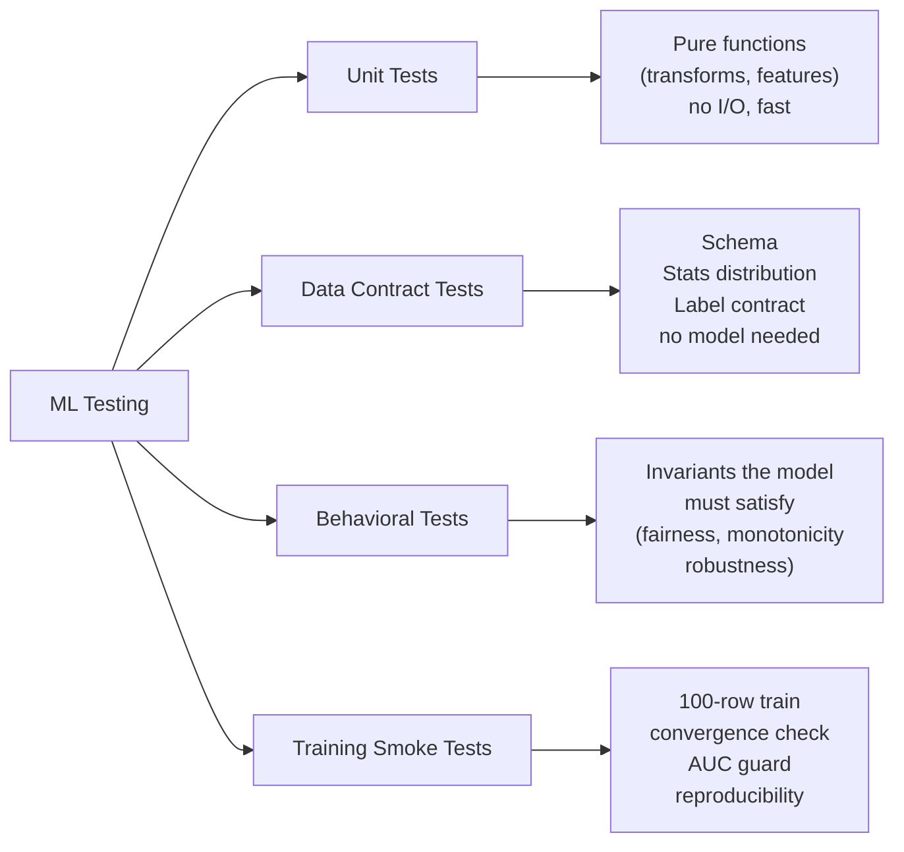
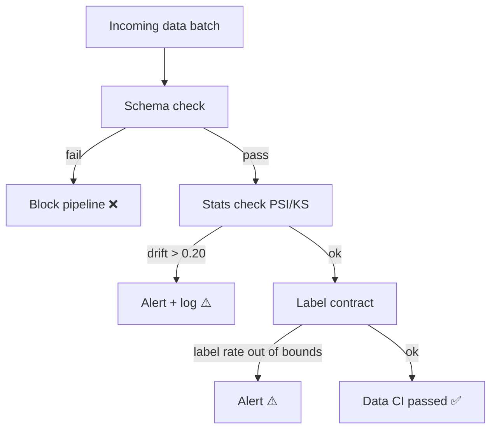
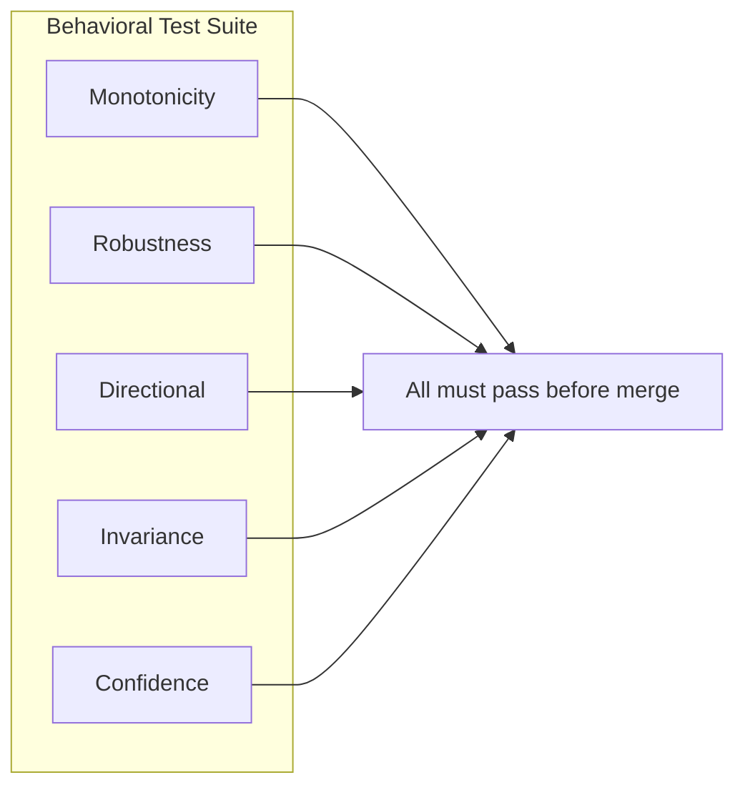
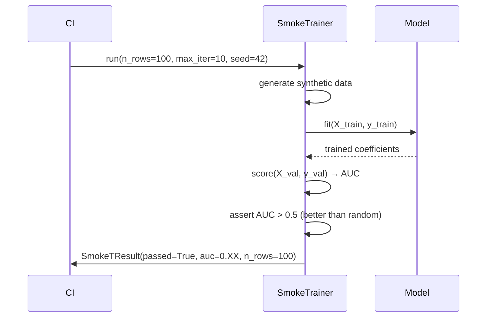
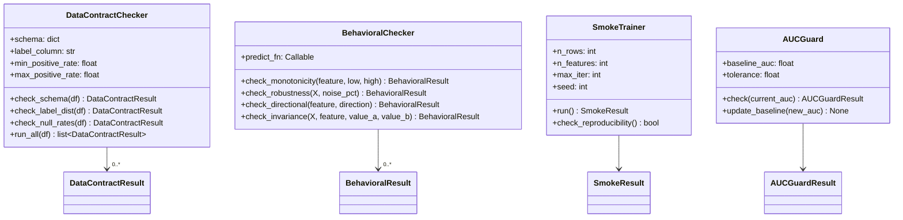

# Day 55 — Testing ML: Unit, Data, Behavioral, and Training Smoke Tests

## The ML Testing Landscape



---

## 1 — Unit Tests for ML Transforms

ML transforms are pure functions — given same input, same output. Test them like any pure function.

### What to test

| Transform | Test | Example |
|---|---|---|
| Bucketization | Bucket boundaries correct | `age=35` → `bucket="31-40"` |
| Log transform | Handles zero / negative | `log1p(0)=0`, `log1p(-1)` raises |
| One-hot encoder | Unknown category → zeros | `cat="unseen"` → `[0,0,0,0]` |
| Scaler | Fitted range not exceeded | `z-score` stays reasonable |
| PIT join | No future leakage | feature timestamp < prediction timestamp |

---

## 2 — Data Contract Tests

A **data contract** is a machine-readable spec for a dataset: column types, ranges, null rates, label distribution.



### Schema contract

```python
EXPECTED_SCHEMA = {
    "age":         {"dtype": float, "min": 18, "max": 100, "null_rate": 0.0},
    "income":      {"dtype": float, "min": 0,  "max": None, "null_rate": 0.05},
    "loan_amount": {"dtype": float, "min": 100, "max": 500_000, "null_rate": 0.0},
    "default":     {"dtype": int,  "values": [0, 1], "null_rate": 0.0},
}
```

### Label contract

```python
LABEL_CONTRACT = {
    "column": "default",
    "min_positive_rate": 0.05,   # at least 5% defaults
    "max_positive_rate": 0.40,   # at most 40% defaults
}
```

---

## 3 — Behavioral Tests

Behavioral tests check **properties the model must satisfy** regardless of the dataset:

| Behavioral invariant | Failure means | Example assertion |
|---|---|---|
| Monotonicity | Higher risk feature → higher score | `score(income=0) > score(income=100k)` |
| Robustness | Small input noise → small score change | `Δscore < 0.05` for `Δinput 1%` |
| Directional | Increasing bad signal → increasing score | More derogatory marks → higher default score |
| Invariance | Protected attribute swap → same score | Score unchanged when `gender=M ↔ F` |
| Minimum confidence | Score not stuck at 0.5 | `stdev(scores) > 0.05` over test set |



---

## 4 — Training Smoke Tests

Goal: confirm training code is runnable and produces a valid artifact in **<5 seconds** using 100 synthetic rows.



### Smoke test invariants

1. **No crash** — training runs to completion
2. **Better than random** — AUC > 0.5 on held-out 20%
3. **Reproducible** — same AUC for same seed across 2 runs (tolerance: ±0.001)
4. **Feature count matches** — model coefficients count = expected features

---

## 5 — AUC Regression Guard

The AUC guard prevents code changes from silently degrading model quality:

```
baseline_auc = load("artifacts/baseline_auc.json")     # saved from last good run
current_auc  = train_and_score(smoke_data, seed=42)

if current_auc < baseline_auc - TOLERANCE:
    FAIL  # regression detected
elif current_auc > baseline_auc:
    PASS + save new baseline
else:
    PASS  # within tolerance
```

**TOLERANCE = 0.01** — allows micro-regressions from refactors, blocks real degradation.

---

## Class Diagram


