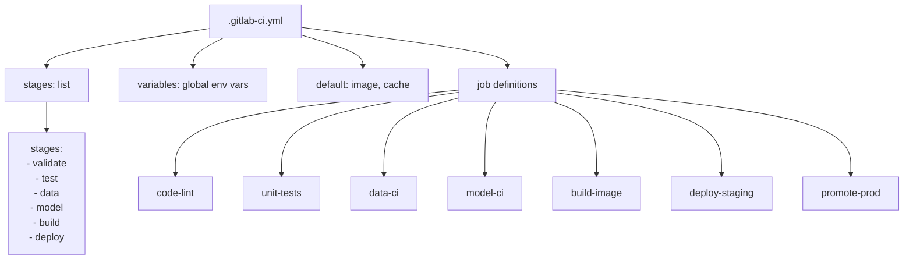

# Day 56 — GitLab CI Pipelines: Stages, Runners, Caching, Artifacts

## What GitLab CI Adds Over GitHub Actions

GitLab CI runs on **runners** — Docker containers or shell processes that the platform controls. Every ML team's pipeline needs:

1. **Caching** — pip packages, dataset samples (avoid re-downloading every run)
2. **Artifacts** — model files, reports, logs passed between stages and kept for inspection
3. **Environments** — staging vs prod; with protected branch rules
4. **Rules / triggers** — run model-ci only when training code changes; schedule data-ci weekly

---

## Pipeline YAML Structure



---

## Key Concepts

### Stages vs Jobs

- **Stage**: a phase of the pipeline (`validate`, `test`, `build`, `deploy`)
- **Job**: actual work unit; belongs to one stage; runs in parallel within a stage

```yaml
stages:
  - validate   # lint, type-check — must pass first
  - test       # unit tests (parallel: code and data checks)
  - model      # smoke train, AUC guard
  - build      # Docker image, model artifact
  - deploy     # staging → approve → prod
```

### Runners

| Runner type | When to use |
|---|---|
| `docker` | Reproducible builds; safe isolation |
| `shell` | Local dev; GPU access (no Docker overhead) |
| `kubernetes` | Auto-scaling; K8s-native ML training |

### Caching Strategy

```yaml
cache:
  key: "${CI_COMMIT_REF_SLUG}-py"  # per-branch cache
  paths:
    - .uv-cache/
    - .venv/
  policy: pull-push  # download at start, upload at end
```

For model artifacts and data samples:

```yaml
cache:
  key: "data-${DATA_VERSION}"  # invalidate on data version change
  paths:
    - data/samples/
  policy: pull  # never write — data is immutable
```

### Artifacts

Artifacts persist files from one job and make them downloadable:

```yaml
artifacts:
  paths:
    - reports/ci_report.json
    - models/smoke_model.pkl
  expire_in: 7 days
  reports:
    junit: reports/junit.xml  # GitLab parses this for test results UI
```

### Rules (conditional triggers)

```yaml
rules:
  - if: '$CI_PIPELINE_SOURCE == "schedule"'         # weekly data-ci
  - if: '$CI_COMMIT_BRANCH == "main"'
    changes:
      - training/**/*                               # model-ci on training changes
      - ci/**/*
  - when: never                                     # default: skip
```

---

## Full .gitlab-ci.yml Design

```yaml
# ── Global ──────────────────────────────────────────────────────────────────
image: python:3.11-slim

variables:
  UV_CACHE_DIR: ".uv-cache"
  MLFLOW_TRACKING_URI: "${MLFLOW_URI}"
  DATA_VERSION: "v1"

default:
  cache: &py_cache
    key: "${CI_COMMIT_REF_SLUG}-py"
    paths: [.uv-cache/, .venv/]
    policy: pull-push

stages: [validate, test, model, build, deploy]

# ── validate ────────────────────────────────────────────────────────────────
lint:
  stage: validate
  script:
    - pip install uv
    - uv run ruff check platform/
    - uv run mypy platform/ --ignore-missing-imports
  rules:
    - when: always

# ── test ─────────────────────────────────────────────────────────────────────
unit-tests:
  stage: test
  script:
    - uv run pytest platform/tests/unit/ -v --junit-xml=reports/junit.xml
  artifacts:
    reports:
      junit: reports/junit.xml
    paths: [reports/]
    expire_in: 7 days

data-ci:
  stage: test
  script:
    - uv run python -m ci.data_contract_check --sample data/samples/reference.csv
  artifacts:
    paths: [reports/data_ci_report.json]
    expire_in: 7 days
  rules:
    - if: '$CI_PIPELINE_SOURCE == "schedule"'
    - changes:
        - data/**/*

# ── model ─────────────────────────────────────────────────────────────────────
model-ci:
  stage: model
  script:
    - uv run python -m ci.smoke_train_check
    - uv run python -m ci.auc_guard_check
  artifacts:
    paths: [reports/model_ci_report.json, artifacts/baseline_auc.json]
    expire_in: 30 days
  rules:
    - changes:
        - training/**/*
        - ci/**/*

# ── build ─────────────────────────────────────────────────────────────────────
build-image:
  stage: build
  image: docker:24
  services: [docker:24-dind]
  script:
    - docker build -t $CI_REGISTRY_IMAGE:$CI_COMMIT_SHA .
    - docker push $CI_REGISTRY_IMAGE:$CI_COMMIT_SHA
  only:
    - main

# ── deploy ─────────────────────────────────────────────────────────────────────
deploy-staging:
  stage: deploy
  environment:
    name: staging
    url: https://staging.api.example.com
  script:
    - helm upgrade --install ml-api ./infra/helm/ml-api
        --set image.tag=$CI_COMMIT_SHA
        --set environment=staging
  only:
    - main

promote-prod:
  stage: deploy
  environment:
    name: production
    url: https://api.example.com
  when: manual          # human approval gate
  script:
    - helm upgrade --install ml-api ./infra/helm/ml-api
        --set image.tag=$CI_COMMIT_SHA
        --set environment=production
  only:
    - main
```

---

## Sequence: MR from Push to Staging

```mermaid
sequenceDiagram
    participant Dev
    participant GL as GitLab
    participant V as validate stage
    participant T as test stage
    participant M as model stage
    participant B as build stage
    participant D as deploy stage

    Dev->>GL: git push → opens MR
    GL->>V: lint job (ruff + mypy)
    V-->>GL: passed ✅
    GL->>T: unit-tests job
    GL->>T: data-ci job (parallel)
    T-->>GL: passed ✅
    GL->>M: model-ci job (training/** changed)
    M->>M: smoke train + AUC guard
    M-->>GL: passed ✅; artifacts saved
    GL->>B: build-image (main only, after merge)
    B-->>GL: image pushed to registry ✅
    GL->>D: deploy-staging (auto)
    D-->>GL: staging deployed ✅
    GL->>D: promote-prod (manual gate)
    D-->>GL: awaiting human approval ⏳
```

---

## Caching Decision Matrix

| Artifact | Cache key | Policy |
|---|---|---|
| Python packages | branch + python version | pull-push |
| Dataset sample | data version | pull only (immutable) |
| Model artifact | commit SHA | no cache (always rebuild) |
| Test reports | — | GitLab artifacts (not cache) |

---

## Concepts to Remember

- `rules:` replaces `only:/except:` — more expressive, evaluated top-down
- `when: manual` = human gate; `when: always` = unconditional
- `artifacts:` persist between stages; `cache:` speeds up re-runs of the same job
- Runners pull the image, run `script:`, then upload `artifacts:` — three discrete operations
- Protected branches + environment approvals are the CD gate mechanism
