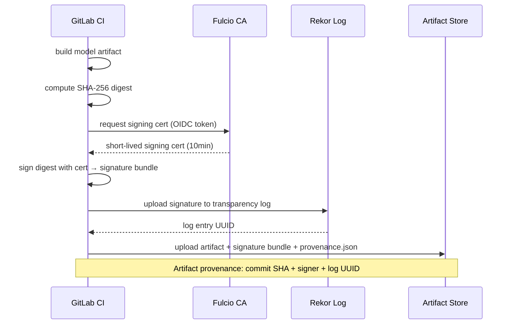
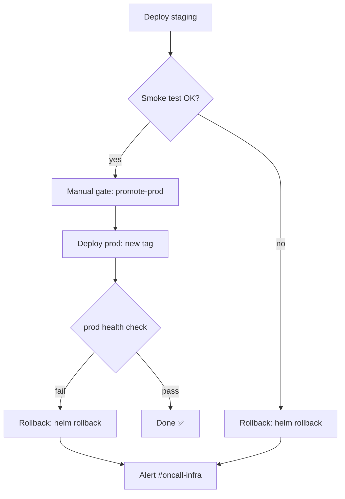
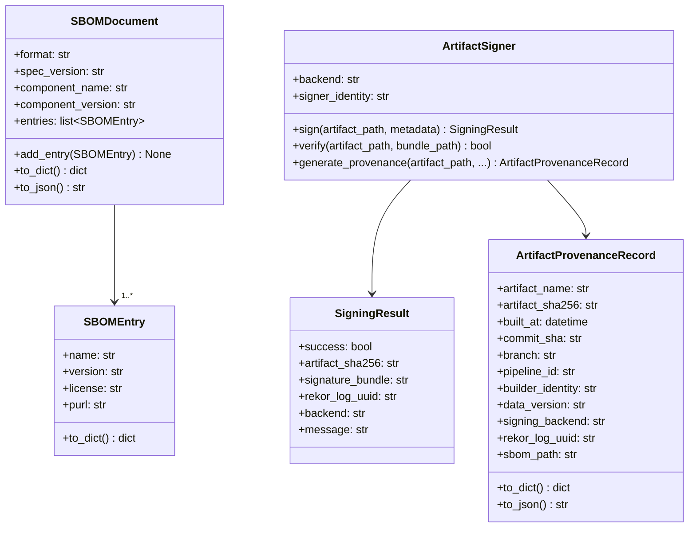

# Day 57 — Automated Image + Model Build; Artifact Signing (Sigstore) + SBOM

## Why Sign ML Artifacts?

In classical software, you sign executables so users can verify provenance. In ML, the **model artifact** IS the executable for inference. A tampered model file can silently change predictions — the worst kind of supply chain attack.

Three questions signing answers:
1. **Who built it?** — identity of the signer (CI system, person)
2. **What was the input?** — code commit SHA + data version that produced this artifact
3. **Has it been altered?** — SHA-256 digest binds the artifact to the signature

---

## Sigstore: Keyless Signing

Sigstore's `cosign` tool implements **keyless signing** — no long-lived private keys to manage:



**Why keyless?** The signing cert is tied to the CI job's OIDC token, which is tied to the git commit and pipeline ID. No key to rotate, no key to leak.

---

## SBOM: Software Bill of Materials

An SBOM is a machine-readable inventory of all components in an artifact:

```
model-artifact.pkl
├── python==3.11.8
├── scikit-learn==1.4.0
├── numpy==1.26.4
├── pandas==2.2.0
└── scipy==1.12.0
```

**Why SBOM for ML?**
- Compliance: EU AI Act, NIST, SOC2 require component disclosure
- Vulnerability response: when `numpy` CVE lands, you know which models are affected
- Auditability: reproduce the exact environment that produced a model

### SBOM Formats

| Format | Owner | Machine-readable | Use case |
|---|---|---|---|
| SPDX | Linux Foundation | JSON/YAML/tag-value | Compliance, regulatory |
| CycloneDX | OWASP | JSON/XML | Security tooling, SBOM merging |
| Syft/Grype | Anchore | JSON (internal) | Container scanning |

---

## Artifact Provenance Record

Every model artifact gets a `provenance.json` stored alongside it:

```json
{
  "artifact_name": "model_v1.2.pkl",
  "artifact_sha256": "abc123...",
  "built_at": "2026-06-29T10:15:00Z",
  "commit_sha": "6c6a398",
  "branch": "main",
  "pipeline_id": "12345",
  "builder_identity": "ci@company.com",
  "data_version": "v1",
  "signing_backend": "cosign-keyless",
  "rekor_log_uuid": "24296...",
  "sbom_path": "model_v1.2.sbom.json"
}
```

---

## CD Rollback Flow



**Helm rollback command:**
```bash
helm rollback ml-api          # rolls back to previous revision
helm rollback ml-api 3        # rolls back to specific revision
helm history ml-api           # list revisions
```

---

## Class Diagram



---

## Release Engineering Checklist

| Step | Tool | Artifact produced |
|---|---|---|
| 1. Build image | `docker build` | OCI image |
| 2. Sign image | `cosign sign` | image signature in OCI registry |
| 3. Build SBOM | `syft` or `cdxgen` | `model.sbom.json` (CycloneDX) |
| 4. Sign SBOM | `cosign attest` | SBOM attestation |
| 5. Capture provenance | custom `provenance.json` | `model.provenance.json` |
| 6. Upload all to registry | `aws s3 cp` / OCI push | Immutable artifact set |
| 7. Verify before deploy | `cosign verify` | CI gate blocks if invalid |
